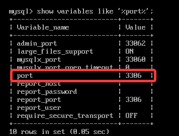

[toc]

# 写在前面

- 导入sql文件


```sql
source sql文件路径
```

- 编码问题

  `show variables like '%char%';`

  Mysql命令行中文乱码的解决方法


  ​		数据库本身安装时默认已经是使用utf8编码的了，但在命令行中执行查询时，查询到的中文依然乱码，解决方法如下：

  方法一：
  登录mysql命令行前指定gbk编码而不是utf8编码：>mysql -u用户名 -p --default-character-set=gbk

  `utf8mb4`

  方法二：
  登录mysql命令行后设置gbk编码：

  >mysql -u用户名 -p
  >mysql>set names gbk;
  >注：set names utf8 等同于同时运行了如下三条命令：
  >set character_set_client=utf8;
  >set character_set_results=utf8;
  >set character_set_connection=utf8;

## 安装mysql

1. 修改环境变量

2. 初始化

   ```sh
   mysqld --initialize-insecure
   ```

3. 安装

   ```sh
   mysqld -install [服务名默认mysql]
   ```

4. 连接服务

   ```sh
   net start mysql
   ```

   

## 密码

### 修改密码

```sql
ALTER USER 'root'@'localhost' IDENTIFIED BY '123456';
或者
ALTER USER 'root'@'%' IDENTIFIED BY '123456';
-- 具体看mysql.user表
```

### 修改密码安全性

[参考](https://blog.csdn.net/an0708/article/details/101806521?utm_medium=distribute.pc_relevant_t0.none-task-blog-BlogCommendFromMachineLearnPai2-1.channel_param&depth_1-utm_source=distribute.pc_relevant_t0.none-task-blog-BlogCommendFromMachineLearnPai2-1.channel_param)

查看

```
show variables like 'validate_password%'; 
```

修改

修改策略（将策略要求置为LOW，长度要求置为1）

```mysql
set global validate_password_policy=0; # 1
set global validate_password_length=1; # 8
```

绝对

```mysql
mysql> set global validate_password_policy=0;       # 关闭密码复杂性策略
mysql> set global validate_password_length=1;      # 设置密码复杂性要求密码最低长度为1
mysql> select @@validate_password_policy;          # 查看密码复杂性策略
mysql> select @@validate_password_length;          # 查看密码复杂性要求密码最低长度大小
```


# SQL数据库基本操作

## SQL数据库操作

set @@ sql_mode ='STRICT_TRANS_TABLES，NO_ZERO_IN_DATE，NO_ZERO_DATE，ERROR_FOR_DIVISION_BY_ZERO，NO_AUTO_CREATE_USER，NO_ENGINE_SUBSTITUTION';

<!--2020.01.01-->

### 创建数据库：

`create database [if not EXISTS] 数据库名`

`[[DEFAULT] CHARACTER SET <字符集名>] [[DEFAULT] COLLATE <校对规则名>];`

```sql
CREATE  DATABASE  数据库名 ON [ PRIMARY ] 
（    NAME=  ‘ 数据文件的逻辑名称 ’
ILENAME=  ‘ 文件的路径和文件名 ’ ,  SIZE=文件的初始大小 , 
 MAXSIZE=文件的最大容量|UNLIMITED  ,  FILEGROWTH=文件的每次增长量   ）[, … n]
 LOG  ON
 (     NAME='事务日志文件的逻辑名称' ,
  FILENAME='文件的路径和文件名', 
 SIZE=文件的初始大小, 
 MAXSIZE=文件的最大容量|UNLIMITED,  FILEGROWTH=文件的每次增长量   ) [, … n]
```


### 查看数据库：

`show databases；`

按条件查询：

例：

```sql
show databases like test%;
+--------------------+
| Database (%test%)  |
+--------------------+
| db_test            |
+--------------------+
| db_test_db         |
+--------------------+
| test_db            |sql
+--------------------+
```

### 修改数据库

```sql
ALTER DATABASE [数据库名] { [ DEFAULT ] CHARACTER SET <字符集名> |
[ DEFAULT ] COLLATE <校对规则名>}
```

例：

```sql
mysql> SHOW CREATE DATABASE test_db;
mysql> CREATE DATABASE test_db
    -> DEFAULT CHARACTER SET gb2312
    -> DEFAULT COLLATE gb2312_chinese_ci;
mysql> SHOW CREATE DATABASE test_db;
+----------+--------------------------------------------------------+
| Database | Create Database                                        |
+----------+--------------------------------------------------------+
| test_db  | CREATE DATABASE `test_db` /*!40100 DEFAULT CHARACTER SET gb2312 */|
+----------+--------------------------------------------------------+
1 row in set (0.00 sec)
```

### 删除数据库

```
DROP DATABASE [ IF EXISTS ] <数据库名>
```

### 选择数据库

```
USE <数据库名>
```

### 如何选择 MySQL 存储引擎

MySQL 5.7 支持的存储引擎有 InnoDB、MyISAM、Memory、Merge、Archive、Federated、CSV、BLACKHOLE 等。可以使用`SHOW ENGINES`语句查看系统所支持的引擎类型.

`Support` 列的值表示某种引擎是否能使用，`YES`表示可以使用，`NO`表示不能使用，`DEFAULT`表示该引擎为当前默认的存储引擎。

不同的存储引擎都有各自的特点，以适应不同的需求，如表所示。为了做出选择，首先要考虑每一个存储引擎提供了哪些不同的功能。不同的存储引擎都有各自的特点，以适应不同的需求，如表所示。为了做出选择，首先要考虑每一个存储引擎提供了哪些不同的功能。


| 功能         | MylSAM | MEMORY | InnoDB | Archive |
| ------------ | ------ | ------ | ------ | ------- |
| 存储限制     | 256TB  | RAM    | 64TB   | None    |
| 支持事务     | No     | No     | Yes    | No      |
| 支持全文索引 | Yes    | No     | No     | No      |
| 支持树索引   | Yes    | Yes    | Yes    | No      |
| 支持哈希索引 | No     | Yes    | No     | No      |
| 支持数据缓存 | No     | N/A    | Yes    | No      |
| 支持外键     | No     | No     | Yes    | No      |


可以根据以下的原则来选择 MySQL 存储引擎：

- 如果要提供提交、回滚和恢复的事务安全（ACID 兼容）能力，并要求实现并发控制，InnoDB 是一个很好的选择。
- 如果数据表主要用来插入和查询记录，则 MyISAM 引擎提供较高的处理效率。
- 如果只是临时存放数据，数据量不大，并且不需要较高的数据安全性，可以选择将数据保存在内存的 MEMORY 引擎中，MySQL 中使用该引擎作为临时表，存放查询的中间结果。
- 如果只有 INSERT 和 SELECT 操作，可以选择Archive 引擎，Archive 存储引擎支持高并发的插入操作，但是本身并不是事务安全的。Archive 存储引擎非常适合存储归档数据，如记录日志信息可以使用 Archive 引擎。


<font color="red">提示：使用哪一种引擎要根据需要灵活选择，一个数据库中多个表可以使用不同的引擎以满足各种性能和实际需求。使用合适的存储引擎将会提高整个数据库的性能。</font>

> 如果要提供提交、回滚和恢复的事务安全（ACID 兼容）能力，并要求实现并发控制，InnoDB 是一个很好的选择。
> 如果数据表主要用来插入和查询记录，则 MyISAM 引擎提供较高的处理效率。
> 如果只是临时存放数据，数据量不大，并且不需要较高的数据安全性，可以选择将数据保存在内存的 MEMORY 引擎中，MySQL 中使用该引擎作为临时表，存放查询的中间结果。
> 如果只有 INSERT 和 SELECT 操作，可以选择Archive 引擎，Archive 存储引擎支持高并发的插入操作，但是本身并不是事务安全的。Archive 存储引擎非常适合存储归档数据，如记录日志信息可以使用 Archive 引擎。

MySQL默认存储引擎

InnoDB

是默认引擎，支持可靠的事务处理

使用下面的语句可以修改数据库临时的默认存储引擎

```
SET default_storage_engine=< 存储引擎名 >
```

### MySQL常见的数据类型

在 MySQL 中常见的数据类型如下：

##### 1) 整数类型

包括 TINYINT、SMALLINT、MEDIUMINT、INT、BIGINT，浮点数类型 FLOAT 和 DOUBLE，定点数类型 DECIMAL。

##### 2) 日期/时间类型

包括 YEAR、TIME、DATE、DATETIME 和 TIMESTAMP。

##### 3) 字符串类型

包括 CHAR、VARCHAR、BINARY、VARBINARY、BLOB、TEXT、ENUM 和 SET 等。

##### 4) 二进制类型

包括 BIT、BINARY、VARBINARY、TINYBLOB、BLOB、MEDIUMBLOB 和 LONGBLOB。


类型名称 | 说明 | 存储需求

TINYINT	很小的整数	1个字节
SMALLINT	小的整数	2个宇节
MEDIUMINT	中等大小的整数	3个字节
INT (INTEGHR)	普通大小的整数	4个字节
BIGINT	大整数	8个字节


类型名称	说明	存储需求
FLOAT	单精度浮点数	4 个字节
DOUBLE	双精度浮点数	8 个字节
DECIMAL (M, D)，DEC	压缩的“严格”定点数	M+2 个字节

DECIMAL 类型不同于 FLOAT 和 DOUBLE。DOUBLE 实际上是以字符串的形式存放的，DECIMAL 可能的最大取值范围与 DOUBLE 相同，但是有效的取值范围由 M 和 D 决定。如果改变 M 而固定 D，则取值范围将随 M 的变大而变大。


| 类型名称| 日期格式 | 日期范围 | 存储需求 |
| ---------------- | -------- | ---- | -------- |
| YEAR | YEAR | 1901 ~ 2155 | 1 个字节 |
| TIME | HH:MM:SS | -838:59:59 ~ 838:59:59 | 3 个字节 |
| DATE | YYYY-MM-DD HH:MM:SS | 1000-01-01 00:00:00 ~ 9999-12-31 23:59:59 | 8 个字节 |
| TIMESTAMP | YYYY-MM-DD HH:MM:SS | 1980-01-01 00:00:01 UTC ~ 2040-01-19 03:14:07 UTC | 4 个字节 |

## 数据表

### 创建数据表

```
CREATE TABLE <表名> ([表定义选项])[表选项][分区选项];
[表定义选项]: <列名1> <类型1> [,…] <列名n> <类型n>
```

>  <表名>：指定要创建表的名称，在 CREATE TABLE 之后给出，必须符合标识符命名规则。表名称被指定为 db_name.tbl_name，以便在特定的数据库中创建表。无论是否有当前数据库，都可以通过这种方式创建。在当前数据库中创建表时，可以省略 db-name。如果使用加引号的识别名，则应对数据库和表名称分别加引号。例如，'mydb'.'mytbl' 是合法的，但 'mydb.mytbl' 不合法。

例：

```sql
mysql> USE test_db;
Database changed
mysql> CREATE TABLE tb_emp1
    -> (
    -> id INT(11),
    -> name VARCHAR(25),
    -> deptId INT(11),
    -> salary FLOAT
    -> );
Query OK, 0 rows affected (0.37 sec)
```


### 显示数据表

##### 显示所有表

```sql
SHOW TABLES;
```

##### 显示单个表

DESCRIBE/DESC 语句可以查看表的字段信息，包括字段名、字段数据类型、是否为主键、是否有默认值等，语法规则如下：

```sql
DESCRIBE <表名>;
```

或简写成：

```sql
DESC <表名>;
```

其中，各个字段的含义如下：

> Null：表示该列是否可以存储 NULL 值。
> Key：表示该列是否已编制索引。PRI 表示该列是表主键的一部分，UNI 表示该列是 UNIQUE 索引的一部分，MUL 表示在列中某个给定值允许出现多次。
> Default：表示该列是否有默认值，如果有，值是多少。
> Extra：表示可以获取的与给定列有关的附加信息，如 AUTO_INCREMENT 等。

SHOW CREATE TABLE语句可以用来显示创建表时的CREATE TABLE语句，语法格式如下：
SHOW CREATE TABLE <表名>\G；
【实例 3】使用 `SHOW CREATE TABLE `查看表 `tb_emp1 `的详细信息，输入的 SQL 语句和运行结果如下所示。

提示：使用 `SHOW CREATE TABLE` 语句不仅可以查看创建表时的详细语句，而且可以查看存储引擎和字符编码。如果不加`“\G”`参数，显示的结果可能非常混乱，加上“\G”参数之后，可使显示的结果更加直观，易于查看。

```sql
mysql> SHOW CREATE TABLE tb_emp1\G
*************************** 1. row ***************************
       Table: tb_emp1
Create Table: CREATE TABLE `tb_emp1` (
  `id` int(11) DEFAULT NULL,
  `name` varchar(25) DEFAULT NULL,
  `deptId` int(11) DEFAULT NULL,
  `salary` float DEFAULT NULL
) ENGINE=InnoDB DEFAULT CHARSET=gb2312
1 row in set (0.03 sec)
```

### 修改（添加）数据表字段

修改表指的是修改数据库中已经存在的数据表的结构。MySQL 使用 ALTER TABLE 语句修改表。常用的修改表的操作有修改表名、修改字段数据类型或字段名、增加和删除字段、修改字段的排列位置、更改表的存储引擎、删除表的外键约束等。

常用的语法格式如下：

```
ALTER TABLE <表名> [修改选项]
```

修改选项的语法格式如下：

```sql
{ ADD COLUMN <列名> <类型>
| CHANGE COLUMN <旧列名> <新列名> <新列类型>
| ALTER COLUMN <列名> { SET DEFAULT <默认值> | DROP DEFAULT }
| MODIFY COLUMN <列名> <类型>
| DROP COLUMN <列名>
| RENAME TO <新表名> }
```

#### 添加字段

例：

```sql
#在开头
mysql> ALTER TABLE tb_emp1
    -> ADD COLUMN col1 INT FIRST;
#在name后面
mysql> ALTER TABLE tb_emp1
    -> ADD COLUMN col1 INT AFTER name;
```

<font color = "red">提示</font>：“FIRST 或 AFTER 已存在的字段名”用于指定新增字段在表中的位置，如果 SQL 语句中没有这两个参数，则默认将新添加的字段设置为数据表的最后列。

#### 修改字段：

###### 类型

```sql
ALTER TABLE <表名> MODIFY <字段名> <数据类型>
```

###### 名称

```sql
ALTER TABLE <表名> CHANGE <旧字段名> <新字段名> <新数据类型>；
```

<font color="red">提示:</font>   由于不同类型的数据在机器中的存储方式及长度并不相同，修改数据类型可能会影响数据表中已有的数据记录，因此，当数据表中已经有数据时，不要轻易修改数据类型。

###### 表名

```sql
ALTER TABLE <旧表名> RENAME [TO] <新表名>；
```

#### 删除字段

```sql
ALTER TABLE <表名> DROP <字段名>；
```

#### 移动字段

```mysql
alter table employee modify user_name varchar(100) after password;
alter table employee modify user_name varchar(100) first;
```

### 删除数据表

```sql
DROP TABLE [IF EXISTS] <表名> [ , <表名1> , <表名2>] …
```

<!--2020.01.05-->

## 数据约束

### 主键（PRIMARY KEY）

​		主键约束是一个列或者列的组合，其值能唯一地标识表中的每一行。这样的一列或多列称为表的主键，通过它可以强制表的实体完整性。

​	**选取设置主键约束的字段**

​			主键约束即在表中定义一个主键来唯一确定表中每一行数据的标识符。主键可以是表中的某一列或者多列的组合，其中由多列组合的主键称为复合主键。主键应该遵守下面的规则：

+ 每个表只能定义一个主键。

+ 主键值必须唯一标识表中的每一行，且不能为 NULL，即表中不可能存在两行数据有相同的主键值。这是唯一性原则。

+ 一个列名只能在复合主键列表中出现一次。

+ 复合主键不能包含不必要的多余列。当把复合主键的某一列删除后，如果剩下的列构成的主键仍然满足唯一性原则，那么这个复合主键是不正确的。这是最小化原则。

  语法：

  ```sql
  <字段名> <数据类型> PRIMARY KEY [默认值]
  ```

删除主键

```sql
ALTER TABLE <数据表名> DROP PRIMARY KEY;
```


### 外键（FOREIGN KEY）

​	**外键**：用来在两个表的数据之间建立链接，它可以是一列或者多列。一个表可以有一个或多个外键。

​		定义一个外键时，需要遵守下列规则：

+ 父表必须已经存在于数据库中，或者是当前正在创建的表。如果是后一种情况，则父表与子表是同一个表，这样的表称为自参照表，这种结构称为自参照完整性。

+ 必须为父表定义主键。

+ 主键不能包含空值，但允许在外键中出现空值。也就是说，只要外键的每个非空值出现在指定的主键中，这个外键的内容就是正确的。

+ 在父表的表名后面指定列名或列名的组合。这个列或列的组合必须是父表的主键或候选键。

+ 外键中列的数目必须和父表的主键中列的数目相同。

+ 外键中列的数据类型必须和父表主键中对应列的数据类型相同。

  在数据表中创建外键使用 FOREIGN KEY 关键字，具体的语法规则如下：

```sql
[CONSTRAINT <外键名>] FOREIGN KEY 字段名 [，字段名2，…]
REFERENCES <主表名> 主键列1 [，主键列2，…]
```

​		其中：`外键名`为定义的外键约束的名称，一个表中不能有相同名称的外键；`字段名`表示子表需要添加外健约束的字段列；`主表名`即被子表外键所依赖的表的名称；`主键列`表示主表中定义的主键列或者列组合。

- 设置约束


例：

主表：

```sql
mysql> CREATE TABLE tb_dept1
    -> (
    -> id INT(11) PRIMARY KEY,
    -> name VARCHAR(22) NOT NULL,
    -> location VARCHAR(50)
    -> );
Query OK, 0 rows affected (0.37 sec)
```

从表：

```sql
mysql> CREATE TABLE tb_emp6
    -> (
    -> id INT(11) PRIMARY KEY,
    -> name VARCHAR(25),
    -> deptId INT(11),
    -> salary FLOAT,
    -> CONSTRAINT fk_emp_dept1
    -> FOREIGN KEY(deptId) REFERENCES tb_dept1(id)
    -> );
```

以上语句执行成功之后，在表 tb_emp6 上添加了名称为 fk_emp_dept1 的外键约束，外键名称为 deptId，其依赖于表 tb_dept1 的主键 id。

- 添加表的约束

```sql
ALTER TABLE <数据表名> ADD CONSTRAINT <索引名>
FOREIGN KEY(<列名>) REFERENCES <主表名> (<列名>);
```

- 删除表的约束

```sql
ALTER TABLE <表名> DROP FOREIGN KEY <外键约束名>;
```

### 设置唯一约束（UNIQUE KEY）

约束：要求该列唯一，允许为空，但只能出现一个空值。唯一约束可以确保一列或者几列不出现重复值。

```sql
<字段名> <数据类型> UNIQUE
```

<font color = "red">区别:</font>*UNIQUE 和 PRIMARY KEY 的区别：一个表可以有多个字段声明为 UNIQUE，但只能有一个 PRIMARY KEY 声明；声明为 PRIMAY KEY 的列不允许有空值，但是声明为 UNIQUE 的字段允许空值的存在。*

添加唯一约束

```sql
ALTER TABLE <数据表名> ADD CONSTRAINT <唯一约束名> UNIQUE(<列名>);
```

删除唯一约束

```sql
ALTER TABLE <表名> DROP INDEX <唯一约束名>;
```

<!--2020.01.06-->

### 检查约束（CHECK）

```sql
CHECK <表达式>
```

其中：`<表达式>`指的就是 SQL 表达式，用于指定需要检查的限定条件。

若将 CHECK 约束子句置于表中某个列的定义之后，则这种约束也称为基于列的 CHECK 约束。

在更新表数据的时候，系统会检查更新后的数据行是否满足 CHECK 约束中的限定条件。MySQL 可以使用简单的表达式来实现 CHECK 约束，也允许使用复杂的表达式作为限定条件，例如在限定条件中加入子查询。

> 注意：若将 CHECK 约束子句置于所有列的定义以及主键约束和外键定义之后，则这种约束也称为基于表的 CHECK 约束。该约束可以同时对表中多个列设置限定条件。

创建时添加

```sql
CREATE TABLE tb_emp7
(
id INT(11) PRIMARY KEY,
name VARCHAR(25),
deptId INT(11),
salary FLOAT,
CHECK(salary>0 AND salary<100),
FOREIGN KEY(deptId) REFERENCES tb_dept1(id)
);
```

修改时添加

```sql
ALTER TABLE tb_emp7 ADD CONSTRAINT <检查约束名> CHECK(<检查约束>)
```

删除时添加

```sql
ALTER TABLE <数据表名> DROP CONSTRAINT <检查约束名>;
```

### 默认值（DEFAULT）

“默认值（Default）”的完整称呼是“默认值约束（Default Constraint）”。MySQL 默认值约束用来指定某列的默认值。

创建表时可以使用 DEFAULT 关键字设置默认值约束，具体的语法规则如下：

```sql
<字段名> <数据类型> DEFAULT <默认值>;
```

修改时添加约束

```sql
ALTER TABLE <数据表名>
CHANGE COLUMN <字段名> <数据类型> DEFAULT <默认值>;
```

eg.

```sql
ALTER TABLE tb_dept3
    -> CHANGE COLUMN location
    -> location VARCHAR(50) DEFAULT 'Shanghai';
```


删除约束

```sql
ALTER TABLE <数据表名>
CHANGE COLUMN <字段名> <字段名> <数据类型> DEFAULT NULL;
```

### 非空约束（NOT NULL）

可以通过 CREATE TABLE 或 ALTER TABLE 语句实现。在表中某个列的定义后加上关键字 NOT NULL 作为限定词，来约束该列的取值不能为空。

非空约束（Not Null Constraint）指字段的值不能为空。对于使用了非空约束的字段，如果用户在添加数据时没有指定值，数据库系统就会报错。


**在创建表时设置非空约束**
创建表时可以使用 <font color="green">NOT NULL </font>关键字设置非空约束，具体的语法规则如下：

```sql
<字段名> <数据类型> NOT NULL;
```

**在修改表时添加非空约束**

```sql
ALTER TABLE <数据表名>
CHANGE COLUMN <字段名>
<字段名> <数据类型> NOT NULL;
```

**删除非空约束**

```sql
ALTER TABLE <数据表名>
CHANGE COLUMN <字段名> <字段名> <数据类型> NULL;
```


### 查看约束

```sql
SHOW CREATE TABLE <数据表名>;
```

一个有各种键的表

```sql
CREATE TABLE tb_emp8
 (
id INT(11) PRIMARY KEY,
name VARCHAR(22) UNIQUE,
deptId INT(11) NOT NULL,
salary FLOAT DEFAULT 0,
CHECK(salary>0),
FOREIGN KEY(deptId) REFERENCES tb_dept1(id)
);

show create table tb_emp8 \G;
```


## 数据查询

### 表单查询

```sql
SELECT
{* | <字段列名>}
[
FROM <表 1>, <表 2>…
[WHERE <表达式>
[GROUP BY <group by definition>
[HAVING <expression> [{<operator> <expression>}…]]
[ORDER BY <order by definition>]
[LIMIT[<offset>,] <row count>]
]
```

其中，各条子句的含义如下：

- `{*|<字段列名>}`包含星号通配符的字段列表，表示查询的字段，其中字段列至少包含一个字段名称，如果要查询多个字段，多个字段之间要用逗号隔开，最后一个字段后不要加逗号。
- `FROM <表 1>，<表 2>…`，表 1 和表 2 表示查询数据的来源，可以是单个或多个。
- `WHERE` 子句是可选项，如果选择该项，将限定查询行必须满足的查询条件。
- `GROUP BY< 字段 >`，该子句告诉 MySQL 如何显示查询出来的数据，并按照指定的字段分组。
- `[ORDER BY< 字段 >]`，该子句告诉 MySQL 按什么样的顺序显示查询出来的数据，可以进行的排序有升序（ASC）和降序（DESC）。
- `[LIMIT[<offset>，]<row count>]`，该子句告诉 MySQL 每次显示查询出来的数据条数。

1. #### 使用''*''查询表中所有内容

   在 SELECT 语句中使用星号“*”通配符查询所有字段。

   SELECT 查询记录最简单的形式是从一个表中检索所有记录，实现的方法是使用星号“*”通配符指定查找所有列的名称，语法格式如下：

   ```sql
   SELECT * FROM 表名;
   ```

2. #### 查询表中指定的字段

   查询表中的某一个字段的语法格式为：

   ```sql
   SELECT < 列名 >[,<字段名2>,…,<字段名n>] FROM < 表名 >;
   ```

3. #### DISTINCT：去重（过滤重复数据）

   ```
   SELECT DISTINCT <字段名> FROM <表名>;
   ```


#### 设置别名(AS)

当表名很长或者执行一些特殊查询的时候，为了方便操作或者需要多次使用相同的表时，可以为表指定别名，用这个别名代替表原来的名称。

为表取别名的基本语法格式为：

```sql
<表名> [AS] <别名>
```

```sql
<列名> [AS] <列别名>
```

其中各子句的含义如下：

`<表名>`：数据中存储的数据表的名称。 ·
`<别名>`：查询时指定的表的新名称。
`AS`：关键字为可选参数。

<font color ="red">注意：在为表取别名时，要保证不能与数据库中的其他表的名称冲突。</font>

### 限制查询结果的记录条数（LIMIT）

在使用 MySQL SELECT 语句时往往返回的是所有匹配的行，有些时候我们仅需要返回第一行或者前几行，这时候就需要用到 MySQL LIMT 子句。

基本的语法格式如下：

```sql
<LIMIT> [<位置偏移量>,] <行数>
```

LIMIT 接受一个或两个数字参数。参数必须是一个整数常量。如果给定两个参数，第一个参数指定第一个返回记录行的偏移量，第二个参数指定返回记录行的最大数目。

例：

```sql
 SELECT * FROM tb_students_info LIMIT 3,4;
```

### 对查询结果进行排序(ORDER BY)

SELECT 语句中，ORDER BY 子句主要用来将结果集中的数据按照一定的顺序进行排序。其语法格式为：

```sql
ORDER BY {<列名> | <表达式> | <位置>} [ASC|DESC]
```

	语法说明如下

- 1) 列名
  指定用于排序的列。可以指定多个列，列名之间用逗号分隔。

- 2) 表达式
  指定用于排序的表达式。

- 3) 位置
  指定用于排序的列在 SELECT 语句结果集中的位置，通常是一个正整数。

- 4) ASC|DESC

  关键字 ASC 表示按升序分组，关键字 DESC 表示按降序分组，其中 ASC 为默认值。这两个关键字必须位于对应的列名、表达式、列的位置之后

使用 ORDER BY 子句应该注意以下几个方面：

  - ORDER BY 子句中可以包含子查询。
  - 当排序的值中存在空值时，ORDER BY 子句会将该空值作为最小值来对待。
  - 当在 ORDER BY 子句中指定多个列进行排序时，MySQL 会按照列的顺序从左到右依次进行排序。
- 查询的数据并没有以一种特定的顺序显示，如果没有对它们进行排序，则将根据插入到数据表中的顺序显示。使用 ORDER BY 子句对指定的列数据进行排序。


### 条件查询（WHERE）

可以使用 WHERE 子句来指定查询条件，从 FROM 子句的中间结果中选取适当的数据行，达到数据过滤的效果。

语法格式如下：

```sql
WHERE <查询条件> {<判定运算1>，<判定运算2>，…}
```

其中，判定运算其结果取值为 TRUE、FALSE 和 UNKNOWN。

判定运算的语法分类如下：

- <表达式1>`{=|<|<=|>|>=|<=>|<>|！=}`<表达式2>
- <表达式1>`[NOT]LIKE`<表达式2>
- <表达式1>`[NOT][REGEXP|RLIKE]`<表达式2>
- <表达式1>`[NOT]BETWEEN`<表达式2>`AND`<表达式3>
- <表达式1>`IS[NOT]NULL`

#### 多条件的查询语句

使用 SELECT 查询时，可以增加查询的限制条件，这样可以使查询的结果更加精确。MySQL 在 WHERE 子句中使用 AND 操作符限定只有满足所有查询条件的记录才会被返回。

<font color = "red">注意：</font>上例的 WHERE 子句中只包含一个 AND 语句，把两个过滤条件组合在一起，实际上可以添加多个 AND 过滤条件，增加条件的同时增加一个 AND 关键字。

#### 使用 LIKE 的模糊查询

字符串匹配的语法格式如下：

```sql
<表达式1> [NOT] LIKE <表达式2>
```

​		字符串匹配是一种模式匹配，使用运算符 LIKE 设置过滤条件，过滤条件使用通配符进行匹配运算，而不是判断是否相等进行比较。

​		相互间进行匹配运算的对象可以是 CHAR、VARCHAR、TEXT、DATETIME 等数据类型。运算返回的结果是 TRUE 或 FALSE。

​		**利用通配符可以在不完全确定比较值的情形下创建一个比较特定数据的搜索模式，并置于关键字 LIKE 之后。可以在搜索模式的任意位置使用通配符，并且可以使用多个通配符。MySQL 支持的通配符有以下两种：**
​	1) 百分号（%）
​		百分号是 MySQL 中常用的一种通配符，在过滤条件中，百分号可以表示任何字符串，并且该字符串可以出现任意次。

使用百分号通配符要注意以下几点：

- MySQL 默认是不区分大小写的，若要区分大小写，则需要更换字符集的校对规则。

- 百分号不匹配空值。

- 百分号可以代表搜索模式中给定位置的 0 个、1 个或多个字符。

- 尾空格可能会干扰通配符的匹配，一般可以在搜索模式的最后附加一个百分号。

  2) 下划线（_）

  下划线通配符和百分号通配符的用途一样，下画线只匹配单个字符，而不是多个字符，也不是 0 个字符。

#### 日期字段作为条件的查询语句

​		以日期字段作为条件，可以使用比较运算符设置查询条件，也可以使用 BETWEEN AND 运算符查询某个范围内的值。

例：

```sql
 SELECT * FROM tb_students_info WHERE login_date<'2016-01-01';
```

​		BETWEEN AND 用来查询某个范围内的值，该操作符需要两个参数，即范围的开始值和结束值，若字段值满足指定的范围查询条件，则这些记录被返回。

```sql
SELECT * FROM tb_students_info
    -> WHERE login_date
    -> BETWEEN '2015-10-01'
    -> AND '2016-05-01';
```

<!--2020.01.14-->

### 内连接查询

​		内连接是通过在查询中设置连接条件的方式，来移除查询结果集中某些数据行后的交叉连接。简单来说，就是利用条件表达式来消除交叉连接的某些数据行。

​		在[MySQL](http://c.biancheng.net/mysql/) FROM 子句中使用关键字` INNER JOIN `连接两张表，并使用 ON 子句来设置连接条件。如果没有任何条件，`INNER JOIN` 和 `CROSS JOIN` 在语法上是等同的，两者可以互换。

语法格式如下：

```SQL
SELECT <列名1，列名2 …>
FROM <表名1> INNER JOIN <表名2> [ ON子句]
```

语法说明如下。

- `<列名1，列名2…>`：需要检索的列名。
- `<表名1><表名2>`：进行内连接的两张表的表名。

内连接是系统默认的表连接，所以在 FROM 子句后可以省略 INNER 关键字，只用关键字 JOIN。使用内连接后，FROM 子句中的 ON 子句可用来设置连接表的条件。

返回的结果可以看到，显示的记录是由两个表中的不同列值组成的新记录。

> <font color="red">提示：</font>因为 tb_students_info 表和 tb_departments 表中有相同的字段 dept_id，所以在比较的时候，需要完全限定表名（格式为“表名.列名”），如果只给出 dept_id，MySQL 将不知道指的是哪一个，并返回错误信息。


### 外连接查询

​		[MySQL](http://c.biancheng.net/mysql/) 中[内连接](http://c.biancheng.net/view/2563.html)是在交叉连接的结果集上返回满足条件的记录；而外连接先将连接的表分为基表和参考表，再以基表为依据返回满足和不满足条件的记录。

​		外连接更加注重两张表之间的关系。按照连接表的顺序，可以分为左外连接和右外连接。

​		左外连接又称为左连接，在 FROM 子句中使用关键字` LEFT OUTER JOIN` 或者 `LEFT JOIN`，用于接收该关键字左表（基表）的所有行，并用这些行与该关键字右表（参考表）中的行进行匹配，即匹配左表中的每一行及右表中符合条件的行。

​		在左外连接的结果集中，除了匹配的行之外a，还包括左表中有但在右表中不匹配的行，对于这样的行，从右表中选择的列的值被设置为 NULL，即左外连接的结果集中的 NULL 值表示右表中没有找到与左表相符的记录。

【实例 1】在 tb_students_info 表和 tb_departments 表中查询所有学生，包括没有学院的学生，输入的 SQL 语句和执行结果如下所示。

```
mysql> SELECT name,dept_name
    -> FROM tb_students_info s
    -> LEFT OUTER JOIN tb_departments d
    -> ON s.dept_id = d.dept_id;
+--------+-----------+
| name   | dept_name |
+--------+-----------+
| Dany   | Computer  |
| Jane   | Computer  |
| Jim    | Computer  |
| Henry  | Math      |
| John   | Math      |
| Green  | Chinese   |
| Thomas | Chinese   |
| Susan  | Economy   |
| Tom    | Economy   |
| Lily   | NULL      |
+--------+-----------+
10 rows in set (0.03 sec)
```

​		结果显示了 10 条记录，name 为 Lily 的学生目前没有学院，因为对应的 tb_departments 表中并没有该学生的学院信息，所以该条记录只取出了 tb_students_info 表中相应的值，而从 tb_departments 表中取出的值为 NULL。

​		右外连接又称为右连接，在 FROM 子句中使用 RIGHT OUTER JOIN 或者 RIGHT JOIN。与左外连接相反，右外连接以右表为基表，连接方法和左外连接相同。在右外连接的结果集中，除了匹配的行外，还包括右表中有但在左表中不匹配的行，对于这样的行，从左表中选择的值被设置为 NULL。

### 子查询

​		子查询指一个查询语句嵌套在另一个查询语句内部的查询，这个特性从 [MySQL](http://c.biancheng.net/mysql/) 4.1 开始引入，在 SELECT 子句中先计算子查询，子查询结果作为外层另一个查询的过滤条件，查询可以基于一个表或者多个表。

​		子查询中常用的操作符有 ANY（SOME）、ALL、IN 和 EXISTS。

​		子查询可以添加到 `SELECT`、`PDATE` 和 `DELETE `语句中，而且可以进行多层嵌套。子查询也可以使用比较运算符，如“<”、“<=”、“>”、“>=”、“！=”等。

#### 子查询中常用的运算符

#### 1) IN子查询

结合关键字 IN 所使用的子查询主要用于判断一个给定值是否存在于子查询的结果集中。其语法格式为：

<表达式> [NOT] IN <子查询>

语法说明如下。

- `<表达式>`：用于指定表达式。当表达式与子查询返回的结果集中的某个值相等时，返回 TRUE，否则返回 FALSE；若使用关键字 NOT，则返回的值正好相反。
- `<子查询>`：用于指定子查询。这里的子查询只能返回一列数据。对于比较复杂的查询要求，可以使用 SELECT 语句实现子查询的多层嵌套。

#### 2) 比较运算符子查询

比较运算符所使用的子查询主要用于对表达式的值和子查询返回的值进行比较运算。其语法格式为：

```sql
<表达式> {= | < | > | >= | <= | <=> | < > | != }
{ ALL | SOME | ANY} <子查询>
```

语法说明如下。

- `<子查询>`：用于指定子查询。
- `<表达式>`：用于指定要进行比较的表达式。
- `ALL`、`SOME` 和 `ANY`：可选项。用于指定对比较运算的限制。其中，关键字 ALL 用于指定表达式需要与子查询结果集中的每个值都进行比较，当表达式与每个值都满足比较关系时，会返回 TRUE，否则返回 FALSE；关键字 SOME 和 ANY 是同义词，表示表达式只要与子查询结果集中的某个值满足比较关系，就返回 TRUE，否则返回 FALSE。

#### 子查询的应用

【实例 1】在 tb_departments 表中查询 dept_type 为 A 的学院 ID，并根据学院 ID 查询该学院学生的名字，输入的 SQL 语句和执行结果如下所示。

```
mysql> SELECT name FROM tb_students_info
    -> WHERE dept_id IN
    -> (SELECT dept_id
    -> FROM tb_departments
    -> WHERE dept_type= 'A' );
+-------+
| name  |
+-------+
| Dany  |
| Henry |
| Jane  |
| Jim   |
| John  |
+-------+
5 rows in set (0.01 sec)
```

​		上述查询过程可以分步执行，首先内层子查询查出 tb_departments 表中符合条件的学院 ID，单独执行内查询，查询结果如下所示。

```
mysql> SELECT dept_id
    -> FROM tb_departments
    -> WHERE dept_type='A';
+---------+
| dept_id |
+---------+
|       1 |
|       2 |
+---------+
2 rows in set (0.00 sec)
```

​		可以看到，符合条件的 dept_id 列的值有两个：1 和 2。然后执行外层查询，在 tb_students_info 表中查询 dept_id 等于 1 或 2 的学生的名字。嵌套子查询语句还可以写为如下形式，可以实现相同的效果。

```
mysql> SELECT name FROM tb_students_info
    -> WHERE dept_id IN(1,2);
+-------+
| name  |
+-------+
| Dany  |
| Henry |
| Jane  |
| Jim   |
| John  |
+-------+
5 rows in set (0.03 sec)
```

上例说明在处理 SELECT 语句时，MySQL 实际上执行了两个操作过程，即先执行内层子查询，再执行外层查询，内层子查询的结果作为外部查询的比较条件。

### 分组查询

​		在 [MySQL](http://c.biancheng.net/mysql/) SELECT 语句中，允许使用 GROUP BY 子句，将结果集中的数据行根据选择列的值进行逻辑分组，以便能汇总表内容的子集，实现对每个组而不是对整个结果集进行整合。

语法格式如下：

```sql
GROUP BY { <列名> | <表达式> | <位置> } [ASC | DESC]
```

例

```sql
mysql> SELECT dept_id,GROUP_CONCAT(name) AS names
    -> FROM tb_students_info
    -> GROUP BY dept_id;
```

### 集合查询

1. #### Union合并行

   union的作用是为了合并两个查询结果，而且在合并的同时把相同的行去重。

2. #### intersect查找相同行

    mySQL不支持intersect，我们可以使用exists谓词来实现相同的功能。

3. ####  except查找不同行

     mySQL不支持except，我们可以使用not exists、not in等谓词来实现相同的功能。


### 过滤

除了能使用 GROUP BY 子句分组数据外，还可以使用 HAVING 子句过滤分组，在结果集中规定了包含哪些分组和排除哪些分组。

语法格式如下：

```sql
HAVING <条件>
```

​		HAVING 子句和 WHERE 子句非常相似，HAVING 子句支持 WHERE 子句中所有的操作符和语法，但是两者存在几点差异：

- WHERE 子句主要用于过滤数据行，而 HAVING 子句主要用于过滤分组，即 HAVING 子句基于分组的聚合值而不是特定行的值来过滤数据，主要用来过滤分组。
- WHERE 子句不可以包含聚合函数，HAVING 子句中的条件可以包含聚合函数。
- HAVING 子句是在数据分组后进行过滤，WHERE 子句会在数据分组前进行过滤。WHERE 子句排除的行不包含在分组中，可能会影响 HAVING 子句基于这些值过滤掉的分组。

## 数据表的其他操作

<!-- 2020.12.5 -->

### 插入数据

> 数据库与表创建成功以后，需要向数据库的表中插入数据。在 [MySQL](http://c.biancheng.net/mysql/) 中可以使用 INSERT 语句向数据库已有的表中插入一行或者多行元组数据。

#### 1) INSERT…VALUES语句

INSERT VALUES 的语法格式为：

```sql
INSERT INTO <表名> [ <列名1> [ , … <列名n>] ]
VALUES (值1) [… , (值n) ];
```

语法说明如下。

- `<表名>`：指定被操作的表名。
- `<列名>`：指定需要插入数据的列名。若向表中的所有列插入数据，则全部的列名均可以省略，直接采用 INSERT<表名>VALUES(…) 即可。
- `VALUES` 或 `VALUE` 子句：该子句包含要插入的数据清单。数据清单中数据的顺序要和列的顺序相对应。

#### 2) INSERT…SET语句

语法格式为：

```sql
INSERT INTO <表名>
SET <列名1> = <值1>,
    <列名2> = <值2>,
    …
```

此语句用于直接给表中的某些列指定对应的列值，即要插入的数据的列名在 SET 子句中指定，col_name 为指定的列名，等号后面为指定的数据，而对于未指定的列，列值会指定为该列的默认值。

由 INSERT 语句的两种形式可以看出：

- 使用 INSERT…VALUES 语句可以向表中插入一行数据，也可以插入多行数据；
- 使用 INSERT…SET 语句可以指定插入行中每列的值，也可以指定部分列的值；
- INSERT…SELECT 语句向表中插入其他表的数据。
- 采用 INSERT…SET 语句可以向表中插入部分列的值，这种方式更为灵活；
- INSERT…VALUES 语句可以一次插入多条数据。

### 使用 INSERT INTO…FROM 语句复制表数据

INSERT INTO…SELECT…FROM 语句用于快速地从一个或多个表中取出数据，并将这些数据作为行数据插入另一个表中。

SELECT 子句返回的是一个查询到的结果集，INSERT 语句将这个结果集插入指定表中，结果集中的每行数据的字段数、字段的数据类型都必须与被操作的表完全一致。

在数据库 test_db 中创建一个与 tb_courses 表结构相同的数据表 tb_courses_new，创建表的 SQL 语句和执行过程如下所示。

```sql
mysql> CREATE TABLE tb_courses_new
    -> (
    -> course_id INT NOT NULL AUTO_INCREMENT,
    -> course_name CHAR(40) NOT NULL,
    -> course_grade FLOAT NOT NULL,
    -> course_info CHAR(100) NULL,
    -> PRIMARY KEY(course_id)
    -> );
Query OK, 0 rows affected (0.00 sec)
mysql> SELECT * FROM tb_courses_new;
Empty set (0.00 sec)
```

### 修改数据（更新数据）

#### UPDATE 语句的基本语法

> 在 [MySQL](http://c.biancheng.net/mysql/) 中，可以使用 UPDATE 语句来修改、更新一个或多个表的数据。

使用 UPDATE 语句修改单个表，语法格式为：

```sql
UPDATE <表名> SET 字段 1=值 1 [,字段 2=值 2… ] [WHERE 子句 ]
[ORDER BY 子句] [LIMIT 子句]
```

语法说明如下：

- `<表名>`：用于指定要更新的表名称。
- `SET` 子句：用于指定表中要修改的列名及其列值。其中，每个指定的列值可以是表达式，也可以是该列对应的默认值。如果指定的是默认值，可用关键字 DEFAULT 表示列值。
- `WHERE` 子句：可选项。用于限定表中要修改的行。若不指定，则修改表中所有的行。
- `ORDER BY` 子句：可选项。用于限定表中的行被修改的次序。
- `LIMIT` 子句：可选项。用于限定被修改的行数。

> 注意：修改一行数据的多个列值时，SET 子句的每个值用逗号分开即可。

### 删除数据

> 在 [MySQL](http://c.biancheng.net/mysql/) 中，可以使用 DELETE 语句来删除表的一行或者多行数据。

#### 删除单个表中的数据

使用 DELETE 语句从单个表中删除数据，语法格式为：

```sql
DELETE FROM <表名> [WHERE 子句] [ORDER BY 子句] [LIMIT 子句]
```

语法说明如下：

- `<表名>`：指定要删除数据的表名。
- `ORDER BY` 子句：可选项。表示删除时，表中各行将按照子句中指定的顺序进行删除。
- `WHERE` 子句：可选项。表示为删除操作限定删除条件，若省略该子句，则代表删除该表中的所有行。
- `LIMIT` 子句：可选项。用于告知服务器在控制命令被返回到客户端前被删除行的最大值。

> 注意：在不使用 WHERE 条件的时候，将删除所有数据。

### TRUNCATE：清空表记录

> MySQL 提供了 DELETE 和 TRUNCATE 关键字来删除表中的数据。本节主要讲解 TRUNCATE 关键字的使用。

**TRUNCATE** 关键字用于完全清空一个表。其语法格式如下：

```sql
TRUNCATE [TABLE] 表名
```

其中，TABLE 关键字可省略。

#### TRUNCATE 和 DELETE 的区别

从逻辑上说，TRUNCATE 语句与 DELETE 语句作用相同，但是在某些情况下，两者在使用上有所区别。

- DELETE 是 DML 类型的语句；TRUNCATE 是 DDL 类型的语句。它们都用来清空表中的数据。
- DELETE 是逐行一条一条删除记录的；TRUNCATE 则是直接删除原来的表，再重新创建一个一模一样的新表，而不是逐行删除表中的数据，执行数据比 DELETE 快。因此需要删除表中全部的数据行时，尽量使用 TRUNCATE 语句， 可以缩短执行时间。
- DELETE 删除数据后，配合事件回滚可以找回数据；TRUNCATE 不支持事务的回滚，数据删除后无法找回。
- DELETE 删除数据后，系统不会重新设置自增字段的计数器；TRUNCATE 清空表记录后，系统会重新设置自增字段的计数器。
- DELETE 的使用范围更广，因为它可以通过 WHERE 子句指定条件来删除部分数据；而 TRUNCATE 不支持 WHERE 子句，只能删除整体。
- DELETE 会返回删除数据的行数，但是 TRUNCATE 只会返回 0，没有任何意义。

# MySQL存储

## 备份与恢复

数据库的主要作用就是对数据进行保存和维护，所以备份数据是数据库管理中最常用的操作。为了防止数据库意外崩溃或硬件损伤而导致的数据丢失，数据库系统提供了备份和恢复策略。

保证数据安全的最重要的一个措施就是定期的对数据库进行备份。这样即使发生了意外，也会把损失降到最低。

数据库备份是指通过导出数据或者复制表文件的方式来制作数据库的副本。当数据库出现故障或遭到破坏时，将备份的数据库加载到系统，从而使数据库从错误状态恢复到备份时的正确状态。

> MySQL 中提供了两种备份方式，即 mysqldump 命令以及 mysqlhotcopy 脚本。由于 mysqlhotcopy 只能用于 MyISAM 表，所以 MySQL 5.7 移除了 mysqlhotcopy 脚本。

### 备份一个数据库

使用 mysqldump 命令备份一个数据库的语法格式如下：

```sh
mysqldump -u username -p dbname [tbname ...]> filename.sql
```

对上述语法参数说明如下：

- username：表示用户名称；
- dbname：表示需要备份的数据库名称；
- tbname：表示数据库中需要备份的数据表，可以指定多个数据表。省略该参数时，会备份整个数据库；
- 右箭头“>”：用来告诉 mysqldump 将备份数据表的定义和数据写入备份文件；
- filename.sql：表示备份文件的名称，文件名前面可以加绝对路径。通常将数据库备份成一个后缀名为`.sql`的文件。

注意：mysqldump 命令备份的文件并非一定要求后缀名为`.sql`，备份成其他格式的文件也是可以的。例如，后缀名为`.txt`的文件。通常情况下，建议备份成后缀名为`.sql` 的文件。因为，后缀名为`.sql`的文件给人第一感觉就是与数据库有关的文件。

### 备份所有的数据库

mysqldump 命令备份所有数据库的语法格式如下：

```sh
mysqldump -u username -P --all-databases>filename.sql
```

使用`--all-databases`参数时，不需要指定数据库名称。

### 恢复数据

当数据丢失或意外损坏时，可以通过恢复已经备份的数据来尽量减少数据的丢失和破坏造成的损失。本节主要介绍如何对备份的数据进行恢复操作。

在《[MySQL mysqldump备份数据库](http://c.biancheng.net/view/7373.html)》一节中介绍了如何使用 mysqldump 命令将数据库中的数据备份成一个文本文件，且备份文件中通常包含 CREATE 语句和 INSERT 语句。

在 MySQL 中，可以使用 mysql 命令来恢复备份的数据。mysql 命令可以执行备份文件中的 CREATE 语句和 INSERT 语句，也就是说，mysql 命令可以通过 CREATE 语句来创建数据库和表，通过 INSERT 语句来插入备份的数据。

mysql 命令语法格式如下：

```
mysql -u username -P [dbname] < filename.sql
```

其中：

- username 表示用户名称；
- dbname 表示数据库名称，该参数是可选参数。如果 filename.sql 文件为 mysqldump 命令创建的包含创建数据库语句的文件，则执行时不需要指定数据库名。如果指定的数据库名不存在将会报错；
- filename.sql 表示备份文件的名称。

注意：mysql 命令和 mysqldump 命令一样，都直接在命令行（cmd）窗口下执行。

索引与视图

### 索引

添加

```sql
create UNIQUE index <索引名> on <列名>(表名)
```

删除

```sql
drop index index_stu_no;
```

查看

```
show keys from student;
 show index from student;
```

### 视图

1. 创建视图

   ```sql
    create view VIEW_EMP
     as
     select empno,ename,job,deptno
     from emp
     where deptno = 20
   ```

2. 使用视图

   ```sql
   select * from VIEW_EMP
   ```

3. 添加视图信息

   ```sql
   insert into VIEW_EMP values(...)
   ```

4. 更新视图

   ```sql
   update VIEW_EMP set ename = '西方' where
   ```

5. 删除视图内容

   ```sql
   delete from emp where ...
   ```

6. 删除视图

   ```sql
   drop view VIEW_EMP;
   ```

7. 查看所有视图

   ```sql
   show table status where comment='view';
   ```

   

- 只读视图

  1. 创建

     ```sql
     create or replace view VIEW_EMP
       as
       select empno,ename,job,deptno
       from emp
       where deptno = 20 read only;
     ```

## 

# 常用运算符详解

​		例如，学生表中存在一个 birth 字段，这个字段表示学生的出生年份。而运用 MySQL 的算术运算符用当前的年份减学生出生的年份，那么得到的就是这个学生的实际年龄数据。

MySQL 支持 4 种运算符，分别是：
**1) 算术运算符**
	执行算术运算，例如：加、减、乘、除等。
**2) 比较运算符**
	包括大于、小于、等于或者不等于，等等。主要用于数值的比较、字符串的匹配等方面。例如：LIKE、IN、BETWEEN AND 和 IS NULL 等都是比较运算符，还包括正则表达式的 REGEXP 也是比较运算符。
**3) 逻辑运算符**
	包括与、或、非和异或等逻辑运算符。其返回值为布尔型，真值（1 或 true）和假值（0 或 false）。
**4) 位运算符**
	包括按位与、按位或、按位取反、按位异或、按位左移和按位右移等位运算符。位运算必须先将数据转换为二进制，然后在二进制格式下进行操作,运算完成后，将二进制的值转换为原来的类型，返回给用户。

**算术运算符**
	算术运算符是 SQL 中最基本的运算符，MySQL 中的算术运算符如下表所示。

| 算术运算符 | 说明     |
| ---------- | -------- |
| +          | 加法运算 |
| -          | 减法运算 |
| *          | 乘法运算 |
| /          | 除法运算 |
| %          | 求余运算 |

**比较运算符**
	比较运算符的语法格式为：

```sql
<表达式1> {= | < | <= | > | >= | <=> | < > | !=} <表达式2>
```

​	ySQL 支持的比较运算符如下表所示。


| 比较运算符        | 说明                               |
| ----------------- | ---------------------------------- |
| =                 | 等于                               |
| <                 | 小于                               |
| <=                | 小于等于                           |
| >                 | 大于                               |
| >=                | 大于等于                           |
| <=>               | 安全的等于，不会返回 UNKNOWN       |
| <> 或!=           | 不等于                             |
| IS NULL 或 ISNULL | 判断一个值是否为 NULL              |
| IS NOT NULL       | 判断一个值是否不为 NULL            |
| LEAST             | 当有两个或多个参数时，返回最小值   |
| GREATEST          | 当有两个或多个参数时，返回最大值   |
| BETWEEN AND       | 判断一个值是否落在两个值之间       |
| IN                | 判断一个值是IN列表中的任意一个值   |
| NOT IN            | 判断一个值不是IN列表中的任意一个值 |
| LIKE              | 通配符匹配                         |
| REGEXP            | 正则表达式匹配                     |

下面分别介绍不同的比较运算符的使用方法。
	**1) 等于运算符“=”**
	等号“=”用来判断数字、字符串和表达式是否相等。如果相等，返回值为 1，否则返回值为 0。

数据进行比较时，有如下规则：
若有一个或两个参数为 NULL，则比较运算的结果为 NULL。
若同一个比较运算中的两个参数都是字符串，则按照字符串进行比较。
若两个参数均为正数，则按照整数进行比较。
若一个字符串和数字进行相等判断，则 MySQL 可以自动将字符串转换成数字。
	**2) 安全等于运算符“<=>”**
		用于比较两个表达式的值。当两个表达式的值中有一个为空值或者都为空值时，将返回 UNKNOWN。

​		对于运算符“<=>”，当两个表达式彼此相等或都等于空值时，比较结果为 TRUE；若其中一个是空值或者都是非空值但不相等时，则为 FALSE，不会出现 UNKNOWN 的情况。
​	**3) 不等于运算符“<>”或者“!=”**
​	“<>”或者“!=”用于数字、字符串、表达式不相等的判断。如果不相等，返回值为 1；否则返回值为 0。这两个运算符不能用于判断空值（NULL）。
​	**4) 小于或等于运算符“<=”**
​	“<=”用来判断左边的操作数是否小于或等于右边的操作数。如果小于或等于，返回值为 1；否则返回值为 0。“<=”不能用于判断空值。
​	**5) 小于运算符“<”**
​	“<”用来判断左边的操作数是否小于右边的操作数。如果小于，返回值为 1；否则返回值为 0。“<”不能用于判断空值。
​	**6) 大于或等于运算符“>=”**
​	“>=”用来判断左边的操作数是否大于或等于右边的操作数。如果大于或等于，返回值为 1；否则返回值为 0。“>=”不能用于判断空值。
​	**7) 大于运算符“>”**
​	“>”用来判断左边的操作数是否大于右边的操作数。如果大于，返回值为 1；否则返回值为 0。“>”不能用于判断空值。
​	**8) IS NULL（或者 ISNULL）**
​	IS NULL 和 ISNULL 用于检验一个值是否为 NULL，如果为 NULL，返回值为 1；否则返回值为 0。
​	**9) IS NOT NULL**
​	IS NOT NULL 用于检验一个值是否为非 NULL，如果为非 NULL，返回值为 1；否则返回值为 0。
​	**10) BETWWEN AND**
语法格式为：

```sql
<表达式> BETWEEN <最小值> AND <最大值>
```

若<表达式>大于或等于<最小值>，且小于或等于<最大值>，则 BETWEEN 的返回值为 1；否则返回值为 0。
	**11) LEAST**
	语法格式为：

```sql
LEAST(<值1>,<值2>,…,<值n>)
```

​		其中，值 n 表示参数列表中有 n 个值。存在两个或多个参数的情况下，返回最小值。若任意一个自变量为 NULL，则 LEAST() 的返回值为 NULL。
​	**12) GREATEST**
​	语法格式为：

```sql
GREATEST (<值1>,<值2>,…,<值n>)
```

​		其中，值 n 表示参数列表中有 n 个值。存在两个或多个参数的情况下，返回最大值。若任意一个自变量为 NULL，则 GREATEST() 的返回值为 NULL。
​	**13) IN**
​	IN 运算符用来判断操作数是否为 IN 列表中的一个值。如果是，返回值为 1；否则返回值为 0。
​	**14) NOT IN**
NOT IN 运算符用来判断表达式是否为 IN 列表中的一个值。如果不是，返回值为 1；否则返回值为 0。

## 逻辑运算符

​		在 SQL 语言中，所有逻辑运算符求值所得的结果均为 TRUE、FALSE 或 NULL。在 MySQL 中分别体现为 1（TRUE）、0（FALSE）和 NULL。

MySQL 中的逻辑运算符如下表所示。


| 逻辑运算符   | 说明     |
| ------------ | -------- |
| NOT 或者 !   | 逻辑非   |
| AND 或者 &&  | 逻辑与   |
| OR 或者 \|\| | 逻辑或   |
| XOR          | 逻辑异或 |


下面分别介绍不同的逻辑运算符的使用方法。

#### 1) NOT 或者 !

​		逻辑非运算符 NOT 或者 !，表示当操作数为 0 时，返回值为 1；当操作数为非零值时，返回值为 0；当操作数为 NULL 时，返回值为 NULL。

#### 2) AND 或者 &&

​		逻辑与运算符 AND 或者 &&，表示当所有操作数均为非零值并且不为 NULL 时，返回值为 1；当一个或多个操作数为 0 时，返回值为 0；其余情况返回值为 NULL。

#### 3) OR 或者 ||

​		逻辑或运算符 OR 或者 ||，表示当两个操作数均为非 NULL 值且任意一个操作数为非零值时，结果为 1，否则结果为 0；当有一个操作数为 NULL 且另一个操作数为非零值时，结果为 1，否则结果为 NULL；当两个操作数均为 NULL 时，所得结果为 NULL。

#### 4) XOR

​		逻辑异或运算符 XOR。当任意一个操作数为 NULL 时，返回值为 NULL；对于非 NULL 的操作数，若两个操作数都不是 0 或者都是 0 值，则返回结果为 0；若一个为 0，另一个不为非 0，则返回结果为 1。

## 位运算符

位运算符是用来对二进制字节中的位进行移位或者测试处理的。

MySQL 中提供的位运算符如下表所示。


| 位运算符 | 说明                   |
| -------- | ---------------------- |
| \|       | 按位或                 |
| &        | 按位与                 |
| ^        | 按位异或               |
| <<       | 按位左移               |
| >>       | 按位右移               |
| ~        | 按位取反，反转所有比特 |


下面分别介绍不同的位运算符的使用方法。

#### 1) 位或运算符“|”

位或运算的实质是将参与运算的两个数据按对应的二进制数逐位进行逻辑或运算。若对应的二进制位有一个或两个为 1，则该位的运算结果为 1，否则为 0。

#### 2) 位与运算符“&”

位与运算的实质是将参与运算的两个数据按对应的二进制数逐位进行逻辑与运算。若对应的二进制位都为 1，则该位的运算结果为 1，否则为 0。

#### 3) 位异或运算符“^”

位异或运算的实质是将参与运算的两个数据按对应的二进制数逐位进行逻辑异或运算。对应的二进制位不同时，对应位的结果才为 1。如果两个对应位都为 0 或者都为 1，则对应位的结果为 0。

#### 4) 位左移运算符“<<”

位左移运算符“<<”使指定的二进制值的所有位都左移指定的位数。左移指定位数之后，左边高位的数值将被移出并丢弃，右边低位空出的位置用 0 补齐。

语法格式为`表达式<，这里 n 指定值要移位的位数。

#### 5) 位右移运算符“>>”

位右移运算符“>>”使指定的二进制值的所有位都右移指定的位数。右移指定位数之后，右边高位的数值将被移出并丢弃，左边低位空出的位置用 0 补齐。

语法格式为`表达式>>n`，这里 n 指定值要移位的位数。

#### 6) 位取反运算符“~”

位取反运算符的实质是将参与运算的数据按对应的二进制数逐位反转，即 1 取反后变 0，0 取反后变为 1。

运算符的优先级决定了不同的运算符在表达式中计算的先后顺序，下表列出了 MySQL 中的各类运算符及其优先级。


| 优先级由低到高排列 | 运算符                                                       |
| ------------------ | ------------------------------------------------------------ |
| 1                  | =(赋值运算）、:=                                             |
| 2                  | II、OR                                                       |
| 3                  | XOR                                                          |
| 4                  | &&、AND                                                      |
| 5                  | NOT                                                          |
| 6                  | BETWEEN、CASE、WHEN、THEN、ELSE                              |
| 7                  | =(比较运算）、<=>、>=、>、<=、<、<>、!=、 IS、LIKE、REGEXP、IN |
| 8                  | \|                                                           |
| 9                  | &                                                            |
| 10                 | <<、>>                                                       |
| 11                 | -(减号）、+                                                  |
| 12                 | *、/、%                                                      |
| 13                 | ^                                                            |
| 14                 | -(负号）、〜（位反转）                                       |
| 15                 | !                                                            |


可以看出，不同运算符的优先级是不同的。一般情况下，级别高的运算符优先进行计算，如果级别相同，MySQL 按表达式的顺序从左到右依次计算。

另外，在无法确定优先级的情况下，可以使用圆括号“()”来改变优先级，并且这样会使计算过程更加清晰。


### 插入数据

> INSERT 语句有两种语法形式，分别是 INSERT…VALUES 语句和 INSERT…SET 语句。

##### 1) INSERT…VALUES语句

**[INSERT VALUES 的语法格式为：**

```sql
INSERT INTO <表名> [ <列名1> [ , … <列名n>] ]
VALUES (值1) [… , (值n) ];
```

##### 2) INSERT…SET语句

**语法格式为：**

```sql
INSERT INTO <表名>
SET <列名1> = <值1>,
        <列名2> = <值2>,
        …
```

由 INSERT 语句的两种形式可以看出：

- 使用 INSERT…VALUES 语句可以向表中插入一行数据，也可以插入多行数据；
- 使用 INSERT…SET 语句可以指定插入行中每列的值，也可以指定部分列的值；
- INSERT…SELECT 语句向表中插入其他表的数据。
- 采用 INSERT…SET 语句可以向表中插入部分列的值，这种方式更为灵活；
- INSERT…VALUES 语句可以一次插入多条数据。

### 修改数据

```sql
UPDATE <表名> SET 字段 1=值 1 [,字段 2=值 2… ] [WHERE 子句 ]
[ORDER BY 子句] [LIMIT 子句]
```


### 删除数据

```sql
DELETE from <数据表> [where <条件>]
```

## 备份与恢复

```sql
mysqldump [options] --database DB1 [DB2,DB3...]  
mysqldump --user [username] --password=[password] [database name] [table name] >table_name.sql
```


# 写在后面

## 远程连接MySQL

### 1.确保远程端的端口是打开的

1. 查询端口号

   ```mysql
   show variables like '%port%'
   ```

   

2. 打开端口

   ```sh
   firewall-cmd --zone=public --add-port=3306/tcp --permanent
   ```

3. 查看防火墙状态

   ```sh
   firewall-cmd --state
   ```

4. 检查开放端口

   ```sh
   firewall-cmd --list-ports
   ```

5. 重启防火墙

   ```sh
   firewall-cmd --reload
   ```

6. 删除端口

   ```sh
   firewall-cmd --zone=public --remove-port=80/tcp --permanent
   ```

### 2.MySQL开启权限

1. ```mysql
   use mysql;
   ```

2. ```
   select host, user from user;
   ```

   
   
3. ```sql
   update user set host='%' where user='root'
   ```

4. ```mysql
   grant all privileges on *.* to 'root'@'%' identififed by '密码' with grant option;
   ```

5. ```mysql
   GRANT ALL ON *.* TO 'root'@'%'
   或者
   GRANT ALL PRIVILEGES ON *.* TO 'root'@'%'WITH GRANT OPTION;
   ```

6. ```mysql
   flush privileges;
   ```

   

### 3.CentO S安装MySQL8

https://learnku.com/articles/38526


## 设置时间

>  一般我们不允许手动设置时间

创建时添加时间 

```sql
`create_time` TIMESTAMP NOT NULL DEFAULT CURRENT_TIMESTAMP comment '创建时间',
`update_time` TIMESTAMP NOT NULL DEFAULT CURRENT_TIMESTAMP ON UPDATE CURRENT_TIMESTAMP COMMENT '修改时间' ;
```

添加创建时间

```sql
ALTER TABLE `table_name`
ADD COLUMN  `CreateTime` datetime NULL DEFAULT CURRENT_TIMESTAMP COMMENT '创建时间' ;
```

修改创建时间

```sql
ALTER TABLE dept MODIFY COLUMN create_time datetime NULL DEFAULT CURRENT_TIMESTAMP COMMENT '创建时间' ;
```

添加修改时间

```sql
TABLE `table_name`
ADD COLUMN `UpdateTime` timestamp NULL DEFAULT CURRENT_TIMESTAMP ON UPDATE CURRENT_TIMESTAMP COMMENT '修改时间' ;
```

修改修改时间

```sql
ALTER TABLE `table_name`
MODIFY COLUMN `UpdateTime` timestamp NULL DEFAULT CURRENT_TIMESTAMP ON UPDATE CURRENT_TIMESTAMP COMMENT '修改时间' ;
```

