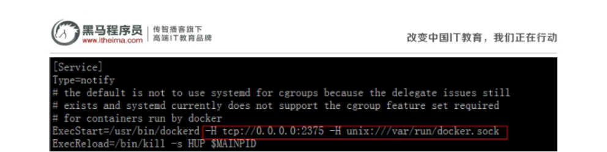

学习目标：

- 掌握DockerMaven插件的使用

- 掌握持续集成工具Jenkins的安装与使用

- 掌握容器管理工具Rancher的安装与使用

- 掌握时间序列数据库influxDB的安装与使用

- 掌握容器监控工具cAdvisor的安装与使用

- 掌握图表工具Grafana的使用

# **1** DockerMave插 件

微服务部署有两种方法：

（1）手动部署：首先基于源码打包生成jar包（或war包）,将jar包（或war包）上传至虚 拟机并拷贝至JDK容器。

（2）通过Maven插件自动部署。

对于数量众多的微服务，手动部署无疑是非常麻烦的做法，并且容易出错。所以我们这 里学习如何自动部署，这也是企业实际开发中经常使用的方法。

Maven插件自动部署步骤：

（1）修改宿主机的docker配置，让其可以远程访问 

```
vi /lib/systemd/system/docker.service
```

其中ExecStart=后添加配置 

```
‐H tcp://0.0.0.0:2375 ‐H unix:///var/run/docker.sock 
```

修改后如下：



（2）刷新配置，重启服务

```
systemctl daemon‐reload 
systemctl restart docker 
docker start registry
```


```
ExecStart=/usr/bin/dockerd -H tcp://0.0.0.0:2375 -H unix:///var/run/docker.sock
```

（3）在工程pom.xml 增加配置

```xml
<build>
<finalName>app</finalName>
<plugins>
    <plugin>
        <groupId>org.springframework.boot</groupId>
        <artifactId>spring‐boot‐maven‐plugin</artifactId> 
    </plugin>
    <!‐‐docker的maven插件，官网：
    https://github.com/spotify/docker‐maven‐plugin ‐‐>
    <plugin>
        <groupId>com.spotify</groupId>
        <artifactId>docker‐maven‐plugin</artifactId> 
        <version>0.4.13</version>
        <configuration>
            <imageName>192.168.184.141:5000/${project.artifactId}:${project.version}
            </imageName>
            <baseImage>jdk1.8</baseImage>
            <entryPoint>["java","‐jar",
                "/${project.build.finalName}.jar"]</entryPoint>
            <resources>
                <resource>
                    <targetPath>/</targetPath>
                    <directory>${project.build.directory}
                    </directory>
                    <include>${project.build.finalName}.jar</include>
                </resource>
            </resources>
            <dockerHost>http://192.168.184.141:2375</dockerHost>
        </configuration>
    </plugin>
</plugins>
</build>
```

以上配置会自动生成Dockerfile

```
FROM jdk1.8
ADD app.jar /
ENTRYPOINT ["java","‐jar","/app.jar"]
```

（5）在windows的命令提示符下，进入工程tensquare_parent所在的目录

```
mvn install
```

进入tensquare_base 所在的目录，输入以下命令，进行打包和上传镜像

```
mvn docker:build  ‐DpushImage
```

执行后，会有如下输出，代码正在上传

（6）进入宿主机 , 查看镜像

```
docker images
```

```
REPOSITORY TAG IMAGE ID
CREATED SIZE
192.168.184.135:5000/tensquare_base 1.0‐SNAPSHOT 83efa6b4478c
10 minutes ago 687.9 MB
192.168.184.135:5000/jdk1.8 latest 507438a0158f
6 hours ago 584 MB
jdk1.8 latest 507438a0158f
6 hours ago 584 MB
```

输出如上内容，表示微服务已经做成镜像

```
{"repositories":["tensquare_base"]}
```

浏览器访问 http://192.168.184.141:5000/v2/_catalog[ ](http://192.168.184.141:5000/v2/_catalog)，输出

```
{"repositories":["tensquare_base"]}
```

（7） 启动容器：

```
docker run ‐di ‐‐name=base ‐p 9001:9001
192.168.184.141:5000/tensquare_base:1.0‐SNAPSHOT 
```


# 2 持 续 集 成 工 具 -Jenkins

## 2.1 什 么 是 持 续 集 成

​		持续集成 Continuous integration ，简称CI

​		随着软件开发复杂度的不断提高，团队开发成员间如何更好地协同工作以确保软件开发的质量已经慢慢成为开发过程中不可回避的问题。尤其是近些年来，敏捷（Agile） 在软件工程领域越来越红火，如何能再不断变化的需求中快速适应和保证软件的质量也 显得尤其的重要。

​		持续集成正是针对这一类问题的一种软件开发实践。它倡导团队开发成员必须经常集成他们的工作，甚至每天都可能发生多次集成。而每次的集成都是通过自动化的构建 来验证，包括自动编译、发布和测试，从而尽快地发现集成错误，让团队能够更快的开 发内聚的软件。

持续集成具有的特点：

- 它是一个自动化的周期性的集成测试过程，从检出代码、编译构建、运行测试、结果 记录、测试统计等都是自动完成的，无需人工干预；
- 需要有专门的集成服务器来执行集成构建；
- 需要有代码托管工具支持，我们下一小节将介绍Git以及可视化界面Gogs的使用 持续集成的作用：
- 保证团队开发人员提交代码的质量，减轻了软件发布时的压力；
- 持续集成中的任何一个环节都是自动完成的，无需太多的人工干预，有利于减少重复 过程以节省时间、费用和工作量；

## 2.2 Jenkins简 介

​		Jenkins，原名Hudson，2011年改为现在的名字，它 是一个开源的实现持续集成的 软件工具。官方网站：http://jenkins-ci.org/。

 		Jenkins 能实施监控集成中存在的错误，提供详细的日志文件和提醒功能，还能用图 表的形式形象地展示项目构建的趋势和稳定性。

特点:

- 易安装：仅仅一个 java -jar jenkins.war，从官网下载该文件后，直接运行，无需额 外的安装，更无需安装数据库；
- 易配置：提供友好的GUI配置界面；
- 变更支持：Jenkins能从代码仓库（Subversion/CVS）中获取并产生代码更新列表并 输出到编译输出信息中；
- 支持永久链接：用户是通过web来访问Jenkins的，而这些web页面的链接地址都是 永久链接地址，因此，你可以在各种文档中直接使用该链接；
- 集成E-Mail/RSS/IM：当完成一次集成时，可通过这些工具实时告诉你集成结果（据 我所知，构建一次集成需要花费一定时间，有了这个功能，你就可以在等待结果过程 中，干别的事情）；
- JUnit/TestNG测试报告：也就是用以图表等形式提供详细的测试报表功能；
- 支持分布式构建：Jenkins可以把集成构建等工作分发到多台计算机中完成；
- 文件指纹信息：Jenkins会保存哪次集成构建产生了哪些jars文件，哪一次集成构建使 用了哪个版本的jars文件等构建记录；
- 支持第三方插件：使得 Jenkins 变得越来越强大