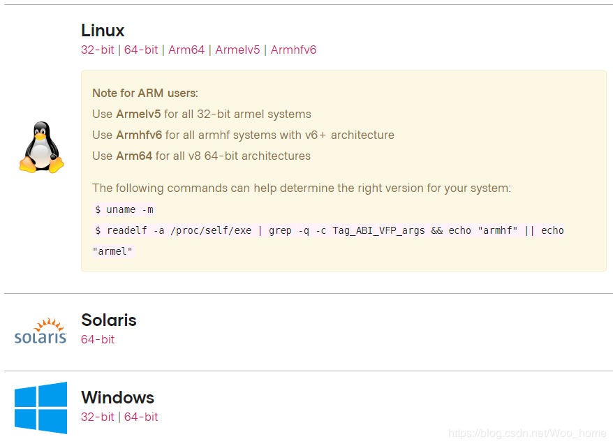
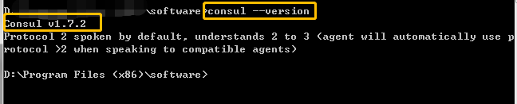
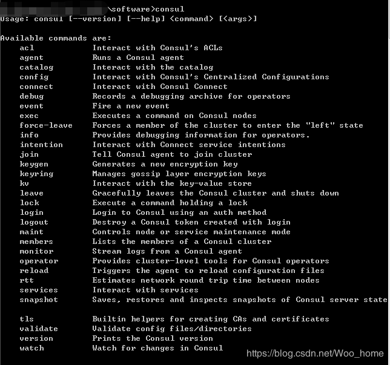
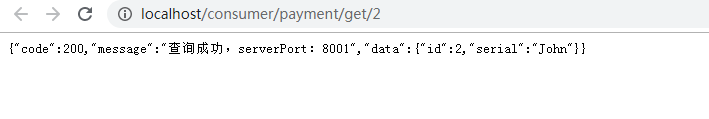
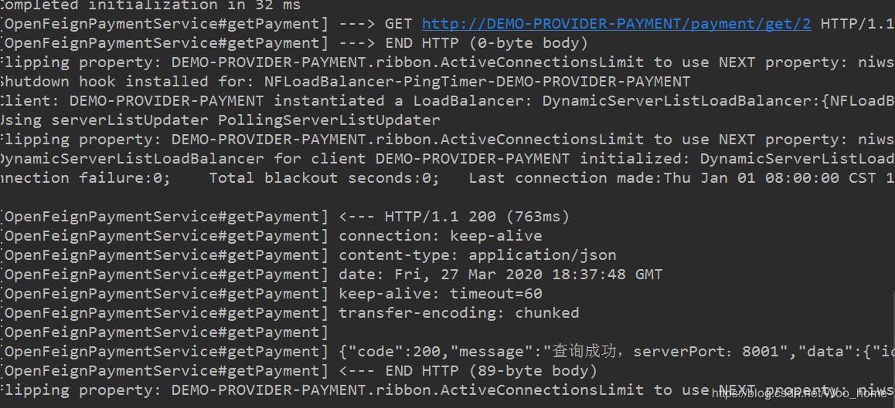

中文文档

https://www.springcloud.cc/

[原文](https://blog.csdn.net/woo_home/category_9841636.html)

# 创建

[github doc](https://github.com/Chuyongwei/Java-Spring/tree/SpringCloud)

1. 建module
2. 改pom
3. 写yml
4. 主启动
5. 业务类

# 注册中心

## 样例

### Eureka

#### 创建（包括多机）

pom

```xml
<?xml version="1.0" encoding="UTF-8"?>
<project xmlns="http://maven.apache.org/POM/4.0.0"
         xmlns:xsi="http://www.w3.org/2001/XMLSchema-instance"
         xsi:schemaLocation="http://maven.apache.org/POM/4.0.0 http://maven.apache.org/xsd/maven-4.0.0.xsd">
    <parent>
        <artifactId>cloud2020</artifactId>
        <groupId>cn.atguigu</groupId>
        <version>1.0-SNAPSHOT</version>
    </parent>
    <modelVersion>4.0.0</modelVersion>

    <artifactId>cloud-eureka-server7001</artifactId>

    <dependencies>
        <!--eureka-server-->
        <dependency>
            <groupId>org.springframework.cloud</groupId>
            <artifactId>spring-cloud-starter-netflix-eureka-server</artifactId>
        </dependency>
        <!-- 引入自己定义的api通用包，可以使用Payment支付Entity -->
        <dependency>
            <groupId>cn.atguigu</groupId>
            <artifactId>cloud-api-commons</artifactId>
            <version>${project.version}</version>
        </dependency>
        <!--boot web actuator-->
        <dependency>
            <groupId>org.springframework.boot</groupId>
            <artifactId>spring-boot-starter-web</artifactId>
        </dependency>
        <dependency>
            <groupId>org.springframework.boot</groupId>
            <artifactId>spring-boot-starter-actuator</artifactId>
        </dependency>
        <!--一般通用配置-->
        <dependency>
            <groupId>org.springframework.boot</groupId>
            <artifactId>spring-boot-devtools</artifactId>
            <scope>runtime</scope>
            <optional>true</optional>
        </dependency>
        <dependency>
            <groupId>org.projectlombok</groupId>
            <artifactId>lombok</artifactId>
        </dependency>
        <dependency>
            <groupId>org.springframework.boot</groupId>
            <artifactId>spring-boot-starter-test</artifactId>
            <scope>test</scope>
        </dependency>
        <dependency>
            <groupId>junit</groupId>
            <artifactId>junit</artifactId>
        </dependency>
    </dependencies>

</project>
```

yml

```yaml
server:
  port: 7001


eureka:
  instance:
    hostname: localhost #eureka7001  #eureka服务端的实例名称 
  client:
    register-with-eureka: false     #false表示不向注册中心注册自己。
    fetch-registry: false     #false表示自己端就是注册中心，我的职责就是维护服务实例，并不需要去检索服务
    service-url:
      #集群指向其它eureka
      #defaultZone: http://eureka7002.com:7002/eureka/
      #单机就是7001自己
      defaultZone: http://eureka7001.com:7001/eureka/
    #server:
    #关闭自我保护机制，保证不可用服务被及时踢除
    #enable-self-preservation: false
    #eviction-interval-timer-in-ms: 2000
```

启动类

```java
@SpringBootApplication
@EnableEurekaServer
public class EurekaMain7001 {

    public static void main(String[] args) {
        SpringApplication.run(EurekaMain7001.class,args);
    }
}
```


#### 将消费者和生产者加入eureka


pom

```xml
        <!--eureka-client-->
        <dependency>
            <groupId>org.springframework.cloud</groupId>
            <artifactId>spring-cloud-starter-netflix-eureka-client</artifactId>
        </dependency>
```

yaml

```yaml
eureka:
  client:
    #表示是否将自己注册进EurekaServer默认为true。
    register-with-eureka: true
    #是否从EurekaServer抓取已有的注册信息，默认为true。单节点无所谓，集群必须设置为true才能配合ribbon使用负载均衡
    fetchRegistry: true
    service-url:
      #单机版
      defaultZone: http://localhost:7001/eureka
      # 集群版
      #defaultZone: http://eureka7001.com:7001/eureka,http://eureka7002.com:7002/eureka
  instance:
    instance-id: payment8001
    #访问路径可以显示IP地址
    prefer-ip-address: true
    #Eureka客户端向服务端发送心跳的时间间隔，单位为秒(默认是30秒)
    #lease-renewal-interval-in-seconds: 1
    #Eureka服务端在收到最后一次心跳后等待时间上限，单位为秒(默认是90秒)，超时将剔除服务
    #lease-expiration-duration-in-seconds: 2
```

java启动

```java
@SpringBootApplication
@EnableEurekaClient
public class PaymentMain8001 {
    public static void main(String[] args) {
        SpringApplication.run(PaymentMain8001.class,args);
    }
}
```


#### 多生产者运行

1. 消费者访问接口

   ```java
   public static final String PAYMENT_URL="http://CLOUD-PAYMENT-SERVICE";//eureka的生产者名字
   ```

2. 消费者配置类加上`LoadBalanced`访问eureka接口

   ```java
   @Configuration
   public class ApplicationContextConfig {
       @Bean
       @LoadBalanced
       public RestTemplate getRestTemplate(){
           return new RestTemplate();
       }
   }
   ```


访问地址

```java
@GetMapping(value = "/payment/discovery")
public Object  discovery(){
    List<String> services = discoveryClient.getServices();
    for (String element:services){
        log.info("*****element:"+element);
    }
    List<ServiceInstance> instances = discoveryClient.getInstances("CLOUD-PAYMENT-SERVICE");
    for (ServiceInstance instance:instances){
        log.info(instance.getServiceId()+"\t"+instance.getPort()+"\t"+instance.getUri());
    }
    return this.discoveryClient;
}
```

启动类加入`EnableDiscoveryClient`

```java
@SpringBootApplication
@EnableDiscoveryClient
@EnableEurekaClient
public class PaymentMain8002 {
    public static void main(String[] args) {
        SpringApplication.run(PaymentMain8002.class,args);
    }
}
```


#### 自我保护机制

> 当端口不见的时候，不会了立刻删除

关闭自我保护

eureka.yaml

```yaml
server:
  port: 7002

eureka:
  instance:
    hostname: eureka7002.com
  client:
    register-with-eureka: false     #false表示不向注册中心注册自己。
  fetch-registry: false     #false表示自己端就是注册中心，我的职责就是维护服务实例，并不需要去检索服务
  service-url:
      defaultZone: http://eureka7001.com:7001/eureka/
    server:
      #关闭自我保护机制，保证不可用服务被及时踢除
      enable-self-preservation: false
      eviction-interval-timer-in-ms: 2000
```

### zookeeper


## consul

[consul](https://www.consul.io/)

### Consul 是什么？

Consul 是一套开源的分布式服务发现和配置管理系统，由 HashiCorp 公司 用 Go 语言开发

Consul 提供了微服务系统中的服务治理、配置中心、控制总线等功能。这些功能中的每一个都可以根据需要单独使用，也可以一起使用以构建全方位的服务网格，总之 Consul 提供了一种完整的服务网格解决方案

它具有很多优点。包括：基于 raft 协议，比较简洁；支持健康检查，同时支持 HTTP 和 DNS 协议支持跨数据中心的 WAN 集群提供图形界面跨平台，支持 Linux、Mac、Windows

### SpringCloud Consul 具有如下特性

- 服务注册与发现（主要功能，提供 HTTP 和 DNS 两种发现方式）
- 健康检查（支持多种方式，HTTP、TCP、Docker、Shell 脚本定制化）
- 键值对的存储（Key、Value 的存储方式）
- 安全加固
- 多数据中心（Consul 支持多数据中心）
- 可视化 Web 界面

### Consul 的下载安装

[Consul 的下载地址 https://www.consul.io/downloads.html](https://www.consul.io/downloads.html) ，根据版本下载即可，这里下载的是 Windows 版本的

下载之后解压就一个 exe 可执行文件

查看版本，用 cmd 打开，输入 **consul --version** 即可:

输入 consul 还可以查看所有参数


### 启动 Consul

输入以下命令启动 Consul

```java
consul agent -dev
1
```


#### 访问页面

启动 Consul 之后在浏览器输入 http://localhost:8500/ 即可访问 Consul 的控制界面

这样 Consul 的下载安装并且运行成功了

### 新建 Module（8006）


#### 添加依赖

```xml
<dependencies>
    <!--SpringCloud consul-server -->
    <dependency>
        <groupId>org.springframework.cloud</groupId>
        <artifactId>spring-cloud-starter-consul-discovery</artifactId>
    </dependency>
    <!-- SpringBoot整合Web组件 -->
    <dependency>
        <groupId>org.springframework.boot</groupId>
        <artifactId>spring-boot-starter-web</artifactId>
    </dependency>
    <dependency>
        <groupId>org.springframework.boot</groupId>
        <artifactId>spring-boot-starter-actuator</artifactId>
    </dependency>
    <!--日常通用jar包配置-->
    <dependency>
        <groupId>org.springframework.boot</groupId>
        <artifactId>spring-boot-devtools</artifactId>
        <scope>runtime</scope>
        <optional>true</optional>
    </dependency>
    <dependency>
        <groupId>org.projectlombok</groupId>
        <artifactId>lombok</artifactId>
        <optional>true</optional>
    </dependency>
    <dependency>
        <groupId>org.springframework.boot</groupId>
        <artifactId>spring-boot-starter-test</artifactId>
        <scope>test</scope>
    </dependency>
    <dependency>
        <groupId>cn.hutool</groupId>
        <artifactId>hutool-all</artifactId>
        <version>RELEASE</version>
        <scope>test</scope>
    </dependency>
    <dependency>
        <groupId>cn.hutool</groupId>
        <artifactId>hutool-all</artifactId>
        <version>RELEASE</version>
        <scope>test</scope>
    </dependency>
</dependencies>
123456789101112131415161718192021222324252627282930313233343536373839404142434445
```

#### 编写 application.yml

```yml
server:
  port: 8006

spring:
  application:
    name: consul-provider-payment
  # consul 注册中心地址
  cloud:
    consul:
      host: localhost
      port: 8500 # consul 的端口号
      discovery:
        # hostname：127.0.0.1
        service-name: ${spring.application.name}
1234567891011121314
```

#### 启动类

```java
package com.java.springcloud;

import org.springframework.boot.SpringApplication;
import org.springframework.boot.autoconfigure.SpringBootApplication;
import org.springframework.cloud.client.discovery.EnableDiscoveryClient;

/**
 * @author Woo_home
 * @create 2020/3/26 16:02
 */

@SpringBootApplication
@EnableDiscoveryClient
public class ConsulPaymentMain {
    public static void main(String[] args){
        SpringApplication.run(ConsulPaymentMain.class,args);
    }
}
123456789101112131415161718
```

#### 编写 Controller

```java
package com.java.springcloud.controller;

import lombok.extern.slf4j.Slf4j;
import org.springframework.beans.factory.annotation.Value;
import org.springframework.web.bind.annotation.RequestMapping;
import org.springframework.web.bind.annotation.RestController;
import java.util.UUID;

/**
 * @author Woo_home
 * @create 2020/3/26 16:03
 */

@RestController
@Slf4j
public class PaymentController {

    @Value("${server.port}")
    private String serverPort;

    @RequestMapping(value = "/payment/consul")
    public String paymentConsul() {
        return "SpringCloud with Consul : " + serverPort + "\t" + UUID.randomUUID().toString();
    }
}
12345678910111213141516171819202122232425
```

#### 测试

8006 访问 OK

而且 8006 也成功注册到 Consul


### 新建 Module（80）

新建的步骤跟上面一样

#### 添加依赖

```xml
<dependencies>
    <!--SpringCloud consul-server -->
    <dependency>
        <groupId>org.springframework.cloud</groupId>
        <artifactId>spring-cloud-starter-consul-discovery</artifactId>
    </dependency>
    <!-- SpringBoot整合Web组件 -->
    <dependency>
        <groupId>org.springframework.boot</groupId>
        <artifactId>spring-boot-starter-web</artifactId>
    </dependency>
    <dependency>
        <groupId>org.springframework.boot</groupId>
        <artifactId>spring-boot-starter-actuator</artifactId>
    </dependency>
    <!--日常通用jar包配置-->
    <dependency>
        <groupId>org.springframework.boot</groupId>
        <artifactId>spring-boot-devtools</artifactId>
        <scope>runtime</scope>
        <optional>true</optional>
    </dependency>
    <dependency>
        <groupId>org.projectlombok</groupId>
        <artifactId>lombok</artifactId>
        <optional>true</optional>
    </dependency>
    <dependency>
        <groupId>org.springframework.boot</groupId>
        <artifactId>spring-boot-starter-test</artifactId>
        <scope>test</scope>
    </dependency>
</dependencies>
123456789101112131415161718192021222324252627282930313233
```

#### 编写 application.yml 文件

```yml
server:
  port: 80

spring:
  application:
    name: consul-consumer-order
  # consul 注册中心地址
  cloud:
    consul:
      host: localhost
      port: 8500 # consul 的端口号
      discovery:
        # hostname：127.0.0.1
        service-name: ${spring.application.name}
1234567891011121314
```

#### 编写启动类

```java
package com.java.springcloud;

import org.springframework.boot.SpringApplication;
import org.springframework.boot.autoconfigure.SpringBootApplication;
import org.springframework.cloud.client.discovery.EnableDiscoveryClient;

/**
 * @author Woo_home
 * @create 2020/3/26 16:14
 */

@SpringBootApplication
@EnableDiscoveryClient
public class OrderConsulMain80 {
    public static void main(String[] args){
        SpringApplication.run(OrderConsulMain80.class,args);
    }
}
123456789101112131415161718
```

#### 配置 Bean

这个配置类其实就加了个 @LoadBalance 实现负载均衡的能力

```java
package com.java.springcloud.config;

import org.springframework.cloud.client.loadbalancer.LoadBalanced;
import org.springframework.context.annotation.Bean;
import org.springframework.context.annotation.Configuration;
import org.springframework.web.client.RestTemplate;

/**
 * @author Woo_home
 * @create 2020/3/26 16:15
 */

@Configuration
public class ApplicationContextConfig {

    @Bean
    @LoadBalanced
    public RestTemplate getResTemplate() {
        return new RestTemplate();
    }
}
123456789101112131415161718192021
```

#### 编写 Controller

```java
package com.java.springcloud.controller;

import lombok.extern.slf4j.Slf4j;
import org.springframework.web.bind.annotation.GetMapping;
import org.springframework.web.bind.annotation.RestController;
import org.springframework.web.client.RestTemplate;

import javax.annotation.Resource;

/**
 * @author Woo_home
 * @create 2020/3/26 16:17
 */

@RestController
@Slf4j
public class OrderConsulController {

	// 这里调的是 consul 界面提供者的实例名称
    private static final String INVOCE_URL = "http://consul-provider-payment";

    @Resource
    private RestTemplate restTemplate;

    @GetMapping(value = "consumer/payment/consul")
    public String paymentInfo() {
        String result = restTemplate.getForObject(INVOCE_URL + "/payment/consul", String.class);
        return result;
    }
}
123456789101112131415161718192021222324252627282930
```

#### 测试

访问 http://localhost:8500/ui/dc1/services 可以发现已经注册到 Consul 控制界面

可以正常访问 http://localhost:8006/payment/consul

也可以正常访问 http://localhost/consumer/payment/consul

在 Consul 的控制台可以看到一直在检测服务的状态


## Eureka 自我保护机制

### 概述

    保护模式主要用于一组客户端和 Eureka Server 之间存在网络分区场景下的保护。一旦进入保护模式，Eureka Server 将会尝试保护其服务注册表中的信息，不再删除服务注册表中的数据，也就是不会注销任何微服务

如果在 Eureka Server 的首页看到以下这段提示，则说明 Eureka 进入了保护模式：

> **EMERGENCY! EUREKA MAY BE INCORRECTLY CLAIMING INSTANCES ARE UP WHEN THEY’RE NOT. RENEWALS ARE LESSER THAN THRESHOLD AND HENCE THE INSTANCES ARE NOT BEING EXPIRED JUST TO BE SAFE.**


    简单地说就是某时刻某一个微服务不可用了，Eureka 不会立刻清理，依旧会对该服务的信息进行保存，属于 CAP 里面的 AP 分支

### 为什么会产生 Eureka 自我保护机制？

    为了防止 EurekaClient 可以正常运行，但是与 EurekaServer 网络不通的情况下，EurekaServer 不会立刻 将 EurekaClient 服务剔除

### 什么是自我保护模式？

    默认情况下，如果 EurekaServer 在一定时间内没有接收到某个微服务实例的心跳，EurekaServer 将会注销该实例（默认 90 s）。但是当网络分区故障发生（延时、卡顿、拥挤时）时，微服务与 EurekaServer 之间无法正常通信，以上行为可能变得非常危险了 —— 因为微服务本身其实是健康的，此时本不应该注销这个微服务。Eureka 通过 “**自我保护模式**” 来解决这个问题 —— 当 EurekaServer 节点在短时间内丢失过多客户端时（可能发生了网络分区故障），那么这个节点就会进入自我保护模式


    自我保护机制：默认情况下 EurekaClient 定时向 EurekaServer 端发送心跳包，如果 Eureka 在 Server 端在一定时间内（默认 90 s）没有收到 EurekaClient 发送的心跳包，便会直接从服务注册列表中删除该服务，但是在短时间（90 s 中）内丢失了大量的服务实例心跳，这时候 EurekaServer 会开启自启保护机制，不会剔除该服务（该现象可能出现在如果网络不通但是 EurekaClient 为出现宕机，此时如果换做别的注册中心如果一定时间内没有收到心跳会将剔除该服务，这样就出现了严重的失误，因为客户端还能正常发送心跳，只是网络延迟问题，而保护机制是为了解决此问题而产生的）

在自我保护模式中，Eureka Server 会保护服务注册表中的信息，不在注销任何服务实例

它的设计哲学就是宁可保留错误的服务注册信息，也不盲目注销任何可能健康的服务实例

    综上所述，自我保护模式是一种应对网络异常的安全保护措施。它的架构哲学是宁可同时保留所有微服务（健康的微服务和不健康的微服务都会保留）也不盲目注销任何健康的微服务。使用自我保护模式，可以让 Eureka 集群更加的健壮、稳定

### 怎么禁止自我保护

```yml
eureka:
  server:
    # 关闭自我保护机制，保证不可用服务被及时剔除
    enable-self-preservation: false
```

## 三个注册中心的异同点


| 组件名    | 语言 | CAP  | 服务健康检查 | 对外暴露接口 | SpringCloud 集成 |
| --------- | ---- | ---- | ------------ | ------------ | ---------------- |
| Eureka    | Java | AP   | 可配支持     | HTTP         | 支持             |
| Consul    | Go   | CP   | 支持         | HTTP/DNS     | 支持             |
| Zookeeper | Java | CP   | 支持         | 客户端       | 支持             |

另外，Eureka 和 Consul 都是有界面的，而 Zookeeper 没有

1. #### 什么是 CAP？

   - C：Consistency（强一致性）
   - A：Availability（可用性）
   - P：Partition tolerance（分区容错性）

   最多只能同时较好的满足两个

   CAP 理论的核心是：一个分布式系统不可能同时很好的满足一致性、可用性、分区容错性这三个需求，因此，根据 CAP 原理将 NoSQL 数据库分成了满足 CA 原则、满足 CP 原则和满足 AP 原则三大类：

   - CA：单点集群，满足一致性，可用性的系统，通常在可扩展性上不太强大
   - CP：满足一致性，分区容忍性的系统，通常性能不是特别高
   - AP：满足可用性，分区容忍性的系统，通常可能对一致性要求低一些

   CAP 理论关注粒度是数据，而不是整个系统设计的策略

   ------

2. #### AP 架构

   当网络分区出现后，为了保证可用性，系统 B 可以返回旧值，保证系统的可用性

   结论：违背了一致性 C 的要求，只满足可用性和分区容错，即 AP

   

   #### 

3. #### CP 架构

   当网络分区出现后，为了保证一致性，就必须拒接请求，否则无法保证一致性

   结论：违背了可用性 A 的要求，只满足一致性和分区容错，即 AP
   
   


# Ribbon

[文档](http://netflix.github.io/ribbon/ribbon-core-javadoc/index.html)

## 什么是 Ribbon？

SpringCloud Ribbon 是基于 Netflix Ribbon 实现的一套 客户端负载均衡的工具

    简单地说，Ribbon 是 Netflix 发布的开源项目，主要功能是提供 客户端软件负载均衡算法和服务调用。Ribbon 客户端组件提供一系列完善的配置项，如连接超时、重试等等。

    简单地说，就是在配置文件中列出 Load Balance（简称 LB）后面所有的机器，Ribbon 会自动的帮助你基于某种规则（如简单轮询，随机连接等）去连接这些机器。我们很容易使用 Ribbon 实现自定义的负载均衡算法

## Ribbon 能干什么？

### 负载均衡（LB）

**什么是负载均衡？
**
简单地说就是将用户的请求平摊的分配到多个服务上，从而达到系统的 HA（高可用）
常见的负载均衡软件有有 Nginx，LVS，硬件 F5 等

**Ribbon 本地负载均衡客户端 VS Nginx 服务端负载均衡的区别
**

Nginx 是服务器负载均衡，客户端所有请求都会交给 Nginx，然后由 Nginx 实现转发请求。即负载均衡是由服务器端实现的

Ribbon 本地负载均衡，在调用微服务接口的时候，会在注册中心上获取注册信息服务列表之后缓存到 JVM 本地，从而在本地实现 RPC 远程服务调用技术

### 集中式 LB

即在服务的消费方和提供方之间使用独立的 LB 设施（可以是硬件，如 F5，也可以是软件，如 Nginx），由该设施负责把访问请求通过某种策略转发至服务的提供方

### 进程内 LB

将 LB 逻辑集成到消费方，消费方从服务注册中心获取有哪些地址可以用，然后自己再从这些地址中选择出一个合适的服务器

**Ribbon 就属于进程内 LB**，它只是一个类库，集成与消费方进程，消费方通过它来获取到服务提供方的地址

------

简单地说 Ribbon == 负载均衡 + RESTTemplate 调用

### 总结：

Ribbon 其实就是一个软负载均衡的客户端组件，它可以和其它所需请求的客户端结合使用，和 Eureka 结合只是其中的一个实例

## Ribbon 的负载均衡和 REST 调用


Ribbon 在工作时分成两步：

- 第一步先选择 EurekaServer，它优先选择在同一个区域内负载较少的 Server
- 第二步在根据用户指定的策略，再从 Server 取到的服务注册列表中选择一个地址

其中 Ribbon 提供了多种策略：比如轮询、随机和根据响应事件加权

### 添加依赖

在前面的文章中其实已经简单地探讨过 Ribbon 的负载均衡，https://blog.csdn.net/Woo_home/article/details/105093023

```xml
<dependencies>
   <!--包含了sleuth+zipkin-->
    <dependency>
        <groupId>org.springframework.cloud</groupId>
        <artifactId>spring-cloud-starter-zipkin</artifactId>
    </dependency>
    <dependency>
        <groupId>org.springframework.cloud</groupId>
        <artifactId>spring-cloud-starter-netflix-eureka-client</artifactId>
    </dependency>
    <dependency>
        <groupId>org.springframework.boot</groupId>
        <artifactId>spring-boot-starter-web</artifactId>
    </dependency>
    <dependency>
        <groupId>org.springframework.boot</groupId>
        <artifactId>spring-boot-devtools</artifactId>
        <scope>runtime</scope>
        <optional>true</optional>
    </dependency>
    <dependency>
        <groupId>org.springframework.boot</groupId>
        <artifactId>spring-boot-starter-actuator</artifactId>
    </dependency>
    <dependency>
        <groupId>org.projectlombok</groupId>
        <artifactId>lombok</artifactId>
        <optional>true</optional>
    </dependency>
    <dependency>
        <groupId>org.springframework.boot</groupId>
        <artifactId>spring-boot-starter-test</artifactId>
        <scope>test</scope>
    </dependency>
</dependencies>
1234567891011121314151617181920212223242526272829303132333435
```

细心的朋友会发现，这里并没有引入 Ribbon 的依赖，那怎么使用负载均衡呢？

其实 spring-cloud-starter-netflix-eureka-client （在新版本中）自带了 spring-cloud-starter-ribbon 引用，可以打开 Maven 看下：

如果想直接添加 Ribbon 依赖的也可以，Ribbon 的依赖如下（别搞得 jar 冲突了）：

```xml
<dependency>
    <groupId>org.springframework.cloud</groupId>
    <artifactId>spring-cloud-starter-netflix-ribbon</artifactId>
</dependency>
1234
```

### RestTemplate 的使用

#### getForObject 和 getForEntity 方法

**getForObject 返回对象为响应体中数据转化成的对象，基本上可以立即为 JSON**

**getForEntity 返回对象为 ResponseEntity 对象，包含了响应中的一些重要信息，比如响应头、响应状态码、响应体等**

```java
@GetMapping("/consumer/payment/getForEntity/{id}")
public CommonResult<Payment> getPayment2(@PathVariable("id") Long id) {
    ResponseEntity<CommonResult> forEntity = restTemplate.getForEntity(PAYMENT_URL + "/payment/get/" + id, CommonResult.class);
    if (forEntity.getStatusCode().is2xxSuccessful()) {
        return forEntity.getBody();
    } else {
        return new CommonResult<>(404,"操作失败");
    }
}
123456789
```


#### postForObject 和 postForEntity 方法


```java
@GetMapping("/consumer/payment/create")
public CommonResult<Payment> create2(Payment payment) {
    return restTemplate.postForEntity(PAYMENT_URL + "/payment/create", payment, CommonResult.class).getBody();
}
1234
```


## Ribbon 核心组件 IRule

### IRule

IRule 是一个接口，根据特定算法中从服务列表中选取一个要访问的服务，看下 IRule 的一些实现类


- com.netflix.loadbalancer.RoundRobinRule：轮询
- com.netflix.loadbalancer.RandomRule：随机
- com.netflix.loadbalancer.RetryRule：先按照 RoundRobinRule 的策略获取服务，如果获取服务失败则在指定的时间内会进行重试，获取可用的服务
- WeightedResponseTimeRule：对 RoundRobinRule 的扩展，响应速度越快的实例选择权重越大，越容易被选择
- BestAvailableRule：会先过滤掉由于多次访问故障而处于断路器跳闸状态的服务，然后选择一个并发量最小的服务
- AvailabilityFilteringRule：会先过滤掉故障实例，再选择并发较小的实例
- ZoneAvoiddanceRule：默认规则，复合判断 server 所在区域的性能和 server 的可用性选择服务器

### 如何替换负载规则？

#### 注意：

**在自定义配置类的时候不能放在 @ComponentScan 所扫描的当前包下以及子包下，否则我们自定义的这个配置类就会被所有的 Ribbon 客户端所共享，这样达不到特殊化定制的目的了**

这话什么意思呢？因为 @SpringBootApplication 注解包含了 @ComponentScan 这个注解

简单地说，就是我们自定义的配置类不能放在与 启动类同一子包下


##### 新建规则类

```java
package com.ruleconfig.myrule;

import com.netflix.loadbalancer.IRule;
import com.netflix.loadbalancer.RandomRule;
import org.springframework.context.annotation.Bean;
import org.springframework.context.annotation.Configuration;

/**
 * @author Woo_home
 * @create 2020/3/27 11:11
 */

@Configuration
public class MySelfRule {

    @Bean
    public IRule myRule() {
        // 返回随机
        return new RandomRule();
    }
}
123456789101112131415161718192021
```

##### 修改启动类

```java
package com.java.springcloud;

import com.ruleconfig.myrule.MySelfRule;
import org.springframework.boot.SpringApplication;
import org.springframework.boot.autoconfigure.SpringBootApplication;
import org.springframework.cloud.netflix.eureka.EnableEurekaClient;
import org.springframework.cloud.netflix.ribbon.RibbonClient;

/**
 * @author Woo_home
 * @create 2020/3/24 14:09
 */

@SpringBootApplication
@EnableEurekaClient
// name 是服务提供者的实例名称
@RibbonClient(name = "DEMO-PROVIDER-PAYMENT",configuration = MySelfRule.class)
public class OrderMain80 {
    public static void main(String[] args){
        SpringApplication.run(OrderMain80.class,args);
    }
}
12345678910111213141516171819202122
```

##### 访问页面

下面是连续刷新页面返回的结果，可以发现端口号并不是默认的轮询了


## Ribbon 负载均衡原理

负载均衡算法：REST 接口第几次请求数 % 服务器集群总数量 = 实际调用服务器位置下标，每次服务启动后 REST 接口计数从 1 开始

```java
List<ServiceInstance> instances = discoveryClient.getInstances("DEMO-PROVIDER-PAYMENT");
1
```

如：
List[0] instances = 127.0.0.1:8001
List[1] instances = 127.0.0.1:8002

1 % 2 = 1 ——》index = 1 list.get(index)
2 % 2 = 0 ——》index = 0 list.get(index)
3 % 2 = 1 ——》index = 1 list.get(index)
4 % 2 = 0 ——》index = 0 list.get(index)
5 % 2 = 1 ——》index = 1 list.get(index)

8001 + 8002 组合成为集群，共计两台机器，集群总数为 2，按照轮询算法原理：

当总请求数为 1 时：1 % 2 = 1 对应下标位置为 1，则获得服务地址为 127.0.0.1:8002
当总请求数为 1 时：2 % 2 = 0 对应下标位置为 0，则获得服务地址为 127.0.0.1:8001
当总请求数为 1 时：3 % 2 = 1 对应下标位置为 1，则获得服务地址为 127.0.0.1:8002
当总请求数为 1 时：4 % 2 = 0 对应下标位置为 0，则获得服务地址为 127.0.0.1:8001
当总请求数为 1 时：5 % 2 = 1 对应下标位置为 1，则获得服务地址为 127.0.0.1:8002

以此类推…

## Ribbon 源码分析

先来看下 IRule 的 UML 图

下面是 IRule 的接口源码


```java
public interface IRule {
    Server choose(Object key);

    void setLoadBalancer(ILoadBalancer lb);

    ILoadBalancer getLoadBalancer();
}

```


IRule 的实现类


### RoundRobinRule

来看下默认的轮询算法源码 RoundRobinRule.java

可以发现 RoundRobinRule 类中定义了一个 AtomicInteger， 并初始化为 0

再来看下 RoundRobinRule 实现 IRule 的 choose 方法

```java
public Server choose(ILoadBalancer lb, Object key) {
	// 如果 lb 等于 null，也就是说没有负载均衡
    if (lb == null) {
        log.warn("no load balancer");
        // 返回 null
        return null;
    }

    Server server = null;
    int count = 0;
    // 如果服务器为 null 并且 count++ < 10
    while (server == null && count++ < 10) {
    	// 获取可达（健康的）的机器（服务器）
        List<Server> reachableServers = lb.getReachableServers();
        // 获取所有机器
        List<Server> allServers = lb.getAllServers();
        // 获取健康服务的数量
        int upCount = reachableServers.size();
        // 获取所有服务的数量，这里也就是上面所说的获取集群总数量如 8001 + 8002 两台机器
        int serverCount = allServers.size();

		// 一般只要有服务启动成功，通常不会执行这个 if
        if ((upCount == 0) || (serverCount == 0)) {
            log.warn("No up servers available from load balancer: " + lb);
            return null;
        }

		// 这里得到的值为 1，为什么是 1，下面会讲到
        int nextServerIndex = incrementAndGetModulo(serverCount);
        // 获取下一个服务下标，如 0、1、0、1
        server = allServers.get(nextServerIndex);

        if (server == null) {
            /* Transient. */
            Thread.yield();
            continue;
        }

        if (server.isAlive() && (server.isReadyToServe())) {
            return (server);
        }

        // Next.
        server = null;
    }

    if (count >= 10) {
        log.warn("No available alive servers after 10 tries from load balancer: "
                + lb);
    }
    // 返回下标对应的服务
    return server;
}
1234567891011121314151617181920212223242526272829303132333435363738394041424344454647484950515253
```

### getReachableServers()

返回可访问的服务器


### getAllServers()

返回所有已知的服务器，包括可访问的和不可访问的


### incrementAndGetModulo

```java
// 根据上面的代码如果集群数量为 2，那么这里 modulo 传的就是 2
private int incrementAndGetModulo(int modulo) {
	// 以下是一个自旋锁
    for (;;) {
        // nextServerCyclicCounter 上面已经介绍过，初始值为 0，那么也就是说 current = 0
        int current = nextServerCyclicCounter.get();
        // （0 + 1）% 2 = 1，根据上面提到的负载均衡原理，这里的下标就是 1
        int next = (current + 1) % modulo;
        // 这里使用的是 CAS （比较并交换），将当前的值（current）传进去，下一次的值传进去
        // 假设 next 值没修改过的话，那么 next 值就是 1，否则开始自旋，不断比较
        if (nextServerCyclicCounter.compareAndSet(current, next))
        	// 返回 next 值
            return next;
    }
}
123456789101112131415
```

## 自定义轮询算法

先定义一个接口

```java
package com.java.springcloud.lb;

import org.springframework.cloud.client.ServiceInstance;
import java.util.List;

/**
 * @author Woo_home
 * @create 2020/3/27 13:13
 */

public interface LoadBalancer {
    ServiceInstance instances(List<ServiceInstance> serviceInstances);
}
12345678910111213
```

创建实现类

```java
package com.java.springcloud.lb;

import org.springframework.cloud.client.ServiceInstance;
import org.springframework.stereotype.Component;
import java.util.List;
import java.util.concurrent.atomic.AtomicInteger;

/**
 * @author Woo_home
 * @create 2020/3/27 13:14
 */

@Component // 一定要加上这个注解，否则无法扫描
public class MyLB implements LoadBalancer{

    private AtomicInteger atomicInteger = new AtomicInteger(0);

    public final int getAndIncrement() {
        int current;
        int next;
        do {
            current = this.atomicInteger.get();
            // 这一串数字是 Integer.MAX_VALUE 的值
            next = current >= 2147483647 ? 0 : current + 1;
        } while (!this.atomicInteger.compareAndSet(current,next)); // 这里不要忘记加上 ！，不然打印的结果出乎你的意料
        System.out.println("****** 第 " + next + " 次访问 ****** : ");
        // 返回的是第几次访问
        return next;
    }

    // 负载均衡算法：REST 接口第几次请求数 % 服务器集群总数量 = 实际调用服务器位置下标，每次服务启动后 REST 接口计数从 1 开始
    @Override
    public ServiceInstance instances(List<ServiceInstance> serviceInstances) {
        int index = getAndIncrement() % serviceInstances.size();
        return serviceInstances.get(index);
    }
}
12345678910111213141516171819202122232425262728293031323334353637
```

修改消费者端 Controller

```java
@GetMapping(value = "/consumer/payment/lb")
public String getPaymentLB() {
	// 获取服务实例
    List<ServiceInstance> instances = discoveryClient.getInstances("DEMO-PROVIDER-PAYMENT");
    if (instances == null || instances.size() <= 0) {
        return null;
    }

	// 使用自定义的轮询算法
    ServiceInstance serviceInstance = loadBalancer.instances(instances);
    URI uri = serviceInstance.getUri();

    return restTemplate.getForObject(uri + "/payment/lb",String.class);
}
1234567891011121314
```

访问页面


控制台输出


# OpenFeign

## 什么是 OpenFeign？

Feign 是一个声明式 WebService 客户端，使用 Feign 能让编写 Web Service 客户端更加简单

    它的使用方法是 定义一个服务接口然后在上面添加注解。Feign 也支持可插拔式的编码器和解码器。SpringCloud 对 Feign 进行了封装，使其支持了 SpringMVC 标准注解和 HttpMessageConverters。Feign 可以与 Eureka 和 Ribbon 组合使用以支持负载均衡

简单地说：Feign 是一个声明式的 Web 服务客户端，让编写 Web 服务客户端变得非常容易，只需创建一个接口并在接口上添加注解即可

## Feign 能干什么？

Feign 旨在使编写 Java Http 客户端变得更加容易

    在前面的文章里使用 Ribbon + RestTemplate 时 [SpringCloud —— Ribbon
](https://blog.csdn.net/Woo_home/article/details/105125602)，利用 RestTemplate 对 http 请求的封装处理，形成了一套模板化的调用方法。但是在实际开发中，由于对服务依赖的调用可能不止一处，往往一个接口会被多处调用，所以通常会针对每个微服务自行封装一些客户端类来包装这些依赖的调用。所以，Feign 在此基础上做了进一步封装，由他来帮助我们定义和实现依赖服务接口的定义。

    在 Feign 的实现下，我们 只需创建一个接口并使用注解的方式来配置它（以前是 Dao 接口上面标注 @Mapper 注解，现在是一个微服务接口上面标注一个 @Feign 注解即可），即可完成对服务提供方的接口绑定，简化了使用 SpringCloud Ribbon 时自动封装服务调用客户端的开发量

## Feign 集成了 Ribbon


    利用 Ribbon 维护了提供方的服务列表信息，并且通过轮询实现了客户端的负载均衡。而与 Ribbon 不同的是，通过 Feign 只需要定义服务绑定接口且以声明式的方法，优雅而简单的实现了服务调用

## Feign 和 OpenFeign 的区别


## 新建 Module（80）


### 编写 application.yml 文件

```yml
server:
  port: 80

eureka:
  client:
    register-with-eureka: false
    service-url:
      defualtZone: http://eureka7001.com:7001/eureka/,http://eureka7002.com/eureka/
12345678
```

### 编写启动类

```java
package com.java.springcloud;

import org.springframework.boot.SpringApplication;
import org.springframework.boot.autoconfigure.SpringBootApplication;
import org.springframework.cloud.openfeign.EnableFeignClients;

/**
 * @author Woo_home
 * @create 2020/3/27 20:48
 */

@SpringBootApplication
@EnableFeignClients
public class OrderOpenFeignMain80 {
    public static void main(String[] args){
        SpringApplication.run(OrderOpenFeignMain80.class,args);
    }
}
123456789101112131415161718
```

### 编写业务接口

```java
package com.java.springcloud.service;

import com.java.springcloud.entity.CommonResult;
import com.java.springcloud.entity.Payment;
import org.springframework.cloud.openfeign.FeignClient;
import org.springframework.stereotype.Component;
import org.springframework.web.bind.annotation.GetMapping;
import org.springframework.web.bind.annotation.PathVariable;

/**
 * @author Woo_home
 * @create 2020/3/27 20:50
 */

@Component
@FeignClient(value = "DEMO-PROVIDER-PAYMENT") // 服务实例名称
public interface OpenFeignPaymentService {

    // 跟 8001 的访问路径一致
    @GetMapping(value = "/payment/get/{id}")
    CommonResult<Payment> getPayment(@PathVariable("id") Long id);
}
12345678910111213141516171819202122
```

### 编写控制器代码

```java
package com.java.springcloud.controller;

import com.java.springcloud.entity.CommonResult;
import com.java.springcloud.entity.Payment;
import com.java.springcloud.service.OpenFeignPaymentService;
import lombok.extern.slf4j.Slf4j;
import org.springframework.web.bind.annotation.GetMapping;
import org.springframework.web.bind.annotation.PathVariable;
import org.springframework.web.bind.annotation.RestController;
import javax.annotation.Resource;

/**
 * @author Woo_home
 * @create 2020/3/27 20:56
 */

@RestController
@Slf4j
public class OpenFeignController {

    @Resource
    private OpenFeignPaymentService paymentFeignService;

    @GetMapping(value = "/consumer/payment/get/{id}")
    public CommonResult<Payment> getPaymentById(@PathVariable("id") Long id) {
    	// 使用接口调用服务
        return paymentFeignService.getPayment(id);
    }
}

123456789101112131415161718192021222324252627282930
```

### 启动服务


先后启动 8001、8002、7001、7002，最后启动新建的 OrderOpenFeignMain80

连续刷新页面


OK，可以实现轮询访问

## OpenFeign 超时控制

### 超时演示出错情况


### 服务提供方 8001 故意写暂停程序


### 服务消费方 80 添加超时方法 OpenFeignPaymentService


### 服务消费方 80 添加超时方法 OpenFeignController


### 测试


报错页面，因为 Feign 客户端只等待一秒钟，导致 Feign 客户端不想等待了，直接返回报错


### 修改 application.yml 开启 OpenFeign 客户端超时控制

为了避免这样的情况，有时候我们需要设置 Feign 客户端的超时控制，如下：

```yml
server:
  port: 80

eureka:
  client:
    register-with-eureka: false
    service-url:
      defaultZone: http://eureka7001.com:7001/eureka/,http://eureka7002.com:7002/eureka/

# 设置 feign 客户端超时时间（OpenFeign 默认支持 Ribbon）
ribbon:
  # 指的是建立连接所用的时间，适用于网络状况正常的情况下，两端连接所用的时间
  ReadTimeout: 5000
  # 指的是建立连接后从服务器读取到可用资源所用的时间
  ConnectTimeout: 5000
123456789101112131415
```

再来测试下

正常访问
在 application.yml 文件中开启配置

## OpenFeign 日志打印功能

Feign 提供了日志打印功能，我们可以通过配置来调整日志级别，从而了解 Feign 中 HTTP 请求细节

简单地说：就是 对 Feign 接口的调用情况进行监控和输出

### 日志级别

- NONE：默认的，不显示任何日志
- BASIC：仅记录请求方法、URL、响应状态码以及执行时间
- HEADERS：除了 BASIC 中定义的信息之外，还有请求和响应的头信息
- FULL：除了 HEADERS 中定义的信息之外，还有请求和响应的正文及元数据

### 配置 Bean


```java
package com.java.springcloud.config;

import feign.Logger;
import org.springframework.context.annotation.Bean;
import org.springframework.context.annotation.Configuration;

/**
 * @author Woo_home
 * @create 2020/3/28 2:06
 */

@Configuration
public class FeignConfig {

    @Bean
    Logger.Level feignLoggerLevel() {
    	// 除了 HEADERS 中定义的信息之外，还有请求和响应的正文及元数据
        return Logger.Level.FULL;
    }

}
123456789101112131415161718192021
```

### 修改 application.yml 文件

```yml
server:
  port: 80

eureka:
  client:
    register-with-eureka: false
    service-url:
      defaultZone: http://eureka7001.com:7001/eureka/,http://eureka7002.com:7002/eureka/
#设置feign客户端超时时间(OpenFeign默认支持ribbon)
ribbon:
  #指的是建立连接所用的时间，适用于网络状况正常的情况下,两端连接所用的时间
  ReadTimeout: 5000
  #指的是建立连接后从服务器读取到可用资源所用的时间
  ConnectTimeout: 5000

logging:
  level:
    # Feign 日志以什么级别监控哪个接口（这里扫描的是接口）
    com.java.springcloud.service.OpenFeignPaymentService: debug
12345678910111213141516171819
```

### 启动服务访问页面



### 控制台输出




# Hystrix 简介

[文档](https://github.com/Netflix/Hystrix/wiki/How-To-Use)

## 分布式系统面临的问题

复杂分布式体系结构中的应用程序有数十个依赖关系，每个依赖关系在某些时候将不可避免地失败

### 服务雪崩

    多个微服务之间调用的时候，假设微服务 A 调用微服务 B 和 微服务 C，微服务 B 和微服务 C 又调用其它的微服务，这就是所谓的 “扇出”。如果扇出的链路上某个微服务的调用响应时间过长或者不可用，对微服务 A 的调用就会占用越来越多的系统资源，进而引起系统崩溃，所谓的 “雪崩效应”

    对于高流量的应用来说，单一的后端依赖可能会导致所有服务器上的所有资源都在几秒钟内饱和。比失败更糟糕的是，这些应用程序还可能导致服务之间的延迟增加，备份队列，线程和其它系统资源紧张，导致整个系统发生更多的级联故障。这些都表示需要对故障和延迟进行隔离和管理，以便单个依赖关系的失败，不能取消整个应用程序或系统

    所以，通常当你发现一个模块下的某个实例失败后，这时候这个模块依然还会接收流量，然后这个有问题的模块还调用了其它的模块，这样就会发生级联故障，或者叫雪崩

## Hystrix 是什么？（概念）

    Hystrix 是一个用于处理分布式系统的 延迟 和 容错的开源库，在分布式系统里，许多依赖不可避免的会调用失败，比如超时、异常等，Hystrix 能够保证在一个依赖出问题的情况下，不会导致整体服务失败，避免级联故障，以提高分布式系统的弹性

    “断路器” 本身是一种开关装置，当某个服务单元发生故障之后，通过断路器的故障监控（类似熔断保险丝），向调用放返回一个符合预期的、可处理的备选响应（FallBack），而不是长时间的等待或者抛出调用方法处理的异常，这样就保证了服务调用方法的线程不会被长时间、不必要的占用，从而避免了故障在分布式系统中的蔓延，乃至雪崩

## Hystrix 能干什么？

### 服务降级

当服务器忙，请稍后再试，不让客户端等待并立即返回一个友好的 fallback

#### 哪些情况会触发降级？

- 程序运行异常
- 超时
- 服务熔断触发服务降级
- 线程池 / 信号量打满也会导致服务降级

### 服务熔断

类似保险丝达到最大服务访问后，直接拒绝访问，拉闸限电，然后调用服务降级的方法并返回友好的提示

服务降级 ——> 进而熔断 ——> 恢复调用链路

### 服务限流

秒杀高并发等操作，严禁一窝蜂的过来拥挤，大家排队，一秒钟 N 个，有序地进行

## Hystrix 实战

### 构建项目 8001（提供者）

新建 Module 8001

#### 添加依赖

```xml
<dependencies>
    <!--hystrix-->
    <dependency>
        <groupId>org.springframework.cloud</groupId>
        <artifactId>spring-cloud-starter-netflix-hystrix</artifactId>
    </dependency>
    <!--eureka client-->
    <dependency>
        <groupId>org.springframework.cloud</groupId>
        <artifactId>spring-cloud-starter-netflix-eureka-client</artifactId>
    </dependency>
    <!--web-->
    <dependency>
        <groupId>org.springframework.boot</groupId>
        <artifactId>spring-boot-starter-web</artifactId>
    </dependency>
    <dependency>
        <groupId>org.springframework.boot</groupId>
        <artifactId>spring-boot-starter-actuator</artifactId>
    </dependency>
    <dependency><!-- 引入自己定义的api通用包，可以使用Payment支付Entity -->
        <groupId>com.atguigu.springcloud</groupId>
        <artifactId>cloud-api-commons</artifactId>
        <version>${project.version}</version>
    </dependency>
    <dependency>
        <groupId>org.springframework.boot</groupId>
        <artifactId>spring-boot-devtools</artifactId>
        <scope>runtime</scope>
        <optional>true</optional>
    </dependency>
    <dependency>
        <groupId>org.projectlombok</groupId>
        <artifactId>lombok</artifactId>
        <optional>true</optional>
    </dependency>
    <dependency>
        <groupId>org.springframework.boot</groupId>
        <artifactId>spring-boot-starter-test</artifactId>
        <scope>test</scope>
    </dependency>
</dependencies>
123456789101112131415161718192021222324252627282930313233343536373839404142
```

#### 编写 application.yml 文件

```yml
server:
  port: 8001

spring:
  application:
    name: demo-provider-hystrix-payment

eureka:
  client:
    register-with-eureka: true
    fetch-registry: true
    service-url:
      defaultZone: http://eureka7001.com:7001/eureka/
12345678910111213
```

#### 编写 Service

```java
package com.java.springcloud.service;

import org.springframework.stereotype.Service;

import java.util.concurrent.TimeUnit;

/**
 * @author Woo_home
 * @create 2020/3/28 12:33
 */

@Service
public class PaymentService {

    /**
     * 正常访问
     * @param id
     * @return
     */
    public String paymentInfo_OK(Integer id) {
        return "线程池：" + Thread.currentThread().getName() + "paymentInfo_OK,id :" + id;
    }

    public String paymentInfo_Timeout(Integer id) {
        int timeNumber = 3;
        try {
            TimeUnit.SECONDS.sleep(timeNumber);
        } catch (InterruptedException e) {
            e.printStackTrace();
        }
        return "线程池：" + Thread.currentThread().getName() + "paymentInfo_OK,id :" + id + "\t" + "耗时 " + timeNumber + " s";
    }

}
12345678910111213141516171819202122232425262728293031323334
```

#### 编写 Controller

```java
package com.java.springcloud.Controller;

import com.java.springcloud.service.PaymentService;
import lombok.extern.slf4j.Slf4j;
import org.springframework.beans.factory.annotation.Value;
import org.springframework.web.bind.annotation.GetMapping;
import org.springframework.web.bind.annotation.PathVariable;
import org.springframework.web.bind.annotation.RestController;

import javax.annotation.Resource;

/**
 * @author Woo_home
 * @create 2020/3/28 12:39
 */

@RestController
@Slf4j
public class PaymentController {

    @Resource
    private PaymentService paymentService;

    @Value("${server.port}")
    private String serverPort;

    @GetMapping(value = "/payment/hystrix/ok/{id}")
    public String paymentInfo_OK(@PathVariable("id") Integer id) {
        String result = paymentService.paymentInfo_OK(id);
        log.info("****** result ****** " + result);
        return result;
    }

    @GetMapping(value = "/payment/hystrix/timeout/{id}")
    public String paymentInfo_Timeout(@PathVariable("id") Integer id) {
        String result = paymentService.paymentInfo_Timeout(id);
        log.info("****** result ****** " + result);
        return result;
    }
}
12345678910111213141516171819202122232425262728293031323334353637383940
```

#### 编写启动类

```java
package com.java.springcloud;

import org.springframework.boot.SpringApplication;
import org.springframework.boot.autoconfigure.SpringBootApplication;
import org.springframework.cloud.netflix.eureka.EnableEurekaClient;

/**
 * @author Woo_home
 * @create 2020/3/28 12:52
 */

@SpringBootApplication
@EnableEurekaClient
public class HystrixPaymentMain8001 {
    public static void main(String[] args){
        SpringApplication.run(HystrixPaymentMain8001.class,args);
    }
}
123456789101112131415161718
```

#### 测试

启动服务端 7001，启动客户端 8001，访问 http://eureka7001.com:7001/

成功注册到 Eureka


也能正常访问 http://localhost:8001/payment/hystrix/ok/1 和 http://localhost:8001/payment/hystrix/timeout/1


控制台输出：


# SpringCloud —— Hystrix 断路器

## 高并发测试

在进行高并发测试之前，先来看下单个请求的，可以发现，请求 http://localhost:8001/payment/hystrix/ok/1
的时候响应很快


使用 JMeter 工具模仿高并发，设置 20000 个并发去访问 8001，20000 个请求都是访问 http://localhost:8001/payment/hystrix/timeout/1

然后再去访问 http://localhost:8001/payment/hystrix/ok/1

先清空控制台

启动 JMeter 工具，设置好 200 个线程，循环 100 次，也就是 20000 次请求

启动高并发访问

在使用高并发测再去访问的时候可以发现访问 http://localhost:8001/payment/hystrix/ok/1
的时候也需要等待了

控制台输出：可右边的滚动条可以发现 timeout 确实接收到了很多的请求


### 为什么会卡死

也就是说，当一大波请求去访问 http://localhost:8001/payment/hystrix/timeout/1 的时候，http://localhost:8001/payment/hystrix/ok/1 也被拖慢了

tomcat 的默认的工作线程数被打满了（　Windows 每个进程中的线程数不允许超过 2000），没有多余的线程来分解压力和处理

上面仅仅是服务提供者 8001 自己测试，假如此时外部的消费者 80 也来访问，那么消费者只能干等，最终导致消费者 80 不满意，服务端 8001 直接崩了

### 新建 Module 80（消费者）

#### 添加依赖

```xml
<dependencies>
    <!--openfeign-->
    <dependency>
        <groupId>org.springframework.cloud</groupId>
        <artifactId>spring-cloud-starter-openfeign</artifactId>
    </dependency>
    <!--hystrix-->
    <dependency>
        <groupId>org.springframework.cloud</groupId>
        <artifactId>spring-cloud-starter-netflix-hystrix</artifactId>
    </dependency>
    <!--eureka client-->
    <dependency>
        <groupId>org.springframework.cloud</groupId>
        <artifactId>spring-cloud-starter-netflix-eureka-client</artifactId>
    </dependency>
    <!-- 引入自己定义的api通用包，可以使用Payment支付Entity -->
    <dependency>
        <groupId>com.atguigu.springcloud</groupId>
        <artifactId>cloud-api-commons</artifactId>
        <version>${project.version}</version>
    </dependency>
    <!--web-->
    <dependency>
        <groupId>org.springframework.boot</groupId>
        <artifactId>spring-boot-starter-web</artifactId>
    </dependency>
    <dependency>
        <groupId>org.springframework.boot</groupId>
        <artifactId>spring-boot-starter-actuator</artifactId>
    </dependency>
    <!--一般基础通用配置-->
    <dependency>
        <groupId>org.springframework.boot</groupId>
        <artifactId>spring-boot-devtools</artifactId>
        <scope>runtime</scope>
        <optional>true</optional>
    </dependency>
    <dependency>
        <groupId>org.projectlombok</groupId>
        <artifactId>lombok</artifactId>
        <optional>true</optional>
    </dependency>
    <dependency>
        <groupId>org.springframework.boot</groupId>
        <artifactId>spring-boot-starter-test</artifactId>
        <scope>test</scope>
    </dependency>
</dependencies>
12345678910111213141516171819202122232425262728293031323334353637383940414243444546474849
```

#### 编写 application.yml 文件

```yml
server:
  port: 80

eureka:
  client:
    register-with-eureka: false
    service-url:
      defaultZone: http://eureka7001.com:7001/eureka/
12345678
```

#### 编写启动类

```java
package com.java.springcloud;

import org.springframework.boot.SpringApplication;
import org.springframework.boot.autoconfigure.SpringBootApplication;
import org.springframework.cloud.openfeign.EnableFeignClients;

/**
 * @author Woo_home
 * @create 2020/3/28 13:59
 */

@SpringBootApplication
@EnableFeignClients
public class HystrixOrderMain80 {
    public static void main(String[] args) {
        SpringApplication.run(HystrixOrderMain80.class,args);
    }
}
123456789101112131415161718
```

#### 编写业务接口

```java
package com.java.springcloud.service;

import org.springframework.cloud.openfeign.FeignClient;
import org.springframework.stereotype.Component;
import org.springframework.web.bind.annotation.GetMapping;
import org.springframework.web.bind.annotation.PathVariable;

/**
 * @author Woo_home
 * @create 2020/3/28 14:00
 */

@Component
@FeignClient(name = "DEMO-PROVIDER-HYSTRIX-PAYMENT") // 上述 8001 的服务实例名称
public interface PaymentHystrixService {

    @GetMapping(value = "/payment/hystrix/ok/{id}")
    public String paymentInfo_OK(@PathVariable("id") Integer id);

    @GetMapping(value = "/payment/hystrix/timeout/{id}")
    public String paymentInfo_Timeout(@PathVariable("id") Integer id);
}
12345678910111213141516171819202122
```

#### 编写 Controller

```java
package com.java.springcloud.controller;

import com.java.springcloud.service.PaymentHystrixService;
import lombok.extern.slf4j.Slf4j;
import org.springframework.web.bind.annotation.GetMapping;
import org.springframework.web.bind.annotation.PathVariable;
import org.springframework.web.bind.annotation.RestController;

import javax.annotation.Resource;

/**
 * @author Woo_home
 * @create 2020/3/28 14:03
 */

@RestController
@Slf4j
public class OrderHystrixController {

    @Resource
    private PaymentHystrixService paymentHystrixService;

    @GetMapping(value = "/consumer/payment/hystrix/ok/{id}")
    public String paymentInfo_OK(@PathVariable("id") Integer id) {
        String result = paymentHystrixService.paymentInfo_OK(id);
        return result;
    }

    @GetMapping(value = "/consumer/payment/hystrix/timeout/{id}")
    public String paymentInfo_Timeout(@PathVariable("id") Integer id) {
        String result = paymentHystrixService.paymentInfo_Timeout(id);
        return result;
    }

}
1234567891011121314151617181920212223242526272829303132333435
```

#### 测试

未开启高并发请求的测试（跟上述一样使用 JMeter），正常访问


开启高并发之后访问，卡顿


总结：

- 消费者要么转圈圈等待
- 消费端要么超时错误
  

## 服务降级

### 服务降级容错解决的维度要求

- 如果出现超时导致服务器变慢（转圈），那么不再等待
- 出错（宕机或程序运行出错）
- 解决
  - 对方服务（8001）超时了，调用者（80）不能一直卡死等待，必须要有服务降级
  - 对方（8001）宕机了，调用者（80）不能一直卡死等待，必须要有服务降级
  - 对方服务（8001）OK 了， 调用者（80）自己出故障或有自我要求（自己的等待时间小于服务提供者）

#### 服务降级配置

使用 @HystrixCommand 注解（一旦调用服务方法失败并抛出了错误信息后，会自动调用 @HystrixCommand 标注好的 fallbackMethod 调用类中的指定方法）

#### 服务提供者超时设置

*设置服务提供者 8001 自身调用超时时间的峰值，峰值内可以正常运行，超过了需要有兜底的方法处理，做服务降级 fallback

##### 修改服务提供者 8001 的 PaymentService

```java
package com.java.springcloud.service;

import com.netflix.hystrix.contrib.javanica.annotation.HystrixCommand;
import com.netflix.hystrix.contrib.javanica.annotation.HystrixProperty;
import org.springframework.stereotype.Service;

import java.util.concurrent.TimeUnit;

/**
 * @author Woo_home
 * @create 2020/3/28 12:33
 */

@Service
public class PaymentService {

    /**
     * 正常访问
     * @param id
     * @return
     */
    public String paymentInfo_OK(Integer id) {
        return "线程池：" + Thread.currentThread().getName() + "paymentInfo_OK,id :" + id;
    }
	
	// ########## 新增注解 ##########
    @HystrixCommand(fallbackMethod = "paymentInfo_TimeoutHandler",commandProperties = {
            // 如果是 3 s 内就走正常逻辑，也就是服务自身调用的峰值
            @HystrixProperty(name = "execution.isolation.thread.timeoutInMilliseconds",value = "3000")
    })
    public String paymentInfo_Timeout(Integer id) {
    	// 设置比上面大的时间
        int timeNumber = 5;
        try {
            TimeUnit.SECONDS.sleep(timeNumber);
        } catch (InterruptedException e) {
            e.printStackTrace();
        }
        return "线程池：" + Thread.currentThread().getName() + " paymentInfo_timeout,id :" + id + "\t" + "耗时 " + timeNumber + " s";
    }

	// 服务降级会执行的方法
    public String paymentInfo_TimeoutHandler(Integer id) {
        return "线程池：" + Thread.currentThread().getName() + " paymentInfo_TimeoutHandler,id :" + id + "\t" + "进入 paymentInfo_TimeoutHandler 方法";

    }

}
123456789101112131415161718192021222324252627282930313233343536373839404142434445464748
```

##### 修该服务提供者 8001 的启动类

增加 @EnableCircuitBreaker 注解


##### 测试访问

可以发现，使用 @HystrixCommand 注解设置峰值为 3 s，超过这个峰值就会走 fallbackMethod 设置的的方法

结论：标注 @HystrixCommand 的方法如果超时异常或者计算异常都会 fallback

### 消费端超时设置

##### 修改 application.yml 文件

```yml
server:
  port: 80

eureka:
  client:
    register-with-eureka: false
    service-url:
      defaultZone: http://eureka7001.com:7001/eureka/

feign:
  hystrix:
    enabled: true
123456789101112
```

##### 修改提供者的超时设置为 5 s


##### 修改消费端控制器代码

```java
package com.java.springcloud.controller;

import com.java.springcloud.service.PaymentHystrixService;
import com.netflix.hystrix.contrib.javanica.annotation.HystrixCommand;
import com.netflix.hystrix.contrib.javanica.annotation.HystrixProperty;
import lombok.extern.slf4j.Slf4j;
import org.springframework.web.bind.annotation.GetMapping;
import org.springframework.web.bind.annotation.PathVariable;
import org.springframework.web.bind.annotation.RestController;
import javax.annotation.Resource;

/**
 * @author Woo_home
 * @create 2020/3/28 14:03
 */

@RestController
@Slf4j
public class OrderHystrixController {

    @Resource
    private PaymentHystrixService paymentHystrixService;

    @GetMapping(value = "/consumer/payment/hystrix/ok/{id}")
    public String paymentInfo_OK(@PathVariable("id") Integer id) {
        String result = paymentHystrixService.paymentInfo_OK(id);
        return result;
    }

    @GetMapping(value = "/consumer/payment/hystrix/timeout/{id}")
    @HystrixCommand(fallbackMethod = "paymentTimeOutFallbackMethod",commandProperties = {
            // 如果是 1.5 s 内就走正常逻辑，也就是服务自身调用的峰值
            @HystrixProperty(name = "execution.isolation.thread.timeoutInMilliseconds",value = "1500")
    })
    public String paymentInfo_Timeout(@PathVariable("id") Integer id) {
        String result = paymentHystrixService.paymentInfo_Timeout(id);
        return result;
    }

    public String paymentTimeOutFallbackMethod(@PathVariable("id") Integer id) {
        return "我是消费者 80，对方支付系统繁忙请 10 s 后再试或者自己运行出错检查自己";
    }
}
12345678910111213141516171819202122232425262728293031323334353637383940414243
```


##### 修改消费端启动类

加上 @EnableHystrix 注解

```java
package com.java.springcloud;

import org.springframework.boot.SpringApplication;
import org.springframework.boot.autoconfigure.SpringBootApplication;
import org.springframework.cloud.netflix.hystrix.EnableHystrix;
import org.springframework.cloud.openfeign.EnableFeignClients;

/**
 * @author Woo_home
 * @create 2020/3/28 13:59
 */

@SpringBootApplication
@EnableFeignClients
@EnableHystrix
public class HystrixOrderMain80 {
    public static void main(String[] args) {
        SpringApplication.run(HystrixOrderMain80.class,args);
    }
}
1234567891011121314151617181920
```

##### 测试访问


### @DefaultProperties(defaultFallback = “”)

- 1:1 每个方法配置一个服务降级方法，技术上可以，实际上不太可行
- 1：N 除了个别重要核心业务有专属，其它普通的可以通过 @DefaultProperties(defaultFallback = “”) 统一跳转到统一处理结果页面

通用的和独享的各自分开，避免了代码膨胀，合理减少了代码量

##### 修改消费端 OrderHystrixController

```java
package com.java.springcloud.controller;

import com.java.springcloud.service.PaymentHystrixService;
import com.netflix.hystrix.contrib.javanica.annotation.DefaultProperties;
import com.netflix.hystrix.contrib.javanica.annotation.HystrixCommand;
import com.netflix.hystrix.contrib.javanica.annotation.HystrixProperty;
import lombok.extern.slf4j.Slf4j;
import org.springframework.web.bind.annotation.GetMapping;
import org.springframework.web.bind.annotation.PathVariable;
import org.springframework.web.bind.annotation.RestController;

import javax.annotation.Resource;

/**
 * @author Woo_home
 * @create 2020/3/28 14:03
 */

@RestController
@Slf4j
@DefaultProperties(defaultFallback = "paymentGlobalFallbackMethod")
public class OrderHystrixController {

    @Resource
    private PaymentHystrixService paymentHystrixService;

    @GetMapping(value = "/consumer/payment/hystrix/ok/{id}")
    public String paymentInfo_OK(@PathVariable("id") Integer id) {
        String result = paymentHystrixService.paymentInfo_OK(id);
        return result;
    }

    @GetMapping(value = "/consumer/payment/hystrix/timeout/{id}")
    /*@HystrixCommand(fallbackMethod = "paymentTimeOutFallbackMethod",commandProperties = {
            // 如果是 1.5 s 内就走正常逻辑，也就是服务自身调用的峰值
            @HystrixProperty(name = "execution.isolation.thread.timeoutInMilliseconds",value = "1500")
    })*/
    @HystrixCommand
    public String paymentInfo_Timeout(@PathVariable("id") Integer id) {
        String result = paymentHystrixService.paymentInfo_Timeout(id);
        return result;
    }

    public String paymentTimeOutFallbackMethod(@PathVariable("id") Integer id) {
        return "我是消费者 80，对方支付系统繁忙请 10 s 后再试或者自己运行出错检查自己";
    }

    // 下面是全局 fallback
    public String paymentGlobalFallbackMethod() {
        return "Global 异常处理信息，请稍后再试";
    }
}
12345678910111213141516171819202122232425262728293031323334353637383940414243444546474849505152
```

##### 测试访问


### FeignFallback

由于上面的代码耦合度较高，所以尽量使用接口的形式

##### 新建 PaymentHystrixService 接口的实现类

```java
package com.java.springcloud.service;

import org.springframework.stereotype.Component;

/**
 * @author Woo_home
 * @create 2020/3/28 16:32
 */

@Component // 记得加上注解
public class PaymentHystrixServiceImpl implements PaymentHystrixService {


    @Override
    public String paymentInfo_OK(Integer id) {
        return "------ PaymentHystrixService fallback paymentInfo OK";
    }

    @Override
    public String paymentInfo_Timeout(Integer id) {
        return "------ PaymentHystrixService fallback paymentInfo timeout";
    }
}
1234567891011121314151617181920212223
```

##### 修改 PaymentHystrixService 代码

```java
package com.java.springcloud.service;

import org.springframework.cloud.openfeign.FeignClient;
import org.springframework.stereotype.Component;
import org.springframework.web.bind.annotation.GetMapping;
import org.springframework.web.bind.annotation.PathVariable;

/**
 * @author Woo_home
 * @create 2020/3/28 14:00
 */

@Component
// 使用实现类的返回信息，降低耦合度
@FeignClient(name = "DEMO-PROVIDER-HYSTRIX-PAYMENT",fallback = PaymentHystrixServiceImpl.class)
public interface PaymentHystrixService {

    @GetMapping(value = "/payment/hystrix/ok/{id}")
    public String paymentInfo_OK(@PathVariable("id") Integer id);

    @GetMapping(value = "/payment/hystrix/timeout/{id}")
    public String paymentInfo_Timeout(@PathVariable("id") Integer id);
}

123456789101112131415161718192021222324
```

##### 测试访问

启动服务端 7001，提供者 8001，消费者 80，正常访问

故意关掉提供者 8001，模仿宕机，可以发现，页面返回了 PaymentHystrixService 实现类定义的信息


## 服务熔断

### 熔断机制概述

熔断机制是应对雪崩效应的一种微服务链路保护机制，当扇出链路的某个微服务出错不可用或者响应时间太长时，会进行服务的降级，进而熔断该节点微服务的调用，快速返回错误的响应信息

当检测到该节点微服务调用响应正常后，恢复调用链路

在 SpringCloud 框架里，熔断机制通过 Hystrix 实现，Hystrix 会监控微服务间调用的状况，当失败的调用到一定的阀值，缺省是 5 s 内 10 次调用失败，就会启动熔断机制，熔断机制的注解是 @HystrixCommand

#### 修改服务提供者 8001 的 PaymentService 代码

```java
package com.java.springcloud.service;

import cn.hutool.core.util.IdUtil;
import com.netflix.hystrix.contrib.javanica.annotation.HystrixCommand;
import com.netflix.hystrix.contrib.javanica.annotation.HystrixProperty;
import org.springframework.stereotype.Service;
import org.springframework.web.bind.annotation.PathVariable;
import java.util.concurrent.TimeUnit;

/**
 * @author Woo_home
 * @create 2020/3/28 12:33
 */

@Service
public class PaymentService {

    /**
     * 正常访问
     * @param id
     * @return
     */
    public String paymentInfo_OK(Integer id) {
        return "线程池：" + Thread.currentThread().getName() + "paymentInfo_OK,id :" + id;
    }

    // ########## 新增注解 ##########
    @HystrixCommand(fallbackMethod = "paymentInfo_TimeoutHandler",commandProperties = {
            // 如果是 3 s 内就走正常逻辑，也就是服务自身调用的峰值
            @HystrixProperty(name = "execution.isolation.thread.timeoutInMilliseconds",value = "5000")
    })
    public String paymentInfo_Timeout(Integer id) {
        // 设置比上面小的时间
        int timeNumber = 3;
        try {
            TimeUnit.SECONDS.sleep(timeNumber);
        } catch (InterruptedException e) {
            e.printStackTrace();
        }
        return "线程池：" + Thread.currentThread().getName() + " paymentInfo_timeout,id :" + id + "\t" + "耗时 " + timeNumber + " s";
    }

    // 服务降级会执行的方法
    public String paymentInfo_TimeoutHandler(Integer id) {
        return "线程池：" + Thread.currentThread().getName() + " 系统繁忙，请稍后再试 " + id + "\t" + "进入 paymentInfo_TimeoutHandler 方法";

    }

    // ====== 服务熔断
    @HystrixCommand(fallbackMethod = "paymentCircuitBreaker_fallback",commandProperties = {
            @HystrixProperty(name = "circuitBreaker.enabled",value = "true"),// 是否开启断路器
            @HystrixProperty(name = "circuitBreaker.requestVolumeThreshold",value = "10"),// 请求次数
            @HystrixProperty(name = "circuitBreaker.sleepWindowInMilliseconds",value = "10000"), // 时间窗口期
            @HystrixProperty(name = "circuitBreaker.errorThresholdPercentage",value = "60"),// 失败率达到多少后跳闸
    })
    public String paymentCircuitBreaker(@PathVariable("id") Integer id)
    {
        if(id < 0)
        {
            throw new RuntimeException("****** id 不能负数");
        }
        String serialNumber = IdUtil.simpleUUID();

        return Thread.currentThread().getName()+"\t"+"调用成功，流水号: " + serialNumber;
    }
    public String paymentCircuitBreaker_fallback(@PathVariable("id") Integer id) {
        return "id 不能负数，请稍后再试 id: " +id;
    }
}
123456789101112131415161718192021222324252627282930313233343536373839404142434445464748495051525354555657585960616263646566676869
```

其中上面的配置是从 HystrixCommandProperties 中拿的， Hystrix 全部配置都在这个类里面


#### 修改服务提供者 8001 的控制器代码

增加以下代码


#### 测试访问


当多次错误请求后会出现下面的情况（说明启动了服务熔断），得过段时间才能正确访问


### 结论

熔断类型：

- 熔断打开：请求不再进行调用当前服务，内部设置时钟一般为 MTTR （平均故障处理时间，当打开时长达到所设时钟则进入半熔断状态）
- 熔断关闭：熔断关闭不会对服务进行熔断
- 熔断半开：部分请求根据规则调用当前服务，如果请求成功且符合规则则认为当前服务恢复正常，关闭熔断

------

##### 断路器在什么情况下开始起作用？


涉及到断路器的三个重要参数：快照时间窗、请求总数阀值、错误百分比阀值

- 快照时间窗：断路器确定是否打开需要统计一些请求和错误数据，而统计的时间范围就是快照时间窗，默认为最近的 10 s
- 请求总数阀值：在快照时间窗内，必须满足请求总数阀值才有资格熔断。默认为 20，意味着在 10s 内，如果该 Hystrix 命令的调用次数不足 20 次，即使所有的请求都超时或其他原因失败，断路器都不会打开
- 错误百分比阀值：当请求总数在快照时间窗内超过了阀值，比如发生了 30 次调用，如果在这 30 次调用中，有 15 次发生了超时异常，也就是超过了 50% 的错误百分比，在默认的设定 50% 阀值情况下，这时候就会将断路器打开

##### 断路器开启或者关闭的条件

- 当满足一定的阀值的时候（默认 10 s 内超过 20 个请求次数）
- 当失败率达到一定的时候（默认 10 s 内超过 50% 的请求失败）
- 到达以上阀值，断路器将会开启
- 当开启的时候，所有请求都不会进行转发
- 一段时间后（默认为 5 s），这个时候断路器是半开状态，会让其中一个请求进行转发。如果成功，断路器会关闭，若失败，则继续开启，重复 4 和 5 步骤

##### 断路器打开之后

1、再有请求调用的时候，将不会调用主逻辑，而是直接调用降级 fallback。通过断路器，实现了自动地发现错误并将降级逻辑切换为主逻辑，减少响应延迟的效果

2、原来的主逻辑要如何恢复？

对于这一问题，Hystrix 也为我们实现了自动恢复功能，当断路器打开，对主逻辑进行熔断之后，Hystrix 会启动一个休眠时间窗，在这个时间窗内，降级逻辑是临时的成为主逻辑，当休眠时间窗到期，断路器将进入半开状态，释放一次请求到原来的主逻辑上，如果此次请求正常返回，那么断路器将继续闭合主逻辑恢复，如果这次请求依然有问题，断路器继续进入打开状态，休眠时间窗重新计时