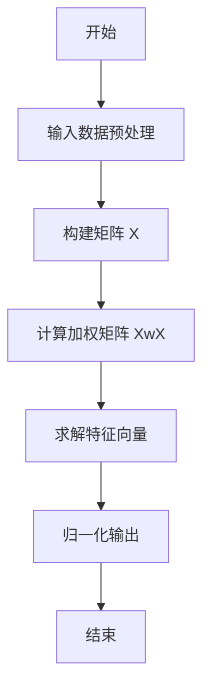

##    torch函数

### 属性：

H：共轭转置，转置后再共轭

方法

1. `cartesian_prod`笛卡尔积

  例如
$$
  \begin{bmatrix}
  1\\
  2\\
  \end{bmatrix} *
  \begin{bmatrix}
  3\\
  4\\
  5\\
  \end{bmatrix} = 
  \begin{bmatrix}
  [1&3]\\
  [1&4]\\
  [1&5]\\
  [2&3]\\
  [2&4]\\
  [2&5]\\
  \end{bmatrix}
$$

2. `linspace`等比数列

   

3. `permute[a,b,c,d]`更换进制的顺序

  ```python
  torch.reshape(
      torch.cartesian_prod(grid_center_x, grid_center_y),
      (1, self.grid_num, self.grid_num, 2)
  ).permute(0,3,2,1)
  ```

### `torch.einsum('bhdn,bhdm->bhnm', query, key)`

  > `torch.einsum` 是 PyTorch 中用于执行爱因斯坦求和约定（Einstein Summation Convention）的函数。它可以根据指定的索引模式对输入张量进行操作，包括点积、矩阵乘法、张量收缩等。

  让我们来分析一下 `torch.einsum('bhdn,bhdm->bhnm', query, key)` 这个操作：

  #### 输入张量

  - `query` 和 `key` 是两个张量。
  - 索引模式 `'bhdn,bhdm->bhnm'` 表示：
    - `query` 的形状为 `(b, h, d, n)`，其中：
      - `b` 是批次大小（batch size）。
      - `h` 是头的数量（通常用于多头注意力机制）。
      - `d` 是特征维度。
      - `n` 是序列长度。
    - `key` 的形状为 `(b, h, d, m)`，其中：
      - `b` 是批次大小。
      - `h` 是头的数量。
      - `d` 是特征维度。
      - `m` 是另一个序列长度。

  ### 索引模式解释

  - `'bhdn,bhdm->bhnm'` 的含义：
    - `b`、`h` 和 `d` 是共享的索引，表示在这些维度上进行广播。
    - `n` 和 `m` 是独立的索引，表示输出张量的形状。
    - `->bhnm` 表示输出张量的形状为 `(b, h, n, m)`。

  ### 具体操作

  - 这个操作实际上是对 `query` 和 `key` 在特征维度 `d` 上进行点积，同时保留批次维度 `b`、头维度 `h`，并将 `query` 的序列长度 `n` 和 `key` 的序列长度 `m` 组合到输出张量中。
  - 具体来说：
    - 对于每个批次 `b` 和每个头 `h`，`query` 的形状为 `(d, n)`，`key` 的形状为 `(d, m)`。
    - 在特征维度 `d` 上进行点积，得到形状为 `(n, m)` 的矩阵。
    - 最终输出的张量形状为 `(b, h, n, m)`。

  示例

  ```python
  import torch
  
  # 假设 b=2, h=3, d=4, n=5, m=6
  query = torch.randn(2, 3, 4, 5)  # 形状为 (b, h, d, n)
  key = torch.randn(2, 3, 4, 6)    # 形状为 (b, h, d, m)
  
  # 使用 torch.einsum 进行操作
  output = torch.einsum('bhdn,bhdm->bhnm', query, key)
  
  print(output.shape)  # 输出形状为 (2, 3, 5, 6)
  ```

5. `torch.softmax` 

  > PyTorch 中的一个函数，用于计算输入张量的 Softmax 函数。Softmax 函数是一种常用的激活函数，尤其在多分类任务中，用于将输入张量的值转换为概率分布。

  ### Softmax 函数的定义

  Softmax 函数将输入向量 z 转换为概率分布 σ(z)，定义如下：
$$
  σ(z)_i=\frac{e^{z_i}}{\sum_j{e^{z_j}}}
$$


  其中：

  - zi 是输入向量 z 的第 i 个分量。
  - ∑jezj 是所有分量的指数和，用于归一化。

  #### `torch.softmax` 的用法

  `torch.softmax` 的函数原型如下：

  Python复制

  ```python
  torch.nn.functional.softmax(input, dim, dtype=None)
  ```

  - **`input`**：输入张量，可以是任意形状。
  - **`dim`**：指定在哪个维度上计算 Softmax。Softmax 会在指定的维度上对每个切片进行归一化。
  - **`dtype`**（可选）：指定输出张量的数据类型。如果未指定，则默认与输入张量的数据类型相同。

  #### 示例

  以下是一些使用 `torch.softmax` 的示例：

  #### 示例 1：对一维张量计算 Softmax

  Python复制

  ```python
  import torch
  
  # 创建一个一维张量
  input_tensor = torch.tensor([1.0, 2.0, 3.0, 4.0])
  
  # 计算 Softmax
  softmax_output = torch.nn.functional.softmax(input_tensor, dim=0)
  
  print("Input Tensor:", input_tensor)
  print("Softmax Output:", softmax_output)
  ```

  输出：

  复制

  ```
  Input Tensor: tensor([1., 2., 3., 4.])
  Softmax Output: tensor([0.0321, 0.0871, 0.2369, 0.6439])
  ```

  #### 示例 2：对二维张量计算 Softmax

  Python复制

  ```python
  # 创建一个二维张量
  input_tensor = torch.tensor([[1.0, 2.0, 3.0], [4.0, 5.0, 6.0]])
  
  # 计算 Softmax，沿着最后一个维度（dim=1）
  softmax_output = torch.nn.functional.softmax(input_tensor, dim=1)
  
  print("Input Tensor:\n", input_tensor)
  print("Softmax Output:\n", softmax_output)
  ```

  输出：

  复制

  ```
  Input Tensor:
   tensor([[1., 2., 3.],
           [4., 5., 6.]])
  Softmax Output:
   tensor([[0.0900, 0.2447, 0.6652],
           [0.0900, 0.2447, 0.6652]])
  ```

  #### Softmax 的作用

  Softmax 函数的主要作用是将输入张量的值转换为概率分布，使得每个分量的值在 0 到 1 之间，并且所有分量的和为 1。这在多分类任务中非常有用，例如在神经网络的输出层，Softmax 可以将输出值转换为类别概率。

  #### 注意事项

  1. **数值稳定性**：
     - Softmax 函数在计算时可能会遇到数值不稳定的问题，特别是当输入值非常大或非常小时。为了提高数值稳定性，通常会在计算 Softmax 之前从输入值中减去每个切片的最大值。
     - PyTorch 的 `torch.nn.functional.softmax` 已经内部处理了这种数值稳定性问题。
  2. **`dim` 参数**：
     - `dim` 参数非常重要，它决定了 Softmax 的归一化方向。例如，在二维张量中，`dim=0` 表示沿着列方向归一化，而 `dim=1` 表示沿着行方向归一化。
  3. **与交叉熵损失函数结合使用**：
     - 在多分类任务中，Softmax 函数通常与交叉熵损失函数（`torch.nn.CrossEntropyLoss`）结合使用。需要注意的是，`CrossEntropyLoss` 内部已经包含了 Softmax，因此在计算损失时不需要显式调用 `torch.softmax`。

  #### 总结

  `torch.softmax` 是 PyTorch 中用于计算 Softmax 函数的函数，它将输入张量的值转换为概率分布。通过指定 `dim` 参数，可以控制 Softmax 的归一化方向。Softmax 在多分类任务中非常常用，尤其是在神经网络的输出层。


### BatchNorm1d

> `torch.nn.BatchNorm1d` 是 PyTorch 中用于对一维数据或序列数据进行批量归一化（Batch Normalization）的模块。它通过归一化操作减少内部协变量偏移，从而加速神经网络的训练收敛，并提高模型的泛化能力。

#### 功能与公式

`BatchNorm1d` 对输入数据的每个特征维度进行归一化处理，具体公式为： 
$$
y=\frac{x−E[x]}{\sqrt{Var[x]+ϵ}}\times\gamma+\beta
$$
其中：

- x 是输入数据。
- E[x] 和 Var[x] 分别是输入数据在每个特征维度上的均值和方差。
- γ 和 β 是可学习的参数，用于对归一化后的数据进行缩放和偏移。默认情况下，γ 初始化为 1，β 初始化为 0。

#### 参数

- **`num_features`**: 输入数据的特征数量或通道数。
- **`eps`**: 为数值稳定性添加到分母的值，默认为 1e−5。
- **`momentum`**: 用于运行平均值和运行方差计算的值，默认为 0.1。
- **`affine`**: 是否使用可学习的仿射参数 γ 和 β，默认为 `True`。
- **`track_running_stats`**: 是否跟踪运行平均值和方差。默认为 `True`，在训练时会更新这些统计量，并在评估时使用它们。

#### 输入与输出

- **输入**: 形状为 `(N, C)` 或 `(N, C, L)` 的张量，其中 `N` 是批次大小，`C` 是特征数量，`L` 是序列长度。
- **输出**: 与输入形状相同的张量。

#### 示例代码

以下是一个使用 `BatchNorm1d` 的示例：

Python复制

```python
import torch
import torch.nn as nn

# 创建 BatchNorm1d 实例
m = nn.BatchNorm1d(100)

# 创建随机输入张量
input_tensor = torch.randn(20, 100)

# 前向传播
output_tensor = m(input_tensor)
print(output_tensor.shape)  # 输出形状与输入相同
```


#### 作用

- **加速训练**: 通过归一化输入数据，减少内部协变量偏移，使网络更快收敛。
- **提高泛化能力**: 归一化操作有助于模型在不同数据分布上表现更稳定。

`BatchNorm1d` 广泛应用于处理一维数据（如全连接层的输入）和序列数据（如时间序列或文本数据），是构建深度学习模型的常用模块。


### BatchNorm2d 

> `torch.nn.BatchNorm2d` 是 PyTorch 中用于对卷积层输出进行批归一化（Batch Normalization）的模块。它主要用于稳定训练过程，加速收敛，并且可以减少对初始化的依赖。

#### BatchNorm2d 的工作原理

BatchNorm2d 的核心操作是将输入数据的每个通道（channel）进行归一化处理，使其均值为 0，方差为 1。具体公式如下：

y=Var[x]+ϵx−E[x]×γ+β

其中：

- x 是输入数据。
- E[x] 和 Var[x] 分别是输入数据的均值和方差，计算时会跨过 batch 维度和空间维度（H 和 W）。
- ϵ 是一个很小的数值（默认为 1e−5），用于防止分母为零。
- γ 和 β 是可学习的参数，分别用于缩放和偏移归一化后的数据。

#### 参数详解

- **`num_features`**：输入数据的通道数（C），即输入张量的第二维。
- **`eps`**：默认值为 1e−5，用于数值稳定性。
- **`momentum`**：用于更新运行时均值和方差的动量参数，默认值为 0.1。
- **`affine`**：默认为 `True`，表示是否使用可学习的参数 γ 和 β 进行仿射变换。
- **`track_running_stats`**：默认为 `True`，表示是否在训练过程中跟踪运行时的均值和方差。如果设置为 `False`，则在训练和测试时都使用当前批次的统计信息。

#### 示例代码

以下是一个简单的使用 `BatchNorm2d` 的代码示例：

Python复制

```python
import torch
import torch.nn as nn

# 创建一个 BatchNorm2d 实例
m = nn.BatchNorm2d(num_features=3)  # 假设输入数据有 3 个通道

# 创建一个随机输入张量，形状为 (batch_size, channels, height, width)
input_tensor = torch.randn(2, 3, 4, 4)

# 应用 BatchNorm2d
output = m(input_tensor)

print("Input Tensor:", input_tensor)
print("Output Tensor:", output)
```

在这个例子中，输入张量的形状为 `(2, 3, 4, 4)`，表示有 2 个样本，每个样本有 3 个通道，每个通道的特征图大小为 4x4。

#### 注意事项

- BatchNorm2d 的效果与 batch size 有关，较小的 batch size 可能导致统计量不稳定。
- 在实际应用中，BatchNorm2d 通常与激活函数（如 ReLU）结合使用。

通过以上介绍，你可以更好地理解和使用 `torch.nn.BatchNorm2d` 来优化你的卷积神经网络模型。

### Conv2d

> `torch.nn.Conv2d` 是 PyTorch 中用于实现二维卷积操作的模块，广泛应用于处理二维数据（如图像）。它通过在输入张量上滑动卷积核（滤波器），对每个局部区域进行加权求和，从而提取特征。二维卷积是卷积神经网络（CNN）的核心操作之一。

#### 功能

`Conv2d` 主要用于处理二维数据（如图像），通过卷积操作提取局部特征。它在图像处理、目标检测、图像分类等领域中发挥重要作用。

#### 参数

`torch.nn.Conv2d` 的构造函数参数如下：

- **`in_channels`**: 输入张量的通道数。对于图像，通常是 3（RGB），对于灰度图像是 1。
- **`out_channels`**: 输出张量的通道数，即卷积核的数量。
- **`kernel_size`**: 卷积核的大小，可以是一个整数（表示正方形卷积核），也可以是一个元组 `(kH, kW)`（表示高度和宽度）。
- **`stride`**: 卷积核的步长，默认为 1。可以是一个整数（表示水平和垂直方向的步长相同），也可以是一个元组 `(sH, sW)`。
- **`padding`**: 填充的大小，默认为 0。可以是一个整数（表示水平和垂直方向的填充相同），也可以是一个元组 `(padH, padW)`。
- **`dilation`**: 膨胀率，默认为 1。可以是一个整数（表示水平和垂直方向的膨胀率相同），也可以是一个元组 `(dH, dW)`。
- **`groups`**: 分组卷积的组数，默认为 1。分组卷积可以减少计算量。
- **`bias`**: 是否添加偏置项，默认为 `True`。
- **`padding_mode`**: 填充模式，默认为 `'zeros'`，表示用零填充。

#### 输入与输出

- **输入**: 形状为 `(N, C_{\text{in}}, H_{\text{in}}, W_{\text{in}})` 的张量，其中：

  - `N` 是批次大小。
  - `C_{\text{in}}` 是输入通道数。
  - `H_{\text{in}}` 是输入的高度。
  - `W_{\text{in}}` 是输入的宽度。

- **输出**: 形状为 `(N, C_{\text{out}}, H_{\text{out}}, W_{\text{out}})` 的张量，其中：

  - `C_{\text{out}}` 是输出通道数。

  - `H_{\text{out}}` 和 `W_{\text{out}}` 是输出的高度和宽度，计算公式为：

    
    $$
    H_{out}=\left \lfloor
    \frac{H_{in}+2×padding[0]−dilation[0]×(kernel\_size[0]−1)−1}{stride[0]}+1\right \rfloor
    $$

    $$
    H_{out}=\left \lfloor
    \frac{W_{in}+2×padding[1]−dilation[1]×(kernel\_size[1]−1)−1}{stride[1]}+1\right \rfloor
    $$

    

#### 示例代码

以下是一个使用 `torch.nn.Conv2d` 的示例：

Python复制

```python
import torch
import torch.nn as nn

# 创建 Conv2d 实例
conv2d = nn.Conv2d(in_channels=3, out_channels=16, kernel_size=3, stride=1, padding=1)

# 创建随机输入张量
# 形状为 (N, C_in, H_in, W_in)，这里 N=4, C_in=3, H_in=32, W_in=32
input_tensor = torch.randn(4, 3, 32, 32)

# 前向传播
output_tensor = conv2d(input_tensor)
print("输入张量形状:", input_tensor.shape)
print("输出张量形状:", output_tensor.shape)
```

#### 输出结果

假设输入张量的形状为 `(4, 3, 32, 32)`，即：

- 批次大小 N=4
- 输入通道数 Cin=3
- 输入高度 Hin=32
- 输入宽度 Win=32

运行上述代码后，输出可能如下：

复制

```
输入张量形状: torch.Size([4, 3, 32, 32])
输出张量形状: torch.Size([4, 16, 32, 32])
```

#### 参数解释

1. **`in_channels`**: 输入张量的通道数。对于 RGB 图像，通常是 3。
2. **`out_channels`**: 输出张量的通道数，即卷积核的数量。
3. **`kernel_size`**: 卷积核的大小。这里设置为 3，表示卷积核是一个 3×3 的矩阵。
4. **`stride`**: 卷积核的步长。这里设置为 1，表示卷积核每次移动一个像素。
5. **`padding`**: 填充的大小。这里设置为 1，表示在输入张量的边界上填充一层零值，以保持输出尺寸与输入尺寸相同。

#### 应用场景

`Conv2d` 广泛应用于以下领域：

1. **图像分类**：如 ResNet、VGG 等经典卷积神经网络。
2. **目标检测**：如 Faster R-CNN、YOLO 等。
3. **语义分割**：如 U-Net、DeepLab 等。
4. **风格迁移**：通过卷积操作提取图像的风格特征。

#### 注意事项

1. **填充与步长**：通过调整 `padding` 和 `stride` 参数，可以控制输出张量的尺寸。
2. **卷积核大小**：较大的卷积核可以捕捉更广泛的局部特征，但会增加计算量。
3. **分组卷积**：通过设置 `groups` 参数，可以实现分组卷积，减少计算量。
4. **偏置项**：在某些情况下（如使用批量归一化），可以将 `bias` 设置为 `False`。

`torch.nn.Conv2d` 是构建卷积神经网络的核心模块之一，通过灵活调整参数，可以实现多种卷积操作，满足不同的应用场景需求。

### linalg.eigh

> `torch.linalg.eigh` 是 PyTorch 中用于计算对称（或厄米特）矩阵的特征值和特征向量的函数。它主要用于处理实对称矩阵或复厄米特矩阵。以下是关于 `torch.linalg.eigh` 的详细介绍：

#### 功能

`torch.linalg.eigh` 用于计算对称矩阵 A 的特征值和特征向量，使得 A=QΛQT，其中 Q 是正交矩阵（或酉矩阵），其列是 A 的特征向量，而 Λ 是对角矩阵，其对角线元素是 A 的特征值。

#### 参数

- **`input`**: 输入矩阵，必须是方阵（即行数等于列数），且必须是对称矩阵（对于实数矩阵）或厄米特矩阵（对于复数矩阵）。输入张量的形状为 `(*, n, n)`，其中 `*` 表示任意数量的前导维度。
- **`UPLO`**: 一个可选参数，用于指定计算时使用的矩阵部分。取值为 `'U'` 或 `'L'`，分别表示使用矩阵的上三角部分或下三角部分。默认值为 `'L'`。

#### 返回值

- **`eigenvalues`**: 特征值，返回一个形状为 `(*, n)` 的张量，特征值按升序排列。
- **`eigenvectors`**: 特征向量，返回一个形状为 `(*, n, n)` 的张量，每一列对应一个特征向量。

#### 示例代码

以下是一个简单的示例，展示如何使用 `torch.linalg.eigh`：

Python复制

```python
import torch

# 创建一个对称矩阵
A = torch.tensor([[4, 2], [2, 3]], dtype=torch.float32)

# 计算特征值和特征向量
eigenvalues, eigenvectors = torch.linalg.eigh(A)

print("特征值:", eigenvalues)
print("特征向量:\n", eigenvectors)
```

#### 输出结果

假设输入矩阵 A 是：

A=[4223]

运行上述代码后，输出可能如下：

复制

```
特征值: tensor([1.0000, 6.0000])
特征向量:
 tensor([[-0.8944, -0.4472],
         [ 0.4472, -0.8944]])
```

#### 注意事项

1. **输入矩阵必须是对称或厄米特矩阵**：如果输入矩阵不是对称或厄米特矩阵，结果可能不准确。
2. **特征值的顺序**：特征值按升序排列。
3. **特征向量的正交性**：对于实对称矩阵，特征向量是正交的；对于复厄米特矩阵，特征向量是酉的。

`torch.linalg.eigh` 是 PyTorch 中处理对称矩阵特征值问题的高效工具，特别适用于需要精确计算特征值和特征向量的场景。

### InstanceNorm2d

> PyTorch 中用于二维数据（如图像）的实例归一化（Instance Normalization）层。它对每个样本的每个通道独立进行归一化操作，而不依赖于小批量数据的统计信息

#### 与 BatchNorm2d 的区别

- **BatchNorm2d**：对整个批次中的样本进行归一化，适用于加速深度神经网络的训练。
- **InstanceNorm2d**：对每个样本独立进行归一化，适用于图像生成任务，能够保持每个样本的特征。


### Parameter

> 在 PyTorch 中，`Parameter` 是一个特殊的 `torch.Tensor`，用于表示模型中的可训练参数。它继承自 `torch.Tensor`，但具有额外的特性，使其能够被优化器（如 `torch.optim` 中的优化器）识别并更新。`Parameter` 是构建神经网络模型的核心组件之一。

#### 1. **`torch.nn.Parameter` 的定义**

`torch.nn.Parameter` 是一个类，用于定义模型中的可训练参数。它的主要作用是：

- 标记张量为模型的参数。
- 使这些张量能够被优化器自动识别和更新。

#### 2. **如何使用 `torch.nn.Parameter`**

在定义自定义模型时，通常会使用 `torch.nn.Parameter` 来声明模型的可训练参数。例如：

```python
import torch
import torch.nn as nn

class MyModel(nn.Module):
    def __init__(self):
        super(MyModel, self).__init__()
        # 定义一个可训练的参数
        self.weight = nn.Parameter(torch.randn(3, 3))  # 随机初始化一个 3x3 的张量作为参数

    def forward(self, x):
        return x @ self.weight  # 简单的矩阵乘法操作
```

在这个例子中，`self.weight` 是一个 `torch.nn.Parameter` 对象。它会被自动添加到模型的参数列表中，优化器可以识别并更新它。

#### 3. **`Parameter` 的特性**

- **自动注册到模型中**：当你将一个 `Parameter` 分配给模型的属性时，PyTorch 会自动将其注册到模型的参数列表中。这意味着你可以通过 `model.parameters()` 获取所有可训练的参数。
- **自动求导**：`Parameter` 默认启用梯度计算（`requires_grad=True`），因此它会自动参与反向传播。
- **优化器识别**：优化器（如 SGD、Adam）会自动识别并更新这些参数。

#### 4. **与普通 `torch.Tensor` 的区别**

- **自动注册**：普通 `torch.Tensor` 不会被自动注册到模型中，而 `Parameter` 会被。
- **默认梯度**：`Parameter` 默认启用梯度计算，而普通 `torch.Tensor` 默认不启用。
- **优化器更新**：优化器会更新 `Parameter`，但不会更新普通 `torch.Tensor`。

#### 5. **查看模型的参数**

你可以通过 `model.parameters()` 或 `model.named_parameters()` 查看模型的所有可训练参数。例如：

Python复制

```python
model = MyModel()
for name, param in model.named_parameters():
    print(f"Name: {name}")
    print(f"Type: {type(param)}")
    print(f"Size: {param.size()}")
    print(f"Values: {param}")
```

#### 6. **总结**

`torch.nn.Parameter` 是 PyTorch 中用于定义模型可训练参数的工具。它与普通 `torch.Tensor` 的主要区别在于它会被自动注册到模型中，并且默认启用梯度计算。通过使用 `Parameter`，你可以轻松地构建和管理模型的可训练参数，并让优化器自动更新它们。

如果你有更具体的问题或需要进一步的解释，请随时告诉我！

## 模型类

八点加权函数

## convMatch

### 注意事项

#### debuge节点

1. 训练入口
2. tran_step
3. model()

#### tips:

作为数组查看：

查看只能二维数组形式查看

```
xx.cpu().detach().numpy()
```

### model

```python
class ConvMatch(nn.Module):
    def __init__(self, config, use_gpu=True):
        nn.Module.__init__(self)
        self.layer_num = config.layer_num

        self.grid_center = GridPosition(config.grid_num, use_gpu=use_gpu)
        # net_channels默认为128
        self.pos_embed = PositionEncoder(config.net_channels)
        self.grid_pos_embed = PositionEncoder(config.net_channels)
        self.init_project = InitProject(config.net_channels)
        self.layer_blocks = nn.Sequential(
            *[LayerBlock(config.net_channels, config.head, config.grid_num) for _ in range(self.layer_num)]
        )

    def forward(self, data):
        # 检查坐标xs是否为4维，channel=1
        assert data['xs'].dim() == 4 and data['xs'].shape[1] == 1
        # 获取批次和坐标点数目
        batch_size, num_pts = data['xs'].shape[0], data['xs'].shape[2]
        # (B,1,N,C) -> (B,C,N): 数量,坐标 --> 坐标,数量
        # C=4:x1,y1,x2,y2
        input = data['xs'].transpose(1,3).squeeze(3)
        # 将数据分割为对照组x1,x2
        x1, x2 = input[:,:2,:], input[:,2:,:]
        # 坐标差
        motion = x2 - x1

        pos = x1 # B2N
        # 制作坐标点、
        # N:batch_size**2
        grid_pos = self.grid_center(batch_size) # B2N
        
        # 图卷积x1和grid pos返回(B,128,n)
        # N 2000
        pos_embed = self.pos_embed(pos) # BCN
        # N 256
        grid_pos_embed = self.grid_pos_embed(grid_pos)
        
        # 差值和x1的图卷积和作为d
        d = self.init_project(motion) + pos_embed # BCN
        
        #NOTICE 至此制作出了坐标，卷积后的差值,x1,坐标,以及他们的和，

        res_logits, res_e_hat = [], []
        for i in range(self.layer_num):
            # data['xs']:(B,1,N,C)
            d, logits, e_hat = self.layer_blocks[i](data['xs'], d, grid_pos_embed) # BCN
            res_logits.append(logits), res_e_hat.append(e_hat)
        return res_logits, res_e_hat 
```


`pos=x1`

`motion=x2-x1`

1. grid_pos:grid_center=`GridPosition`

   > 制作网格位置

   记录学习梯度制作成的等比数列x,y做成笛卡尔积

   返回`[(x1,x2..xn)*n,y1*n...yn*n]`

   ```python
   class GridPosition(nn.Module):
       def __init__(self, grid_num, use_gpu = True):
           nn.Module.__init__(self)
           self.grid_num = grid_num
           self.use_gpu = use_gpu
   
       def forward(self, batch_size):
           # TAG 制作等比数列
           grid_center_x = torch.linspace(-1.+2./self.grid_num/2,1.-2./self.grid_num/2,steps=self.grid_num).cuda() if self.use_gpu else torch.linspace(-1.+1./self.grid_num/2,1.-1./self.grid_num/2,steps=self.grid_num)
           grid_center_y = torch.linspace( 1.-2./self.grid_num/2,-1.+2./self.grid_num/2,steps=self.grid_num).cuda() if self.use_gpu else torch.linspace(1.-1./self.grid_num/2,-1.+1./self.grid_num/2,steps=self.grid_num)
           # BCHW, (b,:,h,w)->(x,y)
           # x和y的笛卡尔乘(grid_num*grid_num x2)
           # --> 1*n1*n2*2 x-y
           # --> 1*2*n2*n1 [(x1..xn)*n (yi*n)*n]
           grid_center_position_mat = torch.reshape(
               torch.cartesian_prod(grid_center_x, grid_center_y),
               (1, self.grid_num, self.grid_num, 2)
           ).permute(0,3,2,1)
           # BCN, (b,:,n)->(x,y), left to right then up to down
           # [(x1..xn)*n] [(yi*n)*n]
           grid_center_position_seq = grid_center_position_mat.reshape(1, 2, self.grid_num*self.grid_num)
           return grid_center_position_seq.repeat(batch_size, 1, 1)
   ```

   

2. 位置解析器`PositionEncoder`

   获取x1的结果

   pos_embed(pos)

   grid_pos_embed(pos_embed)

   

   通过多次图卷积->归一

   ```python
   class PositionEncoder(nn.Module):
       def __init__(self, channels):
           nn.Module.__init__(self)
           # BatchNorm1d对一维数组做归一化
           self.position_encoder = nn.Sequential(
               nn.Conv1d(2, 32, kernel_size=1), nn.BatchNorm1d(32), nn.ReLU(),
               nn.Conv1d(32, 64, kernel_size=1), nn.BatchNorm1d(64), nn.ReLU(),
               nn.Conv1d(64, channels, kernel_size=1)
           )
           
       def forward(self, x):
           # x(B,2,n)
           return self.position_encoder(x)
   ```

3. `InitProject`:初始化项目

   `d = init_project(motion)+pos_embed`

   同PositionEncoder

   ```python
   class InitProject(nn.Module):
       def __init__(self, channels):
           nn.Module.__init__(self)
           self.init_project = nn.Sequential(
               nn.Conv1d(2, 32, kernel_size=1), nn.BatchNorm1d(32), nn.ReLU(),
               nn.Conv1d(32, 64, kernel_size=1), nn.BatchNorm1d(64), nn.ReLU(),
               nn.Conv1d(64, channels, kernel_size=1)
           )
           
       def forward(self, x):
           return self.init_project(x)
   ```

4. `layer_blocks`:做layer_num次循环

   > 包含==5-10==

   ```python
    self.layer_blocks = nn.Sequential(
       *[LayerBlock(config.net_channels, config.head, config.grid_num) for _ in range(self.layer_num)]
   )
       # --------------------
       for i in range(self.layer_num):
           d, logits, e_hat = self.layer_blocks[i](data['xs'], d, grid_pos_embed) # BCN
           res_logits.append(logits), res_e_hat.append(e_hat)
   
   ```

   `LayerBlock`:层次卷积，包含多个模型进行估计

   ```python
   class LayerBlock(nn.Module):
       def __init__(self, channels, head, grid_num):
           nn.Module.__init__(self)
           self.align = AttentionPropagation(channels, head)
           self.filter = FilterNet(grid_num, channels)
           self.dealign = AttentionPropagation(channels, head)
           self.inlier_pre = InlinerPredictor(channels)
   
       def forward(self, xs, d, grid_pos_embed):
           # xs: B1N4
           # grid_pos_embed：坐标差和x1的卷积和(B,C,256)
           #(B,C,256)
           grid_d = self.align(grid_pos_embed, d)
           # BCN:坐标的
           grid_d = self.filter(grid_d)
           # 方法同align
           d_new = self.dealign(d, grid_d)
           # BCN -> B1N -> BN
           # nei'bu'z
           logits = torch.squeeze(self.inlier_pre(d_new - d), 1)
           e_hat = weighted_8points(xs, logits)
           return d_new, logits, e_hat
   ```

5. `AttentionPropagation`:注意传播

   获取查询，键，值，mh筛选后再

   ```python
   class AttentionPropagation(nn.Module):
       def __init__(self, channels, head):
           nn.Module.__init__(self)
           self.head = head
           # 整除
           # 注意头部的维度128//4
           self.head_dim = channels // head 
           # 四个单核筛选
           # 查询，键，值，mh
           self.query_filter, self.key_filter, self.value_filter = nn.Conv1d(channels, channels, kernel_size=1),\
                                                                 nn.Conv1d(channels, channels, kernel_size=1),\
                                                                 nn.Conv1d(channels, channels, kernel_size=1)
           
           self.mh_filter = nn.Conv1d(channels, channels, kernel_size=1)
           # 多核筛选
           self.cat_filter = nn.Sequential(
               nn.Conv1d(2*channels, 2*channels, kernel_size=1),
               nn.BatchNorm1d(2*channels), nn.ReLU(),
               nn.Conv1d(2*channels, channels, kernel_size=1),
           )
   
       def forward(self, motion1, motion2):
           # (grid_pos_embed, d)
           # (B,C,256)(B,C,N)
           # motion1(q) attend to motion(k,v)
           batch_size = motion1.shape[0]
           # view类似于reshape函数
           # 返回(B,C,N)-->(B,h,hdim,N) :C = h*hdim
           # query:(B,h,hdim,256)
           # key:(B,h,hdim,N)
           # value:(B,h,hdim,N)
           query, key, value = self.query_filter(motion1).view(batch_size, self.head, self.head_dim, -1),\
                               self.key_filter(motion2).view(batch_size, self.head, self.head_dim, -1),\
                               self.value_filter(motion2).view(batch_size, self.head, self.head_dim, -1)
           # 计算分数 这里**的优先级比/高   
           # 在d维度上一对一点积，然后组合
           # (B,h,hdim,N)-->(B,h,256,N)
           score = torch.softmax(torch.einsum('bhdn,bhdm->bhnm', query, key) / self.head_dim ** 0.5, dim = -1)
           # 计算add_value
           # 在m维度上点积组合
           # (B,h,hdim,256)
           add_value = torch.einsum('bhnm,bhdm->bhdn', score, value).reshape(batch_size, self.head_dim * self.head, -1)
           #(B,C,256)
           add_value = self.mh_filter(add_value)
           # 将坐标和add_value在C层次cat 放入多核
           # cat:(B,C,256)+(B,C,256)=(B,2C,256)
           # cat_filter:卷积(B,2C,256)-->(B,C,256)
           motion1_new = motion1 + self.cat_filter(torch.cat([motion1, add_value], dim=1))
           # (B,C,256)
           return motion1_new
   ```

6. `FilterNet`

   ```python
   class FilterNet(nn.Module):
       def __init__(self, grid_num, channels):
           nn.Module.__init__(self)
           self.grid_num = grid_num
           self.filter = Filter(channels)
   
       def forward(self, x):
           # grid_d:传播后的坐标(B,C,256) 这里的256 ==grid_num*grid_num
           # (2,C,256) --> (2,C,16,16)
           # BCN -> BCHW
           x = x.reshape(x.shape[0], x.shape[1], self.grid_num, self.grid_num)
           # 
           x = self.filter(x)
           # BCHW -> BCN
           x = x.reshape(x.shape[0], x.shape[1], self.grid_num*self.grid_num)
           return x
   ```

7. `Filter`

   ```python
   class Filter(nn.Module):
       def __init__(self, channels):
           nn.Module.__init__(self)
           # 3次残差网络
           self.resnet = nn.Sequential(*[ResBlock(channels) for _ in range(3)])
           self.scale =  nn.Sequential(
               nn.Conv2d(channels, channels, 1, padding=0),
           )
   
       def forward(self, x):
           x = self.scale(self.resnet(x))
           return x
   ```

8. `ResBlock`:残差网络

   ```python
   class ResBlock(nn.Module):
       def __init__(self, channels):
           nn.Module.__init__(self)
           self.net = nn.Sequential(
               # 卷积核为3，填充1
               nn.Conv2d(channels, channels, 3, padding=1),
               nn.BatchNorm2d(channels),
               nn.ReLU(inplace=True),
               nn.Conv2d(channels, channels, 3, padding=1),
               nn.BatchNorm2d(channels),
               nn.ReLU(inplace=True),
           )
   
       def forward(self, x):
           x = self.net(x) + x
           return x
   
   ```

9. `InlinerPredictor`:内部值的预测

   ```python
   class InlinerPredictor(nn.Module):
       def __init__(self, channels):
           nn.Module.__init__(self)
           self.inlier_pre = nn.Sequential(
               nn.Conv1d(channels, 64, kernel_size=1), nn.InstanceNorm1d(64, eps=1e-3), nn.BatchNorm1d(64), nn.ReLU(),
               nn.Conv1d(64, 16, kernel_size=1), nn.InstanceNorm1d(16, eps=1e-3), nn.BatchNorm1d(16), nn.ReLU(),
               nn.Conv1d(16, 4, kernel_size=1), nn.InstanceNorm1d(4, eps=1e-3), nn.BatchNorm1d(4), nn.ReLU(),
               nn.Conv1d(4, 1, kernel_size=1)
           )
   
       def forward(self, d):
           # BCN -> B1N
           return self.inlier_pre(d)
   ```

10. 评估

    ```python
    def batch_symeig(X):
        # it is much faster to run symeig on CPU
        X = X.cpu()
        b, d, _ = X.size()
        bv = X.new(b,d,d)
        for batch_idx in range(X.shape[0]):
            #TODO bug点位
            # 计算对称矩阵的特征值和特征向量
            # e,v = torch.symeig(X[batch_idx,:,:].squeeze(), True)
            e,v = torch.linalg.eigh(X[batch_idx,:,:].squeeze(), UPLO='U' )
            bv[batch_idx,:,:] = v
        bv = bv.cuda()
        return bv
    
    
    def weighted_8points(x_in, logits):
        # x_in: batch * 1 * N * 4
        x_shp = x_in.shape
        # Turn into weights for each sample
        # (B,2000)
        weights = torch.relu(torch.tanh(logits))
        x_in = x_in.squeeze(1)
        
        # Make input data (num_img_pair x num_corr x 4)
        # (B,4,2000)
        xx = torch.reshape(x_in, (x_shp[0], x_shp[2], 4)).permute(0, 2, 1)
    
        # Create the matrix to be used for the eight-point algorithm
        # 9*(B,2000) --> (B,9,2000) --> (B,2000,9)
        X = torch.stack([
            xx[:, 2] * xx[:, 0], xx[:, 2] * xx[:, 1], xx[:, 2],
            xx[:, 3] * xx[:, 0], xx[:, 3] * xx[:, 1], xx[:, 3],
            xx[:, 0], xx[:, 1], torch.ones_like(xx[:, 0])
        ], dim=1).permute(0, 2, 1)
        # (B,2000,1)
        wX = torch.reshape(weights, (x_shp[0], x_shp[2], 1)) * X
        # (B,2000,9)
        XwX = torch.matmul(X.permute(0, 2, 1), wX)
        
    
        # Recover essential matrix from self-adjoing eigen
        v = batch_symeig(XwX)
        e_hat = torch.reshape(v[:, :, 0], (x_shp[0], 9))
    
        # Make unit norm just in case
        e_hat = e_hat / torch.norm(e_hat, dim=1, keepdim=True)
        return e_hat
    ```


## MCNNet

### debuge节点

1. 训练入口
2. tran_step
3. model()

## MS2DNET

### 主体函数

```python
class MS2DNET(nn.Module):
    def __init__(self, config):
        nn.Module.__init__(self)
        self.iter_num = config.iter_num
        self.gamma = nn.Parameter(torch.zeros(1))
        # 12//(1+1)=8
        depth_each_stage = config.net_depth//(config.iter_num+1)
        self.side_channel = (config.use_ratio==2) + (config.use_mutual==2)#0
        # 128 4 8 500
        self.weights_init = MS2DGBlock(config.net_channels, 4+self.side_channel, depth_each_stage, config.clusters)
        self.weights_iter = [MS2DGBlock(config.net_channels, 6+self.side_channel, depth_each_stage, config.clusters) for _ in range(config.iter_num)]
        self.weights_iter = nn.Sequential(*self.weights_iter)
        
    def forward(self, data):
        # 判断是否为4维，通道数为1
        assert data['xs'].dim() == 4 and data['xs'].shape[1] == 1
        # 显示批次和样本数目
        batch_size, num_pts = data['xs'].shape[0], data['xs'].shape[2]
        # 反转1，3即 B,C,N,X->B,X,N,C 
        # C:1 N:2000 X:4
        input = data['xs'].transpose(1,3)
        # TODO 待进行 self.side_channel = (config.use_ratio==2) + (config.use_mutual==2)#0
        if self.side_channel > 0:
            sides = data['sides'].transpose(1,2).unsqueeze(3)
            input = torch.cat([input, sides], dim=1)

        res_logits, res_e_hat = [], []
        # MS2DGBlock
        # 返回估计值
        logits, e_hat, residual = self.weights_init(input, data['xs'])
        # 存储
        res_logits.append(logits), res_e_hat.append(e_hat)
        # 第一次训练的结果
        logits_1 = logits
        logits_2 = torch.zeros(logits.shape).cuda()
        
        # 获取估计值中最大的k个数字的索引
        index_k = logits.topk(k=num_pts // 2, dim=-1)[1]
        input_new = torch.stack(
            [input[i].squeeze().transpose(0, 1)[index_k[i]] for i in range(input.size(0))]).unsqueeze(-1).transpose(1,
                                                                                                                    2)

        residual_new = torch.stack(
            [residual[i].squeeze(0)[index_k[i]] for i in range(residual.size(0))]).unsqueeze(1)

        logits_new = logits.reshape(residual.shape)
        logits_new = torch.stack(
            [logits_new[i].squeeze(0)[index_k[i]] for i in range(logits_new.size(0))]).unsqueeze(1)

        data_new = torch.stack(
            [data['xs'][i].squeeze(0)[index_k[i]] for i in range(input.size(0))]).unsqueeze(1)

        for i in range(self.iter_num):
            logits, e_hat, residual = self.weights_iter[i](
                torch.cat([input_new, residual_new.detach(), torch.relu(torch.tanh(logits_new)).detach()], dim=1),
                data_new)
            # 将logits在1维度中按照index_k中的索引顺序放入logits_2
            logits_2.scatter_(1, index_k, logits)
            
            # 第一次训练的结果*gamma+logits_2
            #(2 2000)
            logits_2 = logits_2 + self.gamma * logits_1
            # 八点加权
            e_hat = weighted_8points(data['xs'], logits_2)
            #res_logits：训练结果+高优先结果+加权结果
            res_logits.append(logits_2), res_e_hat.append(e_hat)

        return res_logits, res_e_hat  
```

### MS2DGBlock

> linux

```python
class MS2DGBlock(nn.Module):
    # 128 4 8 500
    def __init__(self, net_channels, input_channel, depth, clusters):
        nn.Module.__init__(self)
        # 128
        channels = net_channels
        self.layer_num = depth
        self.k = 20
        self.head = 1
        print('channels:'+str(channels)+', layer_num:'+str(self.layer_num) + ',k:'+ str(self.k))
        # 4 128//2=64 1
        self.conv1 = nn.Conv2d(input_channel, channels // 2, kernel_size=1)
        self.pam=PAM_Module(channels//2)
        self.cam=CAM_Module()
        self.pcf1=MLPs(channels//2,channels//2)
        self.pcf2=MLPs(channels//2,channels//2)

        self.att1_1 = transformer(channels,channels//2 )#
        self.att1_2 = transformer(channels, channels // 2)  #
        self.att1_3 = transformer(channels, channels // 2)  #

        l2_nums = clusters

        self.l1_1 = []
        self.l1_1.append( ((2* channels) , channels))
        for _ in range(self.layer_num//2 - 1):
            self.l1_1.append(ContextNorm(channels))
            
        # down的diff_pool
        # 128 4
        self.down1 = diff_pool(channels, l2_nums)

        self.l2 = []
        for _ in range(self.layer_num//2):
            self.l2.append(OAFilter(channels, l2_nums))

        self.up1 = diff_unpool(channels, l2_nums)

        self.l1_2 = []
        # 128*2 128
        self.l1_2.append(ContextNorm(2*channels, channels))
        for _ in range(self.layer_num//2-1):
            # 
            self.l1_2.append(ContextNorm(channels))

        # 2*ContextNorm->x*ContextNorm
        self.l1_1 = nn.Sequential(*self.l1_1)
        # 
        self.l1_2 = nn.Sequential(*self.l1_2)
        self.l2 = nn.Sequential(*self.l2)
        # 将导入的数据经过残差网络后分成两个通道，分别卷积连接后再拆开，卷积，连接
        self.embed_2 = prit(channels)

        self.output = nn.Conv2d(channels//4, 1, kernel_size=1)

    def forward(self, data, xs):
        # data input
        # xs data["xs"]
        n_heads=4
        batch_size, num_pts = data.shape[0], data.shape[2]
        # 4 4 2000 1=》4 64 2000 1
        x = self.conv1(data)
        # 卷积的结果放入pam和cam
        x_pam = self.pam(x)
        x_cam = self.cam(x)
        # 4 64 2000 1
        x = self.pcf1(x_pam) + self.pcf2(x_cam)
        
        # 处理
        # 
        x_att1 = get_graph_feature(x, k=self.k)  
        x_SDG1 = self.att1_1(x, x_att1) 

        x_f = get_graph_feature(x_SDG1, k=self.k)  
        x_SDG2 = self.att1_2(x_SDG1, x_f) 

        x_g = get_graph_feature(x_SDG2, k=self.k) 
        x_SDG3 = self.att1_3(x_SDG2, x_g)  

        x = torch.cat((x, x_SDG1, x_SDG2, x_SDG3), dim=1)  
        
        # 2*ContextNorm->x*ContextNorm
        x1_1 = self.l1_1(x)
        #diff_pool
        x_down = self.down1(x1_1)
        # OAFilter
        x2 = self.l2(x_down)

        # diff_unpool
        x_up = self.up1(x1_1, x2)
        # 2*ContextNorm->x*ContextNorm
        out = self.l1_2( torch.cat([x1_1,x_up], dim=1))

        # prit
        out = self.embed_2(out)  
        # out卷积后(单channel)改为(batch,N)
        logits = torch.squeeze(torch.squeeze(self.output(out),3),1)
        # 评估值
        e_hat = weighted_8points(xs, logits)

        # xs（本model第一次使用）拆分成x1和x2
        x1, x2 = xs[:,0,:,:2], xs[:,0,:,2:4]
        # 将获取的e_hat
        e_hat_norm = e_hat

        residual = batch_episym(x1, x2, e_hat_norm).reshape(batch_size, 1, num_pts, 1)

        return logits, e_hat, residual
```


### PAM_Module

```python
class PAM_Module(nn.Module):#
    def __init__(self,in_dim):#64
        nn.Module.__init__(self)
        # 64 8
        self.query=nn.Conv2d(in_channels=in_dim,out_channels=in_dim // 8, kernel_size=1)
        self.key = nn.Conv2d(in_channels=in_dim, out_channels=in_dim // 8, kernel_size=1)
        self.value = nn.Conv2d(in_channels=in_dim, out_channels=in_dim , kernel_size=1)
        self.softmax=nn.Softmax (dim=-1)
        #TODO tensor拓展：训练参数（超参)
        self.gamma1 = nn.Parameter(torch.zeros(1))

    def forward(self, x):
        # 4 64 2000 1
        b,c,h,w=x.size()
        # 4 8 2000
        q=self.query(x).view(b,-1,w*h)
        # 4 2000 8
        q=q.permute(0,2,1)
        # 4 8 2000
        k=self.key(x).view(b,-1,w*h)
        # 矩阵乘法 q(4 2000 8) x k(4 8 2000)=(4 2000 2000)
        energy=torch.bmm(q,k)
        # 针对第四维度归一化
        # 4 2000 2000
        attention=self.softmax(energy)
        # 4 64 2000
        v = self.value(x).view(b, -1, w * h)
        # 矩阵乘法 v(4 64 2000) x attention(4 2000 2000) = (4 64 2000)
        out=torch.bmm(v,attention.permute(0,2,1))
        
        # (4 64 1 2000)
        out=out.view(b,c,h,w)
        
        out=self.gamma1 *out+x
        return out
```

### CAM_Module

```python
class CAM_Module(nn.Module):
    """ Channel attention module"""

    def __init__(self):
        super(CAM_Module, self).__init__()

        self.gamma = nn.Parameter(torch.zeros(1))
        self.softmax = nn.Softmax(dim=-1)

    def forward(self, x):
        # 4 64 2000 1
        m_batchsize, C, height, width = x.size()
        # 4 64 2000
        proj_query = x.view(m_batchsize, C, -1)
        # 4 2000 64
        proj_key = x.view(m_batchsize, C, -1).permute(0, 2, 1)
        # 自乘 4 64 64
        energy = torch.bmm(proj_query, proj_key)
        # 获取每个组中最大值 4 64 1
        energy_new = torch.max(energy, -1, keepdim=True)
        # 扩展函数
        energy_new = energy_new[0].expand_as(energy)
        # 获取差值
        energy_new = energy_new - energy
        # 4 64 64
        attention = self.softmax(energy_new)
        # 4 64 2000
        proj_value = x.view(m_batchsize, C, -1)
        # 4 64 2000
        out = torch.bmm(attention, proj_value)
        out = out.view(m_batchsize, C, height, width)

        out = self.gamma * out + x
        return out
```

### MLPs

多层处理

```python
class MLPs(nn.Module):
    def __init__(self, channels, out_channels=None):
        nn.Module.__init__(self)
        self.conv = nn.Sequential(
                nn.InstanceNorm2d(channels, eps=1e-3),
                nn.BatchNorm2d(channels),
                nn.ReLU(),
                nn.Conv2d(channels, out_channels, kernel_size=1),
        )
    def forward(self,x):
        out = self.conv(x)
        return out
```

### get_graph_feature

获得图的特征

```py
# 获取数据
def knn(x, k):
    inner = -2 * torch.matmul(x.transpose(2, 1), x)
    xx = torch.sum(x ** 2, dim=1, keepdim=True)
    pairwise_distance = -xx - inner - xx.transpose(2, 1)
    # 用于从张量中提取前 K 个最大（或最小）的元素及其对应的索引。它在处理排序、选择最大值或最小值以及生成推荐系统等任务中非常有用
    idx = pairwise_distance.topk(k=k, dim=-1)[1]  
    return idx

# 获得图特征

def get_graph_feature(x, k=20, idx=None):
    batch_size = x.size(0)
    num_pts = x.size(2)
    x = x.view(batch_size, -1, num_pts) 
    if idx is None:
        # 4 2000 20
        idx_out = knn(x, k=k)
    else:
        idx_out = idx
    device = torch.device('cuda')

    # （4 1 1）0 2000 4000 6000
    idx_base = torch.arange(0, batch_size, device=device).view(-1, 1, 1) * num_pts 

    # 4 2000 20
    idx = idx_out + idx_base

    # 160000
    idx = idx.view(-1)

    _, num_dims, _ = x.size()

    x = x.transpose(2, 1).contiguous()  
    feature = x.view(batch_size * num_pts, -1)[idx, :]
    feature = feature.view(batch_size, num_pts, k, num_dims) 

    x = x.view(batch_size, num_pts, 1, num_dims).repeat(1, 1, k, 1) 
    feature = torch.cat((x, x - feature), dim=3).permute(0, 3, 1, 2).contiguous()

    return feature
```

### transformer

转换

```python
class transformer(nn.Module):
    def __init__(self, in_channel,out_channels):#channels=128
        nn.Module.__init__(self)
        self.att1 = nn.Sequential(
            nn.InstanceNorm2d(in_channel, eps=1e-3),
            nn.BatchNorm2d(in_channel),
            nn.ReLU(),
            nn.Conv2d(in_channel, out_channels, kernel_size=1),
        )
        self.attq1 = nn.Conv2d(out_channels, out_channels, kernel_size=1)
        self.attk1 = nn.Conv2d(out_channels, out_channels, kernel_size=1)
        self.attv1 = nn.Conv2d(out_channels, out_channels, kernel_size=1)
        self.att2 = ResNet_Block(in_channel,out_channels,pre=True)
        self.gamma1 = nn.Parameter(torch.ones(1))

    def forward(self, x_row, x_local):
        # 4 64 2000 1 
        # 4 64 2000 20
        x_local = self.att1(x_local) 
        
        q = self.attq1(x_row)  
        k = self.attk1(x_local) 
        v = self.attv1(x_local)  
        att = torch.mul(q, k)
        att = torch.softmax(att, dim=3)  
        #4 64 2000 20
        qv = torch.mul(att, v) 
        out_local = torch.sum(qv, dim=3).unsqueeze(3)  
        out_local=torch.cat((x_row,out_local),dim=1)
        out_local=self.att2(out_local)
        #4 64 2000 1
        out = x_row + self.gamma1 * out_local  

        return (out+out.mean(dim=1,keepdim=True))*0.5
```

#### 残差网络

```python
class ResNet_Block(nn.Module):
    def __init__(self, inchannel, outchannel, pre=False):
        super(ResNet_Block, self).__init__()
        self.pre = pre
        self.right = nn.Sequential(
            nn.Conv2d(inchannel, outchannel, (1, 1)),
        )
        self.left1 = nn.Sequential(
            nn.Conv2d(inchannel, outchannel, (1, 1)),
            nn.InstanceNorm2d(outchannel),
            nn.BatchNorm2d(outchannel),
        )
        self.relu1 = nn.ReLU()
        self.left2 = nn.Sequential(
            nn.Conv2d(outchannel, outchannel, (1, 1)),
            nn.InstanceNorm2d(outchannel),
            nn.BatchNorm2d(outchannel),
        )
        self.relu2 = nn.ReLU()
        self.left3 = nn.Sequential(
            nn.Conv2d(outchannel, outchannel, (1, 1)),
            nn.InstanceNorm2d(outchannel),
            nn.BatchNorm2d(outchannel),
        )
        self.relu3 = nn.ReLU()
    def forward(self, x):
        x1 = self.right(x) if self.pre is True else x
        out1 = self.left1(x)
        out1 = self.relu1(out1) + x1
        out2 = self.left2(out1)
        out2 = self.relu2(out2) + out1 + x1
        out3 = self.left3(out2)
        out3 = self.relu3(out3 + x1)
        return out3
```

### diff_pool和diff_unpool

```python
class diff_pool(nn.Module):
    def __init__(self, in_channel, output_points):
        nn.Module.__init__(self)
        self.output_points = output_points
        self.conv = nn.Sequential( 
                nn.InstanceNorm2d(in_channel, eps=1e-3),
                nn.BatchNorm2d(in_channel),
                nn.ReLU(),
                nn.Conv2d(in_channel, output_points, kernel_size=1))
        
    def forward(self, x):
        # 4 128 2000 1
        # 4 500 2000 1
        embed = self.conv(x)
        # 取得极大值
        S = torch.softmax(embed, dim=2).squeeze(3)
        # x和S相乘
        out = torch.matmul(x.squeeze(3), S.transpose(1,2)).unsqueeze(3)
        return out

class diff_unpool(nn.Module):
    def __init__(self, in_channel, output_points):
        nn.Module.__init__(self)
        self.output_points = output_points
        self.conv = nn.Sequential(
                nn.InstanceNorm2d(in_channel, eps=1e-3),
                nn.BatchNorm2d(in_channel),
                nn.ReLU(),
                nn.Conv2d(in_channel, output_points, kernel_size=1))
        
    def forward(self, x_up, x_down):
        # 卷积
        embed = self.conv(x_up)
        # 提取
        S = torch.softmax(embed, dim=1).squeeze(3)
        # x——down和S相乘
        out = torch.matmul(x_down.squeeze(3), S).unsqueeze(3)
        return out
```

### ContextNorm

> ContextNorm 是一种新型的神经网络归一化方法，旨在通过利用上下文信息来提高模型的收敛速度和性能。与传统的 Batch Normalization 和 Group Normalization 不同，ContextNorm 通过将数据分组为不同的“上下文”，并在每个上下文中独立进行归一化，从而更好地适应动态激活分布。

#### ContextNorm 的核心思想

- ContextNorm 引入了基于领域知识的上下文（context）概念，将数据划分为不同的上下文组。
- 在每个上下文中，ContextNorm 会计算均值和方差，并对数据进行归一化。
- 在反向传播过程中，ContextNorm 会为每个上下文学习归一化参数和模型权重，从而实现高效的收敛。

#### ContextNorm 的优势

1. **适应性强**：ContextNorm 不依赖于全局的均值和方差，而是根据上下文进行局部归一化，更适合处理动态激活分布。
2. **性能提升**：实验表明，ContextNorm 在多种任务（如分类和域适应）中表现优于 Batch Normalization 和 Mixture Normalization。
3. **灵活性高**：ContextNorm 可以作为独立的层插入到任何神经网络架构中，并且可以在网络的任何层级中使用。

#### 应用场景

- **分类任务**：在 CIFAR-10、CIFAR-100 和 Tiny ImageNet 等数据集上，ContextNorm 显著提高了模型的收敛速度和最终性能。
- **域适应**：在源域和目标域之间使用 ContextNorm，可以更好地适应不同域的分布差异。
- **超类别分类**：例如在 CIFAR-100 的超类别分类任务中，ContextNorm 提升了模型的分类性能

```python
class ContextNorm(nn.Module):
    def __init__(self, channels, out_channels=None):
        nn.Module.__init__(self)
        if not out_channels:
           # 2*128 = 256
           out_channels = channels
        self.shot_cut = None
        if out_channels != channels:
            self.shot_cut = nn.Conv2d(channels, out_channels, kernel_size=1)
            # TODO:需要研究
        self.conv = nn.Sequential(
            #256
                nn.InstanceNorm2d(channels, eps=1e-3),
                nn.BatchNorm2d(channels),
                nn.ReLU(),
                nn.Conv2d(channels, out_channels, kernel_size=1),
                nn.InstanceNorm2d(out_channels, eps=1e-3),
                nn.BatchNorm2d(out_channels),
                nn.ReLU(),
                nn.Conv2d(out_channels, out_channels, kernel_size=1)
                )
    def forward(self, x):
        # 4 256 2000 1
        out = self.conv(x)
        if self.shot_cut:
            out = out + self.shot_cut(x)
        else:
            # 4 128 2000 1
            out = out + x
        return out
```

### OAFilter

```python
class OAFilter(nn.Module):
    def __init__(self, channels, points, out_channels=None):
        nn.Module.__init__(self)
        if not out_channels:
           out_channels = channels
        self.shot_cut = None
        if out_channels != channels:
            self.shot_cut = nn.Conv2d(channels, out_channels, kernel_size=1)
        self.conv1 = nn.Sequential(
                nn.InstanceNorm2d(channels, eps=1e-3),
                nn.BatchNorm2d(channels),
                nn.ReLU(),
                nn.Conv2d(channels, out_channels, kernel_size=1),
                trans(1,2))
        self.conv2 = nn.Sequential(
                nn.BatchNorm2d(points),
                nn.ReLU(),
                nn.Conv2d(points, points, kernel_size=1)
                )
        self.conv3 = nn.Sequential(        
                trans(1,2),
                nn.InstanceNorm2d(out_channels, eps=1e-3),
                nn.BatchNorm2d(out_channels),
                nn.ReLU(),
                nn.Conv2d(out_channels, out_channels, kernel_size=1)
            )
    def forward(self, x):
        # 4 128 500 1
        # 4 500 128 1
        out = self.conv1(x)
        y=self.conv2(out)
        out = out + self.conv2(out)
        out = self.conv3(out)
        if self.shot_cut:
            out = out + self.shot_cut(x)
        else:
            out = out + x
        return out  
```

#### trans

> 交换1和2

```python
class trans(nn.Module):
    def __init__(self, dim1, dim2):
        nn.Module.__init__(self)
        self.dim1 = dim1
        self.dim2 = dim2

    def forward(self, x):
        return x.transpose(self.dim1, self.dim2)
```

### prit

> 将导入的数据经过残差网络后分成两个通道，分别卷积连接后再拆开，卷积，连接

```python
class prit(nn.Module):
    def __init__(self, in_channel):
        nn.Module.__init__(self)
        self.output_points = in_channel
        self.res = ResNet_Block(in_channel, in_channel, pre=False)
        self.res2 = ResNet_Block(in_channel//2, in_channel//2, pre=False)
        # 独立加批量归一然后二维卷积成channel//4，ReLU激活函数
        self.conv1 = nn.Sequential(
            nn.InstanceNorm2d(in_channel//2, eps=1e-3),
            nn.BatchNorm2d(in_channel//2),
            nn.Conv2d(in_channel//2, in_channel//4, kernel_size=1),
            nn.ReLU())
        self.conv11 = nn.Sequential(
            nn.InstanceNorm2d(in_channel // 2, eps=1e-3),
            nn.BatchNorm2d(in_channel // 2),
            nn.Conv2d(in_channel // 2, in_channel // 4, kernel_size=1),
            nn.ReLU())
        self.conv2 = nn.Sequential(
            nn.InstanceNorm2d(in_channel//4, eps=1e-3),
            nn.BatchNorm2d(in_channel//4),
            nn.Conv2d(in_channel//4, in_channel // 8, kernel_size=1),
            nn.ReLU())
        self.conv22 = nn.Sequential(
            nn.InstanceNorm2d(in_channel // 4, eps=1e-3),
            nn.BatchNorm2d(in_channel // 4),
            nn.Conv2d(in_channel // 4, in_channel // 8, kernel_size=1),
            nn.ReLU())
        self.conv3=nn.Conv2d(in_channel // 4, 1, kernel_size=1),

    def forward(self,x):
        # 2 128 2000 1
        data=self.res(x)
        a = data[:, :64, :, :]
        b = data[:, 64:, :, :]
        # 前后两次卷积
        data1 = self.conv1(a)
        data11 = self.conv11(b)
        
        # 在channel层面上连接
        c= torch.cat((data1, data11), dim=1)
        
        # 分割
        d = c[:, :32, :, :]  
        e = c[:, 32:, :, :]  
        
        # 两次卷积
        data2 = self.conv2(d)  
        data22 = self.conv22(e)  
        
        # 在层面上进行连接
        f = torch.cat((data2, data22), dim=1)

        return f
```

### 评估

> 八点加权和批次评估

$$
X_i=\begin{bmatrix}
x_{i2}.x_{i0}&x_{i2}⋅x_{i1}&x_{i2}\\x_{i3}⋅x_{i0}&x_{i3}⋅x_{i1}&x_{i3}\\x_{i0}&x_{i1}&1
\end{bmatrix}
$$




```python
def batch_symeig(X):
    # it is much faster to run symeig on CPU
    X = X.cpu()
    b, d, _ = X.size()
    # 创建一个跟X一样大小的张量
    bv = X.new(b,d,d)
    for batch_idx in range(X.shape[0]):
        # NOTICE 3.8之后的对称矩阵上三角求特征向量和特征值
        # e,v = torch.symeig(X[batch_idx,:,:].squeeze(), True)
        e, v = torch.linalg.eigh(X[batch_idx, :, :].squeeze(), UPLO='U')
        bv[batch_idx,:,:] = v
    bv = bv.cuda()
    return bv


def weighted_8points(x_in, logits):
    # x_in: x的输入值
    # x_in: batch * 1 * N * 4
    x_shp = x_in.shape
    # 两次激活函数
    # Turn into weights for each sample
    weights = torch.relu(torch.tanh(logits))
    # 去除单通道
    x_in = x_in.squeeze(1)
    
    # Make input data (num_img_pair x num_corr x 4)
    # 重造成(batch,N,4)==>(batch,4,N)
    xx = torch.reshape(x_in, (x_shp[0], x_shp[2], 4)).permute(0, 2, 1)

    # Create the matrix to be used for the eight-point algorithm
    # 八点函数生成X
    # (2,9,2000)
    # ==>(2 2000 9)
    X = torch.stack([
        xx[:, 2] * xx[:, 0], xx[:, 2] * xx[:, 1], xx[:, 2],
        xx[:, 3] * xx[:, 0], xx[:, 3] * xx[:, 1], xx[:, 3],
        xx[:, 0], xx[:, 1], torch.ones_like(xx[:, 0])
    ], dim=1).permute(0, 2, 1)
    # 将由logit创建的权值重塑为(batch,N,1)然后乘X、
    # 2 2000 9
    wX = torch.reshape(weights, (x_shp[0], x_shp[2], 1)) * X
    # (2 9 2000)x(2 2000 9) = (2 9 9)
    XwX = torch.matmul(X.permute(0, 2, 1), wX)

    # Recover essential matrix from self-adjoing eigen
    v = batch_symeig(XwX)
    # 重塑v的特征值为batch*9返回
    e_hat = torch.reshape(v[:, :, 0], (x_shp[0], 9))

    # Make unit norm just in case
    # norm作用是沿着输入张量 e_hat 的第 1 维（每一行）计算 L2 范数，并保留输出张量的维度，使其形状为 (N,1)
    # (2,9)
    e_hat = e_hat / torch.norm(e_hat, dim=1, keepdim=True)
    return e_hat
```
